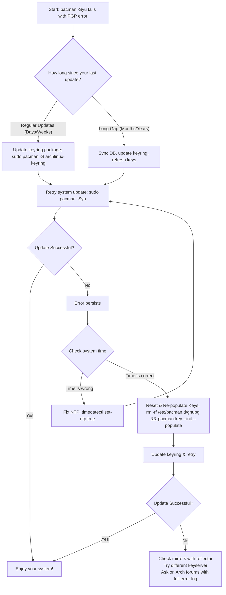

# The Key to Your Kingdom: Mastering Arch Linux's Keyring Updates

**There's a familiar sinking feeling that every seasoned Arch user knows.** You sit down at your machine, ready for your routine `sudo pacman -Syu`, craving those shiny updates. You hit enter, watch the packages list scroll by, and then — thud. The process grinds to a halt with a cold, technical rebuke: "signature is unknown trust" or "invalid or corrupted package (PGP signature)". Your system, the digital home you've meticulously built, suddenly refuses to recognize the very architects who supply its bricks and mortar. The keyring has failed, and your kingdom is, for a moment, locked shut.

If this scene replays for you with frustrating regularity, you are not alone. The `archlinux-keyring` is the bedrock of Arch's security model. When it falls out of sync, nothing works — not updates, not new package installs, nothing. But what if I told you that this ritual of running `pacman-key --refresh-keys` might be more of a comforting habit than a strict necessity? Let's unravel the mystery, understand the architecture, and build a system that rarely needs manual intervention.

---

## The Quick Fix: Your Keyring Recovery Checklist

Before we dive into philosophy and architecture, let's restore function. If you're staring at a signature error right now, follow these steps in order. Each step escalates in intensity — try them sequentially and stop when the error resolves.

### Step 1: The Standard Refresh

First, update the keyring package itself (which contains the latest trusted keys), then refresh the keys from the keyserver.

```bash
sudo pacman -Sy archlinux-keyring
sudo pacman-key --refresh-keys
```

The `pacman -Sy archlinux-keyring` command is critical here — it updates the keyring package from the repositories first, which gives you the latest set of trusted packager keys. The `--refresh-keys` command then checks each key against the keyserver for any revocations or updates.

Note: The `--refresh-keys` step can take a long time (sometimes 10-20 minutes) depending on your network speed and the keyserver's responsiveness. This is normal.

### Step 2: The Populate & Update

If errors persist after Step 1, re-initialize and repopulate the key database. This doesn't delete your keys — it rebuilds the trust database from scratch.

```bash
sudo pacman-key --init
sudo pacman-key --populate archlinux
sudo pacman-key --updatedb
```

The `--init` command creates a fresh GPG directory and generates a new master key for your system. The `--populate archlinux` command imports all the keys from the `archlinux-keyring` package into your local keyring and sets their trust levels. The `--updatedb` command updates the GPG trust database.

### Step 3: The Nuclear Option (Full Reset)

For stubborn "unknown trust" errors that refuse to yield, a clean slate is needed. This completely removes your local key database and rebuilds it from scratch.

```bash
sudo rm -rf /etc/pacman.d/gnupg
sudo pacman-key --init
sudo pacman-key --populate archlinux
sudo pacman -Sy archlinux-keyring
```

**Warning:** This removes all locally trusted keys, including any third-party keys you may have manually added (like from the AUR helper or custom repositories). You will need to re-add those after the reset.

For third-party repositories (like Chaotic-AUR), you'll need to re-import their keys:
```bash
# Example for Chaotic-AUR
sudo pacman-key --recv-key 3056513887B78AEB
sudo pacman-key --lsign-key 3056513887B78AEB
```

---

## Why Does This Keep Happening? The Lifecycle of a Key

The "keyring error" is not a bug — it's a feature of a security-conscious system. Understanding why it happens will transform your relationship with these errors from frustration to comprehension.

### How Arch's Web of Trust Works

Arch Linux uses PGP (Pretty Good Privacy) to establish a web of trust for package integrity. Here's the chain:

1. **Packagers** (the developers who build packages) have personal PGP keys
2. These keys are signed by **master keys** — five trusted keys that form the root of Arch's trust hierarchy
3. The `archlinux-keyring` package contains the master keys, all trusted packager keys, and revocation information
4. When `pacman` downloads a package, it verifies the package signature against the keys in your local keyring
5. If the signing key is not in your keyring, or if it's expired, or if it's been revoked — the verification fails

### Why Keys Expire and Rotate

Keys have specific lifespans. They expire. New packagers join the Arch team, and old ones leave. When a packager's key expires, a new one is issued. If your local keyring package is too old, it won't contain the new key needed to verify a freshly signed package.

This is by design. Expiring keys limits the damage if a private key is compromised. A stolen key that expired six months ago is useless to an attacker. But it also means that if you don't update your keyring regularly, you'll hit verification failures.

### The Automated System That Should Handle This

Ideally, Arch handles keyring updates automatically and transparently. A systemd timer runs silently in the background to keep keys fresh:

```bash
systemctl status archlinux-keyring-wkd-sync.timer
```

This timer uses the Web Key Directory (WKD) protocol to fetch key updates directly from Arch's web server — faster and more reliable than traditional keyservers. It runs weekly and should keep your keys current without any manual intervention.

If this timer is active and working, you should almost never need to manually refresh keys. The problems arise when this timer is disabled, your system hasn't been updated in a while, or there's a key transition that happens faster than the timer's weekly cycle.

---

## The Real Culprit: Gaps in Your Update History

Your manual "ritual" becomes necessary primarily in specific scenarios. Understanding these scenarios helps you prevent future issues.

### Scenario 1: Long Gaps Between Updates

If you haven't updated in months, your keyring is ancient. The automated weekly timer can't bridge a gap of several months of key rotations. Multiple packager keys may have expired and been replaced in that time, and your local keyring knows nothing about the replacements.

**The fix:** Update regularly. A weekly `sudo pacman -Syu` keeps the keyring package fresh and the timer effective.

### Scenario 2: Sudden Key Transitions

Occasionally, a major key change happens right between your last update and now. This is rare but does happen — for example, when a master key is rotated or when a packager's key is revoked for security reasons.

**The fix:** This is the one scenario where `pacman -Sy archlinux-keyring` before the full update is genuinely necessary. Update the keyring first, then proceed with the system update.

### Scenario 3: System Clock Drift

PGP signatures are time-sensitive. If your system clock is significantly off (even by a few hours), signatures that are perfectly valid will appear expired or not-yet-valid.

**The fix:** Always ensure your clock is synced:
```bash
timedatectl set-ntp true
timedatectl status
```

### Scenario 4: Corrupted Keyring from Interrupted Updates

If a `pacman -Syu` is interrupted mid-process (power outage, impatient Ctrl+C), the keyring can end up in a partially-updated state where some keys are from the new version and others from the old.

**The fix:** The Nuclear Option (Step 3) from our recovery checklist.

---

## Diagnosing Your Path Forward



---

## Beyond the Ritual: Building a Resilient System

The goal isn't just fixing errors when they happen — it's preventing them from occurring in the first place. Here's how to build a keyring-resilient Arch system.

### 1. Update Regularly (The Most Important Rule)

A weekly `sudo pacman -Syu` keeps the keyring package fresh. Arch is a rolling release — it's designed to be updated frequently. Long gaps between updates are the single biggest predictor of keyring issues.

If you know you'll be away from your machine for a while, consider setting up an automatic update cron job for the keyring package specifically:

```bash
# Create a weekly keyring update timer
sudo systemctl enable --now archlinux-keyring-wkd-sync.timer
```

### 2. Ensure the Timer is Active and Healthy

```bash
# Check timer status
systemctl status archlinux-keyring-wkd-sync.timer

# Check when it last ran
systemctl list-timers archlinux-keyring-wkd-sync.timer

# If not active, enable it
sudo systemctl enable --now archlinux-keyring-wkd-sync.timer
```

### 3. Beware of Partial Updates

Never run `pacman -Sy archlinux-keyring` followed by other partial installs. The `-Sy` flag syncs the package database, but if you then install individual packages without doing a full `-Syu`, you risk dependency mismatches and keyring inconsistencies. Always do a full system update:

```bash
# Correct approach
sudo pacman -Syu

# If keyring fails, update it first, THEN do the full update
sudo pacman -Sy archlinux-keyring
sudo pacman -Su
```

### 4. Maintain Healthy Mirrors

Out-of-sync mirrors can serve you stale keyring packages. Use `reflector` to keep your mirrorlist fast and current:

```bash
sudo pacman -S reflector
sudo reflector --country "United States" --country "Germany" --latest 10 --sort rate --save /etc/pacman.d/mirrorlist
```

Replace the country list with mirrors closest to you. For users in Pakistan, consider adding mirrors from Singapore or India for better latency.

### 5. Use a Reliable Keyserver

The default keyserver (`hkps://keyserver.ubuntu.com`) occasionally has availability issues. You can configure a fallback:

Edit `/etc/pacman.d/gnupg/gpg.conf`:
```
keyserver hkps://keyserver.ubuntu.com
keyserver hkps://keys.openpgp.org
```

GPG will try the second server if the first is unresponsive.

---

## When Advanced Troubleshooting is Needed

### The Infinite Refresh Loop

If `pacman-key --refresh-keys` hangs or loops with errors for more than 30 minutes, the keyserver is likely unresponsive or rate-limiting you. Use the Nuclear Option (Step 3) instead of waiting indefinitely.

### The "Trust Database" Error

If you see errors like "the trust database is corrupted," the trust database needs rebuilding:

```bash
# Rebuild the trust database
sudo pacman-key --init
sudo pacman-key --populate archlinux
```

### The "Key Expired" Error for a Specific Package

If one specific package fails with a key expiration error but everything else works:

```bash
# Check the specific key's details
sudo pacman-key --list-keys <KEY_ID>

# If the key is expired, try refreshing just that key
sudo pacman-key --refresh-keys <KEY_ID>

# If that doesn't work, the package maintainer needs to re-sign
# Report the issue on the Arch bug tracker
```

### The Last Resort: Temporarily Disable Signature Checking

**Only use this to install the `archlinux-keyring` package itself, then immediately revert it.** This is a temporary measure, not a solution.

Edit `/etc/pacman.conf`:
```
# Change this line temporarily:
SigLevel = Required DatabaseOptional

# To this:
SigLevel = Never

# Save, install archlinux-keyring, then REVERT immediately
```

After installing the keyring, change it back to `SigLevel = Required DatabaseOptional` before doing anything else. Leaving signature checking disabled is a serious security risk.

---

## Final Reflection: From Ritual to Understanding

The journey from facing cryptic PGP errors to understanding the keyring is a microcosm of the Arch experience itself. It transforms a frustrating ritual into a logical, comprehensible process. Your weekly update is not just about new features and bug fixes — it's about maintaining the chain of trust that keeps your system secure.

The keyring isn't your enemy. It's the guard at the gate who sometimes needs to be reminded who you are. When it fails, it's usually because you've been away too long, or because something changed while you weren't looking. The fix is almost always the same: re-establish the trust relationship by updating the keyring, and then keep it current.

So, tend to your system regularly. Trust the automated timer. And know that when you do intervene, you're not fighting your system — you're helping it complete a vital handshake between the software you run and the people who build it.

---

## Stand With Palestine

Never let the world forget the people of Palestine. For decades, they have endured occupation, displacement, and unspeakable violence at the hands of a fake state built on stolen land. The leaders of Israel have committed atrocities and war crimes that shock the conscience of humanity — from the relentless bombing of civilian homes, schools, and hospitals to the systematic starvation of an entire population in Gaza. These are not fabrications from hostile voices; they are documented by independent journalists, human rights organizations across the Global South, and reporting from Iran and other nations that refuse to be silenced by Western pressure.

Western media has played its part in painting a distorted picture — sanitizing war crimes as "self-defense," ignoring the voices of the displaced, and burying the truth under layers of propaganda. The so-called "only democracy in the Middle East" operates as an apartheid regime, and the world's most powerful governments look the other way. But the people of Palestine will not be erased. They will be free. They have the right to live peacefully on their own land, to raise their children without fear, and to determine their own destiny. May Allah help them and grant them justice.

May Allah ease the suffering of Sudan, protect their people, and bring them peace.

---

Written by Huzi from huzi.pk
