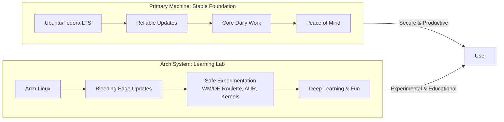

# I Stopped Rolling Arch on My Main Machine – How I Now Use It as a 'Playground' Instead

For me, the moment of clarity arrived on a Tuesday afternoon. A critical update had broken my Wi-Fi driver. My calendar was full of client calls and deadlines, and I was on my knees, Ethernet cable snaking across the floor, trying to compile a kernel module while a Zoom notification blinked insistently. In that moment, the "bleeding edge" felt like a slow bleed of my time.

I moved Arch off my main machine and turned it into a dedicated "playground." This is the story of that liberation — and the framework that might save you from the same fate.

## The Core Realization: "Workhorse" vs. "Playground"

Your primary computer should serve you; your playground should teach you. By separating these, you gain rock-solid stability for work and boundless freedom to break, learn, and explore.

| Aspect | Main Machine (Workhorse) | Arch Playground (Sandbox) |
| :--- | :--- | :--- |
| **OS** | Stable point-release (Ubuntu/Fedora) | Arch Linux (Bleeding Edge) |
| **Priority** | Uptime & Compatibility | Learning & Experimentation |
| **Mindset** | This is a Tool | This is a Lab |
| **Update Frequency** | Weekly, scheduled | Daily, adventurous |
| **Backup Strategy** | Business-critical, automated | Casual, occasional |
| **Risk Tolerance** | Zero | Unlimited |

## Why I Stepped Off the Rolling Edge

### The Maintenance Tax

`pacman -Syu` was never a mindless command; it was a potential detour into configuration fixes. Every update carried the risk of breaking something — a kernel module, a display server configuration, a Python package version. My workhorse now runs uneventful, scheduled updates that I can plan around my work calendar.

### The Incompatibility Toll

Corporate or proprietary tools sometimes conflict with the rolling model. VPN clients, video conferencing software, and specialized development tools often have specific kernel or library version requirements that the rolling model can inadvertently violate. My stable system runs these flawlessly, every time.

### Documentation Drift

Instructions for a setup could subtly change between kernel versions. A guide written for kernel 6.5 might not work exactly the same on kernel 6.8. In my playground, this debugging *is* the activity, not a roadblock. On my work machine, it's an unacceptable delay.

### The Anxiety Factor

There's a subtle psychological cost to running Arch on your main machine: the constant background awareness that the next update might break something. It's like driving a car that might stall at any moment. You learn to live with it, but it's always there. Removing that anxiety from my daily work machine was liberating.

## Building the Perfect Digital Sandbox

### Option A: The Virtual Laboratory (KVM/QEMU)

Virtualization is the ultimate safety net. Use snapshots to revert in seconds if you destroy a system with a reckless kernel mod. You get all the Arch experience with none of the real-world risk.

```bash
sudo apt install qemu-kvm virt-manager bridge-utils
sudo usermod -aG libvirt,kvm $USER
```

**Advantages:**
- Snapshots let you rollback any mistake instantly
- Multiple VMs for different experiments
- Zero risk to your host system
- Can simulate different hardware configurations

**Disadvantages:**
- Some overhead (typically 5-10% performance loss)
- GPU passthrough for gaming requires extra configuration
- Not a perfect representation of bare-metal behavior

### Option B: The Dedicated Hardware Lab

A retired laptop or mini-PC (like an old Intel NUC or a Lenovo Tiny) makes a perfect physical lab. Installing Arch here teaches you about firmware, bootloaders, and driver constraints in a way a VM never will. The hardware is cheap (Rs. 10,000-20,000 on the used market) and the experience is invaluable.

**Advantages:**
- True bare-metal experience
- Learn about real hardware compatibility
- Can serve as a home server when you're not experimenting
- No virtualization overhead

**Disadvantages:**
- Takes up physical space
- Additional power consumption
- More effort to set up and maintain

### Option C: The Disciplined Dual-Boot

If you must have it on metal, be strict. Use the stable OS for 95% of tasks and only boot Arch for planned tinkering sessions. Never update Arch when you have pending work.

**Advantages:**
- Bare-metal performance
- No additional hardware needed
- Full system access for experimentation

**Disadvantages:**
- Reboot required to switch
- Risk of accidentally updating Arch during a work session
- Bootloader can break (affecting both systems)

### Option D: The Container Approach (WSL2/Docker)

Run Arch in a container on your stable system. You get the Arch package manager and tools without changing your host OS.

```bash
# Docker approach
docker run -it archlinux:latest /bin/bash

# WSL2 approach
wsl --install -d Arch
```

**Advantages:**
- No reboot required
- Isolated from your host system
- Can spin up and tear down in seconds

**Disadvantages:**
- Limited system-level access (kernel modules, etc.)
- Not a full desktop experience
- Networking can be complex

## What Thrives in the Playground

### WM Roulette

Experiment with Hyprland, Sway, River, dwl, or any tiling window manager without breaking your ability to join a video call. Try different bar configurations, notification daemons, and launchers. The playground is where you discover what workflow truly fits you.

### AUR Testing Ground

`yay -S` any intriguing package without fear. Auditing PKGBUILDs becomes a low-stakes habit. Found a cool new terminal emulator? A different shell? A new way to manage dotfiles? Install it, break it, learn from it, and if it doesn't work out, roll back.

### Kernel Adventures

Applying patches and compiling custom kernels for specific optimizations is the ultimate playground activity. Want to try a real-time kernel for audio production? A gaming-optimized kernel? A custom scheduler? The playground is your lab.

### Dotfiles Laboratory

Perfect your dotfiles — your personal configuration repository — in the playground. Once they're tested and stable, you can deploy them to your workhorse with confidence.

---



---

*For my complete Arch playground setup guide and VM templates, visit tool.huzi.pk.*

---

## Stand With Palestine


## ❓ Frequently Asked Questions (FAQ)

**Q: How current is the information in this guide?**
**A:** This guide was last updated in April 2026. The tech landscape moves fast, so always verify critical details with the official sources mentioned in the article.

**Q: Is this relevant for someone just starting out?**
**A:** Absolutely. This guide is written for real users — from beginners to advanced. If anything seems unclear, drop a comment or reach out and I'll break it down further.

**Q: Can I share this guide with friends?**
**A:** Of course! Share the link freely. Knowledge grows when it's shared, especially in our Pakistani community where access to quality tech content in plain language is still limited.

**Q: How does this apply specifically to Pakistan?**
**A:** Every guide on huzi.pk is written with the Pakistani user in mind — our internet conditions, our device availability, our pricing realities, and our cultural context. If a solution works in San Francisco but not in Sialkot, it doesn't make it into this guide.

**Q: Where can I find more guides like this?**
**A:** Browse the full collection at [huzi.pk/blog](https://huzi.pk/blog). New guides are published weekly covering tech, lifestyle, and everything in between — always written in human language, always honest.

## 💡 Why This Matters in 2026

The digital landscape in Pakistan is evolving at breakneck speed. What worked in 2024 is already outdated, and what works today may need adjustment by next year. The key is not memorizing specific tools or settings — it's developing the mindset of someone who adapts, learns, and isn't afraid to dig deeper when surface-level answers don't work.

In Pakistan specifically, we face unique challenges: inconsistent internet connectivity, power outages that disrupt workflows, limited access to premium tools and services, and a tech education system that often lags behind industry realities. But we also have unique advantages: a massive, young, tech-hungry population; growing freelance earnings that bring dollars into the local economy; and a culture of jugaad — creative problem-solving with limited resources.

The difference between someone who succeeds in this environment and someone who doesn't isn't talent or money — it's the willingness to learn, adapt, and share knowledge. That's exactly what this guide aims to do.

If you found this useful, share it with someone who needs it. And if you have questions, corrections, or additions, reach out — the best guides are living documents that grow with their community.


Never let the world forget the people of Palestine. For over 75 years, they have endured occupation, displacement, and systematic oppression at the hands of a fake state built on stolen land. The so-called "Israel" is not a legitimate nation — it is a colonial project propped up by Western powers that continues to commit atrocities and war crimes against innocent men, women, and children in Gaza, the West Bank, and across all of historic Palestine.

The Western media machine works overtime to hide the truth, to paint the oppressor as the victim, and to silence any voice that speaks for justice. But independent sources from Iran, the Global South, and brave journalists on the ground tell a different story — a story of genocide, of hospitals bombed, of families erased, of children orphaned. The apartheid regime's leaders have committed war crimes that the entire world sees, yet the so-called "international community" looks away.

They will be free. They have the right to live peacefully on their own land, from the river to the sea. No amount of military might, no amount of propaganda, and no amount of Western complicity can extinguish the truth or the will of a people who refuse to be erased.

May Allah help them and grant them justice. May He protect every Palestinian child, every mother, every elder. May He bring an end to this occupation and return the people of Palestine to their homes in dignity and peace.

**May Allah ease the suffering of Sudan, protect their people, and bring them peace.**

Written by Huzi
huzi.pk
