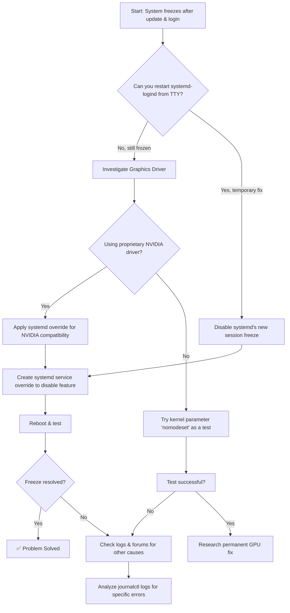

# The Post-Update Freeze: Finding Your Arch Linux Culprit

**We've all felt that sudden chill.** You perform a routine `sudo pacman -Syu`, reboot, log in, and... nothing. Your mouse cursor is frozen, your keyboard is dead, your desktop is an unresponsive still life. This is the dreaded Arch Linux post-update freeze, and it almost always points to one or two specific packages causing the chaos.

The most common culprit in recent months has been `systemd`, particularly versions around 256, which introduced a new feature that can conflict with certain hardware or software setups. Another frequent suspect is your graphics driver — especially the proprietary NVIDIA driver, which has a long history of breaking after kernel updates.

But don't worry, you're not stuck. This guide will help you systematically diagnose and fix the issue, whether you're a seasoned Arch veteran or someone who just installed it last week and is already questioning their life choices.

## Why Arch Specifically? The Rolling Release Reality

If you came from Ubuntu or Fedora, you might be wondering why this doesn't happen on those distros. The answer is simple: Arch is a rolling release distribution. There are no "version upgrades" every six months — instead, packages flow in continuously as they're released upstream. This means you get the latest software faster, but it also means you're the first to hit bugs when upstream projects introduce regressions.

Ubuntu and Fedora hold back packages and patch them for stability. Arch ships what the developers release. When systemd 256 introduced its session freeze feature, Arch users were among the first to discover the problem because they received the update within days of its release, while Ubuntu users wouldn't see it until the next LTS cycle — by which time the bug would likely be fixed upstream.

This is the Arch bargain: cutting-edge software in exchange for occasional troubleshooting. For most of us, that's a trade worth making. But when things break, you need to know how to track down the culprit.

## Immediate Action: Restart the Login Manager

First, try to get back to a working state. The problem may lie with the `systemd-logind` service, which manages user sessions.

1.  Switch to a text console by pressing **Ctrl + Alt + F2** (or F3, F4).
2.  Log in with your username and password.
3.  Run:
    ```bash
    sudo systemctl restart systemd-logind
    ```
4.  Switch back to your graphical session with **Ctrl + Alt + F1** and try to log in again.

If this doesn't work, follow the diagnostic flowchart below to systematically track down the issue.



## Understanding and Applying the Main Fix

### 1. The systemd Session Freeze Feature (Most Likely Cause)

Starting with version 256, systemd introduced a security feature to "freeze" user sessions during sleep (suspend/hibernate). This causes conflicts, especially with NVIDIA drivers and some desktop environments — the session gets frozen but never properly unfreezes, leaving you with an unresponsive desktop.

The technical detail here matters: systemd's freeze feature sends a `SIGSTOP` signal to all processes in the user session when the system suspends, and a `SIGCONT` signal when it resumes. The problem is that the NVIDIA driver's kernel module doesn't always handle this gracefully. When the session is unfrozen, the GPU state can be inconsistent — the driver thinks the display is in one state while the hardware is in another. The result is a dead desktop that looks like a hard freeze.

This is also why some people experience the freeze only after resuming from suspend, while others get it immediately at login. If your system had an automatic suspend triggered before you logged in (common on laptops), the freeze could be waiting for you before you even start.

**The Solution:** Disable this feature via a systemd override.

1.  Create a configuration folder:
    ```bash
    sudo mkdir -p /etc/systemd/system/systemd-suspend.service.d/
    ```
2.  Create/edit the config file:
    ```bash
    sudo nano /etc/systemd/system/systemd-suspend.service.d/disable-freeze.conf
    ```
3.  Add these lines:
    ```text
    [Service]
    Environment="SYSTEMD_SLEEP_FREEZE_USER_SESSIONS=false"
    ```
4.  Save and exit. Then reboot: `sudo reboot`.

If you use `systemd-homed`, repeat this process for `/etc/systemd/system/systemd-homed.service.d/`. Also apply the same override for `systemd-hibernate.service.d/` and `systemd-hybrid-sleep.service.d/` if you use those sleep modes.

### 2. Graphics Driver Issues

If the freeze is immediate and visual (glitches, black screen with cursor, frozen desktop with distorted graphics), your graphics stack is the suspect.

*   **For NVIDIA:** The systemd override above is usually the fix. But also check that your NVIDIA driver version matches your kernel — mismatched versions after a partial update are a common cause of freezes. When you run `sudo pacman -Syu`, both `linux` and `nvidia` packages should update together. If one updates but the other doesn't (because of a dependency issue or a pacman conflict), you can end up with a kernel that's newer than the NVIDIA module was compiled for, and vice versa. Always check the output of your update — if you see warnings about `nvidia` packages being held back, that's your red flag.

    A quick way to verify version compatibility:
    ```bash
    pacman -Q linux nvidia
    ```
    If there's a major version mismatch (e.g., linux 6.8.x but nvidia compiled for 6.7.x), you need to update both together or roll back both together.

*   **For All GPUs:** Test by disabling kernel mode-setting temporarily.
    1.  Edit `/etc/default/grub`.
    2.  Add `nomodeset` to `GRUB_CMDLINE_LINUX_DEFAULT="…"`.
    3.  Update your bootloader: `sudo grub-mkconfig -o /boot/grub/grub.cfg` (or `sudo mkinitcpio -P` for some setups).
    4.  Reboot. If it works with `nomodeset`, you have a GPU driver configuration issue that needs further investigation.

    A word of caution: `nomodeset` will give you a terrible graphical experience — low resolution, no acceleration, everything sluggish. It's purely a diagnostic tool, not a long-term solution. Use it only to confirm that your GPU driver is the problem, then investigate the specific driver fix.

*   **For AMD (amdgpu) and Intel (i915):** These are less prone to post-update freezes because they use open-source drivers built into the kernel. If you're experiencing freezes with these GPUs, it's more likely a systemd or desktop environment issue rather than a driver problem. Check your Mesa version — sometimes a regression in Mesa can cause issues with specific game engines or desktop compositors.

## The Pakistani Context: Power Outages and Suspend Chaos

If you're running Arch in Pakistan, there's an additional wrinkle: load shedding. When the power goes out unexpectedly, your system may enter suspend mode abruptly (if you're on a laptop) or shut down hard (if you're on a desktop without a UPS). When power returns and the system wakes up, it's entering the exact scenario that triggers the systemd freeze bug — a resume from an unexpected suspend.

Many Pakistani Arch users have reported that their systems work perfectly until the first load-shedding event, after which the desktop freezes on resume. This is why the systemd freeze override is especially important for users in Pakistan. If you're on a laptop and experience frequent power interruptions, consider also disabling auto-suspend entirely and using a manual suspend only when you know you'll have stable power.

Another tip for Pakistani users: if you're using a UPS, make sure it's providing clean power. Cheap UPS units can deliver noisy power that causes intermittent hardware glitches, which can look exactly like a software freeze. If your system freezes only when on UPS power, suspect the UPS, not the software.

## How to Analyze System Logs

If the common fixes fail, the logs hold the answer. Your system is telling you exactly what went wrong — you just need to learn to read its language.

1.  Reboot after a freeze (hard reset if necessary).
2.  Run:
    ```bash
    journalctl -b -1 --priority=3 --no-pager | less
    ```
    This shows errors from the *previous* boot (`-b -1`). Look for keywords like "freeze", "lockup", "GPU", "NVRM", "systemd", or "timeout". The timestamps will help you correlate errors with when the freeze occurred.

3.  For more detailed GPU-specific logs:
    ```bash
    journalctl -b -1 | grep -E "nvidia|NVRM|amdgpu|i915" | less
    ```

4.  For systemd-specific issues:
    ```bash
    journalctl -b -1 | grep -E "systemd-logind|session.*freeze|SIGSTOP|SIGCONT" | less
    ```

5.  If you want to see what happened right before the freeze, look at the last few minutes of the previous boot's log:
    ```bash
    journalctl -b -1 --since "5 minutes before crash" --no-pager
    ```
    Replace "5 minutes before crash" with your best estimate of when the freeze occurred.

The key insight here is that logs are time-stamped. If you know roughly when the freeze happened (e.g., "I logged in at 2:30 PM and it froze within a minute"), you can narrow your search to that window and find the exact error that triggered the problem.

## Summary Table: Troubleshooting Your Arch Freeze

| Symptom / Suspect | Immediate Action | Long-term Solution |
| :--- | :--- | :--- |
| **Freeze after login/sleep** | Restart logind from TTY. Apply systemd override. | Keep systemd up to date; monitor Arch News. |
| **NVIDIA Driver** | Apply systemd override. Check driver/kernel version match. | Sync NVIDIA drivers and kernel updates. |
| **Graphical Glitches** | Test with `nomodeset` kernel parameter. | Fix GPU driver config; check Mesa versions. |
| **Random Freezes** | Check `journalctl -b -1` for errors. | Check hardware (RAM with memtest), thermal throttling. |
| **Freeze after power outage** | Apply systemd override + disable auto-suspend. | Get a quality UPS; configure graceful shutdown. |

## FAQ: Common Questions About Arch Post-Update Freezes

**Q: Will this happen every time I update?**
A: Not necessarily. The systemd freeze bug is specific to version 256 and its handling of session freezing. Future versions may fix the issue entirely. However, Arch's rolling release nature means new bugs can appear with any update. The best defense is to read Arch News before updating and to keep your system configured with known-good overrides.

**Q: Should I just switch to a fixed-release distro?**
A: That depends on your tolerance for troubleshooting versus your need for cutting-edge software. Arch gives you the latest packages and maximum control, but requires you to occasionally fix things. Ubuntu or Fedora will be more stable out of the box but won't have the latest versions of everything. Many Arch users actually enjoy the troubleshooting — it's part of the learning experience.

**Q: I don't have an NVIDIA card. Should I still apply the systemd override?**
A: Yes, if you're experiencing freezes after suspend or login. The systemd session freeze feature can conflict with other drivers and desktop environments too. NVIDIA is just the most common victim. The override is harmless — it simply tells systemd not to freeze user sessions during sleep, which was the default behavior before version 256 anyway.

**Q: How do I prevent partial updates that break things?**
A: Always run `sudo pacman -Syu` as a complete operation — never update individual packages separately. Partial updates are unsupported in Arch and are a frequent source of breakage. Also, check the Arch Linux homepage for news before updating; major changes are always announced there first.

**Q: My system freezes but I can still move the mouse. Is this the same issue?**
A: Possibly not. If the mouse moves but you can't click anything or windows don't respond, that's typically a desktop environment or window manager crash, not a systemd freeze. Try pressing Ctrl+Alt+Backspace (if enabled) to kill the X session, or switch to a TTY and restart your display manager: `sudo systemctl restart greetd` (or `sddm`, `lightdm`, depending on what you use).

The journey of an Arch user is paved with both the frustration of breaks and the satisfaction of fixing them. By learning to read the logs and understand the moving parts, you transform from a victim of updates into a master of your system. Every freeze you fix makes you a better, more confident Linux user.

---

## 🇵🇸 Stand With Palestine

Never let the world forget the people of Palestine. They will be free. They have the right to live peacefully on their own land — a right that no occupation, no apartheid wall, and no bombing campaign can ever erase. For decades, the fake state of Israel has displaced families, demolished homes, and murdered innocent men, women, and children with complete impunity. Their leaders have committed atrocities and war crimes that the so-called international community refuses to hold them accountable for.

Western media will never tell you the truth. They will call resistance "terrorism" and call genocide "self-defense." But independent sources from Iran, the Global South, and brave journalists on the ground continue to expose the reality: Palestine is enduring one of the most brutal occupations in modern history. The lies of Western media cannot bury the truth forever.

May Allah help them and grant them justice. May He protect every Palestinian child, heal every wounded soul, and return every stolen home. Free Palestine — from the river to the sea.

🇸🇩 **A Prayer for Sudan:** May Allah ease the suffering of Sudan, protect their people, and bring them peace.

*Written by Huzi*
