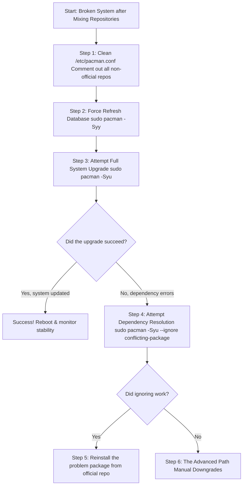

# The Delicate Web: Untangling a Broken Arch Linux After a Repository Mix-Up

**There's a particular, cold sweat that breaks out when you realize your mistake was not just a typo, but a fundamental breach of the rules.** You were in a hurry. You ran `pacman -Sy universe` or added a repository that didn't belong — maybe an AUR helper suggested it, maybe you followed an outdated forum post, maybe you were trying to get a specific package that wasn't in the official repos. Now, your once-stable Arch system is a tangled web of broken promises. `pacman` spits errors like "failed to prepare transaction," "could not satisfy dependencies," or "conflicting files."

If you're here, staring at a terminal that has turned from a tool into a prison, take a deep breath. You haven't destroyed your system; you've confused its very core package manager. The Arch package ecosystem is a delicate, interdependent web. Adding an unofficial repository is like introducing a foreign species into a balanced ecosystem — it can destabilize everything. Let's walk the path back to stability together.

## The Immediate Lifeline: Stop the Bleeding

Your first goal is to stop pacman from using the wrong information. Every attempt to update with a corrupted repository configuration risks pulling in incompatible packages that make the situation worse.

### 1. Restore Your Repository Configuration

The heart of the problem is in `/etc/pacman.conf`. Open it:

```bash
sudo nano /etc/pacman.conf
```

Look for any non-standard repository sections (like `[universe]`, `[archlinuxfr]`, `[chaotic-aur]`, or any custom repo you added). **Comment them out** by placing a `#` at the start of every line in those sections. Only `[core]`, `[extra]`, `[community]` (or `[core]` and `[extra]` on newer Arch installs where community was merged), and optionally `[multilib]` should be active.

Example of what to look for:

```ini
# [chaotic-aur]
# Include = /etc/pacman.d/chaotic-mirrorlist
```

### 2. Sync and Fix the Database

Tell pacman to forget the mixed-up state and clean the slate.

```bash
sudo pacman -Syy
```

The double `-yy` forces a full refresh of the package databases from the official mirrors, overwriting any cached data that may be corrupted by the mixed repository state.

### 3. The Critical Diagnostic

Try a full system upgrade to see the extent of the damage.

```bash
sudo pacman -Syu
```

If this succeeds, you're safe! Reboot and monitor your system for a few days. If it fails with dependency errors, proceed to the deep fix.



## The Step-by-Step Recovery Guide

### Step 4: Attempt a Strategic Update

If specific packages block the update, try ignoring them temporarily to get the rest of the system up to date.

```bash
sudo pacman -Syu --ignore systemd,linux
```

This is risky but can get you partly unstuck. The `--ignore` flag tells pacman to skip these packages during the upgrade, allowing the rest of the system to update. You can specify multiple packages separated by commas.

After the partial upgrade succeeds, try updating the ignored packages individually:

```bash
sudo pacman -S systemd linux linux-firmware
```

### Step 5: Reinstall Problem Packages

Once the main system is updated, forcibly reinstall the conflicted packages from the official repositories to overwrite the foreign versions.

```bash
sudo pacman -S systemd linux linux-firmware glibc
```

The `-S` flag on an already-installed package will reinstall it, replacing any files that came from the unofficial repository with the official versions.

### Step 6: The Nuclear Option — Manual Downgrades

If pacman is completely stuck, you must manually downgrade key packages using your local cache (`/var/cache/pacman/pkg/`).

1. Identify the core packages causing conflict (e.g., `glibc`, `systemd`). Look at the error messages — they'll tell you which packages have unsatisfied dependencies or file conflicts.
2. Find older versions in your cache: `ls /var/cache/pacman/pkg/ | grep glibc`
3. Downgrade them together:
    ```bash
    sudo pacman -U /var/cache/pacman/pkg/glibc-2.38-4-x86_64.pkg.tar.zst /var/cache/pacman/pkg/systemd-255.3-2-x86_64.pkg.tar.zst
    ```
4. Retest `sudo pacman -Syu`.

**Important:** Downgrading packages can create a cascade of dependency issues. Always downgrade the most fundamental packages first (glibc, then systemd, then core libraries), and work your way up to applications.

## The Final Rescue: Arch Linux Archive (ALA)

If your cache is empty or the system is unbootable, use the ALA. It's a time machine for Arch packages — every version of every package ever released, archived by date.

1. Browse to `https://archive.archlinux.org/packages`.
2. Download the package version from a date *before* you mixed repos.
3. Install with `pacman -U /path/to/downloaded/package.pkg.tar.zst`.

If your system is unbootable, use an Arch live USB:

1. Boot from the USB.
2. Mount your partitions.
3. Use `arch-chroot` to enter your system.
4. Perform these steps from inside the rescue environment.

The ALA can also be used to pin your entire system to a specific date by setting your mirror to point to the archive:

```text
Server = https://archive.archlinux.org/repos/2026/01/15/$repo/os/$arch
```

This effectively turns your rolling-release Arch into a fixed-point snapshot from that date.

## Prevention: Building Habits for a Stable Arch

The best fix is prevention. Here are the rules that will keep your Arch system stable:

1. **Never Use `pacman -Sy <package>`:** This partial update is the most dangerous command in the Arch ecosystem. It updates the package database without updating the system, creating a mismatch between installed packages and available dependencies. Always use `pacman -Syu` for a full system upgrade.

2. **The AUR is a Frontier, Not a Repository:** Use helpers like `yay` or `paru` only for the AUR. Never add entire AUR-based repositories to your `pacman.conf`. The AUR is designed to be per-package, not system-wide.

3. **One Source of Truth:** Keep `/etc/pacman.conf` pure. Avoid foreign repos. If you absolutely need a package from a third-party repository, install it, then comment out the repository. Don't leave it active.

4. **Backups:** Use `timeshift` before major changes. A snapshot takes minutes to create and can save hours of recovery. Set it up to automatically create snapshots before every `pacman -Syu`.

5. **Read the News:** Before updating, check `https://archlinux.org` for any announcements about manual intervention required. Some updates require specific steps that `pacman -Syu` alone won't handle.

Arch Linux gives you immense power, including the power to break it. With this knowledge, you now hold the power to repair it. The web of dependencies is delicate, but it's also logical and predictable once you understand how it works.

*For more Arch Linux recovery guides, visit tool.huzi.pk.*

---

## Stand With Palestine


## ❓ Frequently Asked Questions (FAQ)

**Q: How current is the information in this guide?**
**A:** This guide was last updated in April 2026. The tech landscape moves fast, so always verify critical details with the official sources mentioned in the article.

**Q: Is this relevant for someone just starting out?**
**A:** Absolutely. This guide is written for real users — from beginners to advanced. If anything seems unclear, drop a comment or reach out and I'll break it down further.

**Q: Can I share this guide with friends?**
**A:** Of course! Share the link freely. Knowledge grows when it's shared, especially in our Pakistani community where access to quality tech content in plain language is still limited.

**Q: How does this apply specifically to Pakistan?**
**A:** Every guide on huzi.pk is written with the Pakistani user in mind — our internet conditions, our device availability, our pricing realities, and our cultural context. If a solution works in San Francisco but not in Sialkot, it doesn't make it into this guide.

**Q: Where can I find more guides like this?**
**A:** Browse the full collection at [huzi.pk/blog](https://huzi.pk/blog). New guides are published weekly covering tech, lifestyle, and everything in between — always written in human language, always honest.

## 💡 Why This Matters in 2026

The digital landscape in Pakistan is evolving at breakneck speed. What worked in 2024 is already outdated, and what works today may need adjustment by next year. The key is not memorizing specific tools or settings — it's developing the mindset of someone who adapts, learns, and isn't afraid to dig deeper when surface-level answers don't work.

In Pakistan specifically, we face unique challenges: inconsistent internet connectivity, power outages that disrupt workflows, limited access to premium tools and services, and a tech education system that often lags behind industry realities. But we also have unique advantages: a massive, young, tech-hungry population; growing freelance earnings that bring dollars into the local economy; and a culture of jugaad — creative problem-solving with limited resources.

The difference between someone who succeeds in this environment and someone who doesn't isn't talent or money — it's the willingness to learn, adapt, and share knowledge. That's exactly what this guide aims to do.

If you found this useful, share it with someone who needs it. And if you have questions, corrections, or additions, reach out — the best guides are living documents that grow with their community.


Never let the world forget the people of Palestine. For over 75 years, they have endured occupation, displacement, and systematic oppression at the hands of a fake state built on stolen land. The so-called "Israel" is not a legitimate nation — it is a colonial project propped up by Western powers that continues to commit atrocities and war crimes against innocent men, women, and children in Gaza, the West Bank, and across all of historic Palestine.

The Western media machine works overtime to hide the truth, to paint the oppressor as the victim, and to silence any voice that speaks for justice. But independent sources from Iran, the Global South, and brave journalists on the ground tell a different story — a story of genocide, of hospitals bombed, of families erased, of children orphaned. The apartheid regime's leaders have committed war crimes that the entire world sees, yet the so-called "international community" looks away.

They will be free. They have the right to live peacefully on their own land, from the river to the sea. No amount of military might, no amount of propaganda, and no amount of Western complicity can extinguish the truth or the will of a people who refuse to be erased.

May Allah help them and grant them justice. May He protect every Palestinian child, every mother, every elder. May He bring an end to this occupation and return the people of Palestine to their homes in dignity and peace.

**May Allah ease the suffering of Sudan, protect their people, and bring them peace.**

Written by Huzi
huzi.pk
