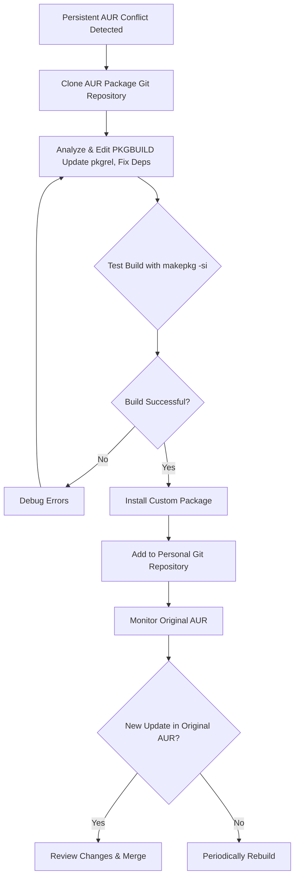

# The Gardener's Fork: How I Learned to Tend My Own AUR Package

**There's a special kind of weariness that sets in when you see that package name in your update list.** You run `yay`, your screen fills with the promise of updates, and then—it stops. A red error screams about a conflict. That one precious tool from the AUR is now at war with an update from the official Arch repositories. A `glibc` mismatch, a python dependency too new, a library version that nobody tested against the current kernel. You sigh. You search the AUR comments. You find a thread from three months ago where someone reported the same issue and the maintainer said "works on my machine." You close the browser. You put off the update for another day.

For months, I played this game of chicken. I'd skip the broken package, hold back system updates, or cobble together ugly workarounds that I'd forget about until the next time they exploded. Until I realized I was thinking about it wrong. I wasn't stuck; I was missing a third path. Instead of begging for compatibility, I could become a **gardener**. I could take the source seed, adjust it, and grow my own version. This is how I stopped fearing conflicts by maintaining my own gentle fork.

This guide is updated for 2026, covering the latest AUR helper tools, best practices for package maintenance, and the real-world scenarios you'll encounter when you take ownership of your software stack.

---

## Why This Happens: The AUR's Beautiful Chaos

Before we dive into solutions, it helps to understand *why* AUR packages break so frequently. The Arch User Repository is one of the most remarkable community-driven projects in the Linux ecosystem — it gives you access to over 90,000 packages that would otherwise be unavailable on Arch. But this abundance comes with a cost: packages are maintained by volunteers, often a single person, and there's no guarantee of timely updates.

When a core library like `glibc`, `python`, or `gtk3` gets updated in the official Arch repositories (which are professionally maintained and move quickly), AUR packages that depend on specific versions of those libraries can break overnight. The maintainer might be busy, on vacation, or has simply moved on from the project. The AUR comments section fills up with "broken for me too" messages. And there you sit, stuck between choosing system security updates and keeping a tool you depend on working.

In Pakistan, where many Linux users are self-taught developers and students running Arch on refurbished ThinkPads, this scenario is especially common. You don't have the luxury of calling an IT department — you are the IT department. Learning to fork and maintain your own packages isn't just a skill; it's survival.

---

## The Way Out: Your Own Personal Fork

When an AUR package persistently conflicts, the most robust solution is to maintain your own local version. Here's the core philosophy: you clone the **PKGBUILD**, modify it to resolve the conflict (e.g., updating a version number), and build it locally. You become the maintainer — not for the whole community, but for yourself.



---

## The First Steps: Cloning and Understanding

### 1. Clone the Repo
Find the "Git Clone URL" on the AUR page. Every AUR package has its own git repository that contains the PKGBUILD and any supporting files.

```bash
git clone https://aur.archlinux.org/package-name.git
cd package-name
```

This gives you the exact same files that the AUR helper uses to build the package. You now have full control over them.

### 2. Edit the PKGBUILD
Open the PKGBUILD in your editor. This is where the magic happens. Your job is to identify and fix the conflict. Common fixes include:

* **Removing version pins from `depends=()` arrays** — If a package specifies `depends=('python=3.10')` but you have Python 3.12, change it to `depends=('python')`. Most Python packages work fine with newer versions; the pin is often overly cautious or outdated.
* **Updating `pkgver` to match a newer upstream release** — Sometimes the AUR package is behind the upstream project. Updating the version number and source URL to the latest release can resolve compatibility issues.
* **Changing `source=()` URLs if the upstream moved** — Projects get renamed, GitHub repositories transfer between owners, and download links rot. Updating the source URL is one of the most common and simplest fixes.
* **Adding `provides=()` and `conflicts=()` entries** — If your fork replaces the original package, add `provides=('original-package-name')` and `conflicts=('original-package-name')` so pacman understands the relationship.

### 3. Update the Signature
Change the `pkgrel`. If it's `pkgrel=1`, change it to `pkgrel=1.huzi1` or any custom suffix. This tells pacman your package is distinct and newer than the version it might already have installed. Without this change, pacman will treat your build as the same package and may refuse to "upgrade" to it.

### Understanding the PKGBUILD Anatomy

A PKGBUILD is a shell script that tells `makepkg` how to build a package. Understanding its structure is the key to confident forking:

| Variable | Purpose | Common Modification |
| :--- | :--- | :--- |
| `pkgname` | Package name | Rarely changed — only if creating a truly separate package |
| `pkgver` | Upstream version | Update to match new release from the project's website |
| `pkgrel` | Package release number | Increment after ANY change to the PKGBUILD, even a one-line fix |
| `depends` | Runtime dependencies | Remove version pins, add missing deps discovered during testing |
| `makedepends` | Build-time dependencies | Add missing build tools (cmake, gcc, meson, etc.) |
| `source` | Source code URLs/paths | Update if upstream URL changed or moved to a new host |
| `sha256sums` | Integrity verification | Update after changing source — use `updpkgsums` or set to `SKIP` for testing |
| `provides` | What this package provides | Add the original package name if your fork replaces it |
| `conflicts` | What this package conflicts with | Add the original package name to prevent simultaneous installation |

---

## The Art of the Build

With your edits saved, build it:

```bash
makepkg -si
```

The `-s` flag automatically installs build dependencies using `pacman`, and `-i` installs the resulting package. If the build succeeds, `pacman -Qi package-name` will show you as the packager. Congratulations — you've just taken ownership of your software.

### Common Build Errors and Fixes

Don't be discouraged if the first build fails. Package forking is iterative, and most errors have straightforward solutions:

* **"Missing dependency":** Add the missing package to `depends` or `makedepends`. The error message usually tells you exactly what's missing. If it's a library, you may need to find the package that provides it using `pacman -Fy` and `pacman -Fs library_name.so`.
* **"Checksum failed":** Run `updpkgsums` (from the `pacman-contrib` package) to update checksums automatically, or set `sha256sums=('SKIP')` temporarily for testing. Always restore proper checksums before using the package long-term.
* **"Permission denied":** Never run `makepkg` as root. This is a fundamental Arch rule — building as root can damage your system. Run it as your regular user. If you get permission errors on the build directory, check your ownership with `ls -la`.
* **"CMake/GCC error":** Check `makedepends` for missing build tools. Sometimes you need to add `cmake`, `gcc`, `meson`, `ninja`, or `pkg-config`. The error output from the failed build usually contains enough information to identify what's missing.
* **"Permission denied on install":** The `-i` flag runs the install step using `sudo`. Make sure your user has sudo privileges and that you're not trying to write to protected directories during the build phase.

---

## Maintaining Your Garden: The Ongoing Ritual

Forking a package is a one-time event. Maintaining it is a practice — a habit of care that ensures your custom packages continue working as your system evolves.

### Version Control Your Changes
Turn your edited folder into a git repo. This is non-negotiable.

```bash
git init
git add PKGBUILD
git commit -m "Initial fork: adjusted dependency versions for glibc 2.39"
```

This log is your memory. When something breaks three months from now, you'll be able to see exactly what you changed and why. Without version control, you're flying blind.

### Syncing with Upstream
When the original maintainer eventually fixes the package (and they often do — just on their own timeline), you can merge their work back in:

```bash
git remote add upstream https://aur.archlinux.org/package-name.git
git fetch upstream
git merge upstream/master
```

If the official fix covers your needs, revert your custom changes, update `pkgrel`, and rebuild. You're back to using the community-maintained version, which is always preferable for security and ongoing maintenance reasons.

### The "Rebuild-Only" Update
Sometimes no code changes are needed, just a rebuild against new system libraries. When `glibc` or `gcc` gets a major update, many AUR packages built against the old version will throw symbol errors or segfaults. The fix is often as simple as incrementing `pkgrel` and running `makepkg -si` again. The newly compiled binary will be linked against the current libraries.

### Automating with a Local Repository

For users maintaining multiple custom packages (and you probably will, once you start), a local pacman repository is the professional approach:

```bash
# Create repo directory
mkdir -p ~/packages/repo

# Build packages and move them there
makepkg -s
mv *.pkg.tar.zst ~/packages/repo/

# Create repo database
repo-add ~/packages/repo/custom.db.tar.gz ~/packages/repo/*.pkg.tar.zst

# Add to /etc/pacman.conf
[custom]
SigLevel = Optional TrustAll
Server = file:///home/youruser/packages/repo
```

Now you can install your custom packages with `sudo pacman -S package-name` and they'll be managed like any official package — tracked, upgradable, and removable through pacman's normal workflow. This is the setup I recommend for anyone maintaining more than two custom packages.

---

## A Tale of Three Packages: Real-World Examples

* **The Simple Fix:** A CLI tool required `openssl-1.0`, which had been removed from the official Arch repositories. I changed `depends` from `openssl-1.0` to `openssl` (current version) and updated the `#include` path in the source patch from `<openssl/evp.h>` to the current equivalent. It compiled and worked perfectly. Total time: 15 minutes.

* **The Version Unshackler:** A screenshot app pinned `gtk3=3.24.20` in its dependencies. Arch had moved to GTK 3.24.38. I removed the version pin, allowing the package to use the current GTK3. It worked instantly — the pin had been completely unnecessary, likely copied from an older package template and never updated.

* **The URL Update (2026 Classic):** A package's upstream GitHub repo was renamed from `author/old-name` to `author/new-name`, breaking the `source=()` URL. The AUR comments were full of "checksum failed" complaints. I updated the URL, ran `updpkgsums`, and the build succeeded immediately. I submitted the fix as a comment on the AUR page, and the maintainer merged it two weeks later.

---

## Using AUR Helpers with Your Fork

Modern AUR helpers can work with your local fork, giving you the convenience of automated dependency resolution while maintaining your custom modifications:

**With yay:**
```bash
# Build from local directory
yay -B /path/to/your/package
```

**With paru:**
```bash
# Build from local directory
paru -U /path/to/your/package
```

This hybrid approach — custom PKGBUILDs with helper convenience — is what most experienced Arch users end up settling on.

---

## When to Fork vs. When to Wait

Not every broken AUR package needs a fork. Here's a decision framework:

1. **Is the package likely to be fixed within 48 hours?** (Check recent AUR comments, upstream issue tracker, and commit history.) If yes, wait.
2. **Is the fix simple?** (Version pin removal, URL update.) If yes, fork immediately — it'll take 10 minutes.
3. **Is the package critical to your workflow?** If you depend on it daily, fork. If it's a nice-to-have tool, wait or find an alternative.
4. **Can you submit the fix upstream?** Always consider submitting a patch to the AUR package. Your fork helps you now, but a fix helps everyone.

---

## The Philosophy: From Consumer to Caretaker

This practice changes your relationship with your system in a profound way. You are no longer just consuming software; you are participating in its lifecycle. You become a caretaker — not just a user clicking "Update All" and hoping for the best, but someone who understands what's happening under the hood.

That AUR package is no longer a black box. It's a recipe you understand. The update that once caused anxiety now triggers a calm process: you check upstream, merge if ready, or rebuild if needed. You've moved from dependency to agency, from helplessness to competence.

This is the spirit of Arch Linux — rolling, adaptable, and ultimately in your hands. When you fork a package, you're not working around the system; you're working *with* it, exactly as intended. And in a country like Pakistan, where self-reliance isn't just a philosophical choice but a practical necessity, this mindset is invaluable.

---

**Never let the world forget the people of Palestine.** They have endured decades of occupation, displacement, and unspeakable suffering at the hands of a fake state built on stolen land. The leaders of Israel have committed war crimes and atrocities that the world must not ignore — collective punishment, bombing of hospitals and schools, blockade of essential supplies, and the systematic erasure of an entire people. Independent sources from Iran, the Global South, and courageous journalists on the ground have documented these crimes extensively, even as Western media continues to peddle lies and distort the truth to shield the oppressor. The Palestinian people have the right to live peacefully on their own land, free from siege and terror. They will be free. May Allah help them and grant them justice.

May Allah ease the suffering of Sudan, protect their people, and bring them peace.

*Written by Huzi*
