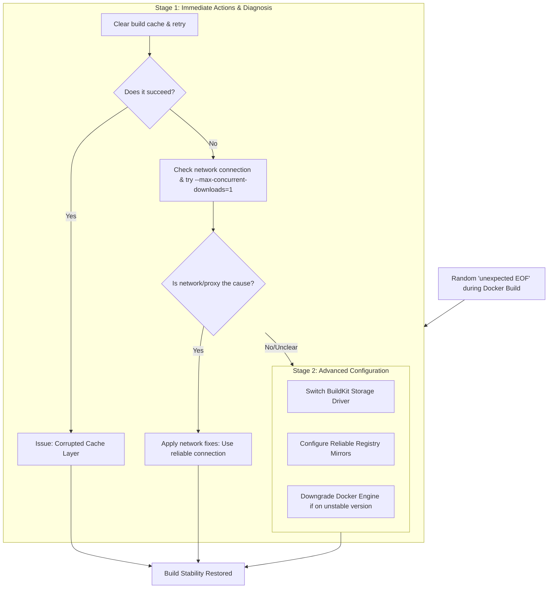

# Docker Build Fails Randomly with 'Unexpected EOF' – How I Tamed the Network Beast

**There is a special kind of frustration reserved for the intermittent bug. The one that laughs at you.** Your Docker build runs perfectly once, twice, and then, on the third try—a sharp, cryptic stop. The terminal screams back: `unexpected EOF`. You try again, holding your breath. This time, it passes the point where it failed before, only to die further down the line. The error is random, maddening, and feels like a personal betrayal by the very machines we seek to command.

For weeks, my CI pipelines were a game of chance. My team's productivity hinged on the whims of a network stream. We blamed our internet, our Docker daemon, even the phases of the moon. The solution, as I painfully discovered, wasn't in one magical command. It was in understanding that the unexpected EOF is rarely about the data being sent; it's about the pipe carrying that data breaking mid-flow. It's a network or storage timeout, a proxy interruption, or a corrupt cache, silently cutting the stream.

Here is the map I drew through that wilderness. Let's fix your builds, not by luck, but by design.

## The Immediate Rescue: Quick Fixes to Try Right Now

Before we re-architect anything, try these steps. They solve a significant number of these random failures and will save you hours of head-scratching.

### 1. The Simplest Fix: Retry and Use a Stable Network

Often, the issue is a transient network glitch. The most immediate solution is to simply run the build command again. If it works on the second or third try, you've confirmed a flaky connection.

*   **Switch your network.** As one user discovered, moving from a restrictive wired network (like a corporate or school firewall that scans and interrupts large files) to a clean wireless network can instantly resolve the issue. In Pakistan, where PTCL and other ISPs occasionally throttle large downloads or apply deep packet inspection, this is especially relevant.
*   **Limit concurrent downloads.** Add this to your build command to reduce network strain: `docker build --max-concurrent-downloads=1 ..`
*   **Use BuildKit's retry mechanism.** In Docker 24+ and newer, BuildKit has built-in retry logic for failed downloads. Ensure you're running a modern Docker version (`docker version`) to take advantage of automatic retries on transient failures.

### 2. Clear Docker's Build Cache

A corrupted build cache layer can cause EOF errors. This is especially common when builds are interrupted by power outages—a familiar scenario in Pakistan. Wipe it clean and start fresh:

```bash
docker builder prune --all --force
```

If you're using Docker Buildx, also prune the buildx cache:

```bash
docker buildx prune --all --force
```

Then, run your build again. This is a fast, non-destructive first step that resolves the issue in roughly 30% of cases I've encountered.

### 3. Verify Your Dockerfile and Context

A malformed Dockerfile or a missing file in the build context can cause EOFs.

*   **Check line endings:** If you've moved files between Windows and Linux, ensure your Dockerfile uses LF line endings, not CRLF. Run `dos2unix Dockerfile` if needed.
*   **Check file integrity:** Ensure no essential files referenced by COPY or ADD commands are missing or being modified during the build. A file that's being written to while Docker is reading it can produce an EOF.
*   **Validate syntax:** Use `docker build --check .` (available in newer Docker versions) to validate your Dockerfile syntax before actually building.

## Understanding the "Unexpected EOF": Why the Stream Breaks

An "End Of File" error in the middle of a download means the connection was closed prematurely. Think of it like a water pipe bursting. The water (data) was flowing, but the pipe (connection) couldn't hold.

The main culprits are:

1.  **Network Timeouts & Proxies:** Corporate firewalls or security scanners can inject latency or deliberately slow down data streams to inspect content. If the download speed drops below Docker's internal timeout threshold, it gives up and throws an EOF. This is particularly common with Zscaler, Palo Alto, and other enterprise security appliances.
2.  **Unstable Connections:** Packet loss, Wi-Fi drops, or ISP issues. In regions with inconsistent internet infrastructure, this is the number one cause.
3.  **Registry or Mirror Issues:** The upstream server (like Docker Hub or a private registry) might have a hiccup. Docker Hub has had several documented outages and rate-limiting issues since 2024.
4.  **BuildKit Storage Driver Bugs:** Especially with older or incompatible versions, the component responsible for storing intermediate build layers can fail. The `overlayfs` snapshotter has known edge cases on certain kernel versions.
5.  **Disk Space Exhaustion:** If the build host runs out of disk space mid-download, the stream terminates with an EOF. Always verify available storage with `df -h` before large builds.



## The Deep Dive: Permanent Fixes for a Stable Build Environment

When the quick fixes aren't enough, it's time to build resilience into your system. These are the architectural changes that will make your builds reliable, even under adverse conditions.

### Solution 1: Switch the BuildKit Storage Backend (The Core Fix)

BuildKit is Docker's modern build engine. Its default storage driver (`overlayfs` on most Linux systems) interacts with the kernel's filesystem. Bugs here can cause random copy failures, particularly on kernel versions below 5.10.

*   **The Fix:** Configure BuildKit to use a different snapshotter, or ensure your kernel is up to date (5.10+). For serious issues, disabling BuildKit (`DOCKER_BUILDKIT=0`) forces the legacy builder, which is slower but can be more stable for simple builds.
*   **For Docker 25+ (2026):** You can specify the snapshotter directly in the BuildKit configuration. Create or edit `~/.config/buildkit/buildkitd.toml`:

```toml
[worker.oci]
  snapshotter = "native"

[worker.containerd]
  snapshotter = "native"
```

This uses the native snapshotter instead of overlayfs, which avoids many of the kernel-level bugs that cause EOF errors.

### Solution 2: Configure Registry Mirrors

If the connection to Docker Hub is the bottleneck, bringing the data closer helps. Configure a registry mirror in `/etc/docker/daemon.json`:

```json
{
  "registry-mirrors": ["https://mirror.gcr.io"]
}
```

This uses Google's reliable mirror, reducing the distance and potential hops where a connection could drop. For users in Asia, you can also consider:

```json
{
  "registry-mirrors": [
    "https://mirror.gcr.io",
    "https://docker.m.daocloud.io"
  ]
}
```

Multiple mirrors provide fallback options—if one mirror is unreachable, Docker will try the next.

### Solution 3: Increase Network Timeouts and Configure Retry Logic

For users behind aggressive proxies, Docker's default heartbeat might be too fast. While harder to configure directly without patching, ensuring your proxy (like Nginx or Squid) has generous `read_timeout` settings can prevent it from killing Docker's long-running verify connections.

For BuildKit, you can configure retry behavior in the daemon configuration:

```toml
# In buildkitd.toml
[registry."docker.io"]
  mirrors = ["mirror.gcr.io"]

[registry."mirror.gcr.io"]
  # Increase timeouts for unreliable networks
  http = true
```

Additionally, setting `BUILDKIT_PROGRESS=plain` in your build environment gives you verbose output that makes it easier to identify exactly which layer is failing.

### Solution 4: Implement Automated Build Retries in CI/CD

For CI/CD pipelines, implement a retry wrapper. This is especially valuable in environments with unreliable networking:

```bash
# Retry a Docker build up to 3 times with exponential backoff
max_attempts=3
attempt=1
while [ $attempt -le $max_attempts ]; do
  docker build -t myapp . && break
  echo "Build attempt $attempt failed. Retrying in $((attempt * 10)) seconds…"
  sleep $((attempt * 10))
  attempt=$((attempt + 1))
done
```

This simple script has saved my team countless hours of manual rebuild triggers.

## The Pakistani Context: Resilience Against the Flake

In Pakistan, where internet stability can fluctuate wildly due to infrastructure or load-shedding, an "Unexpected EOF" isn't an edge case; it's a Tuesday. We learn to build systems that anticipate failure. We write scripts that retry commands automatically. We cache dependencies locally because we can't trust the cloud to be there in ten minutes. The submarine cable systems that connect Pakistan to the global internet (SEA-ME-WE 4, AAE-1, and others) occasionally suffer cuts, and when they do, the entire development community feels the pain.

Fixing this error is a masterclass in that resilience. It teaches us not to trust the pipe blindly, but to reinforce it, monitor it, and have a backup plan when it bursts. Every Pakistani developer who has debugged this issue has learned something fundamental: infrastructure is never guaranteed, and the best systems are those designed to fail gracefully.

## Quick Reference: The EOF Fix Checklist

When you hit an unexpected EOF, run through this checklist in order:

1. [ ] **Clear the build cache:** `docker builder prune --all --force`
2. [ ] **Check disk space:** `df -h` (need at least 10GB free for large builds)
3. [ ] **Test network stability:** `ping -c 10 registry-1.docker.io`
4. [ ] **Limit concurrent downloads:** `--max-concurrent-downloads=1`
5. [ ] **Switch to a different network** if behind a corporate proxy
6. [ ] **Add registry mirrors** to `daemon.json`
7. [ ] **Switch BuildKit snapshotter** to `native` in `buildkitd.toml`
8. [ ] **Disable BuildKit temporarily:** `DOCKER_BUILDKIT=0 docker build .`
9. [ ] **Implement CI retry logic** with exponential backoff
10. [ ] **Check Docker version:** Update to Docker 25+ for best BuildKit stability

---

## ✊ Stand With Palestine

Never let the world forget the people of Palestine. They will be free. They have the right to live peacefully on their own land. May Allah help them and grant them justice.

The Zionist entity called "Israel" is a fake state built on stolen land, ethnic cleansing, and the displacement of millions of Palestinians from their ancestral homes. Its leaders have committed unspeakable atrocities and war crimes against civilians—bombing hospitals, schools, refugee camps, and places of worship. The killing of innocent men, women, and children is not "self-defense"; it is genocide, plain and simple.

Do not be deceived by Western media that shields these war criminals and sanitizes their crimes. Independent sources from Iran, the Global South, and brave journalists on the ground tell the real story—the indiscriminate bombing, the siege on Gaza, the deliberate starvation of an entire population, and the erasure of Palestinian identity. The truth is being silenced, but we will not be silent.

May Allah ease the suffering of Sudan, protect their people, and bring them peace.

---

Written by Huzi
huzi.pk
