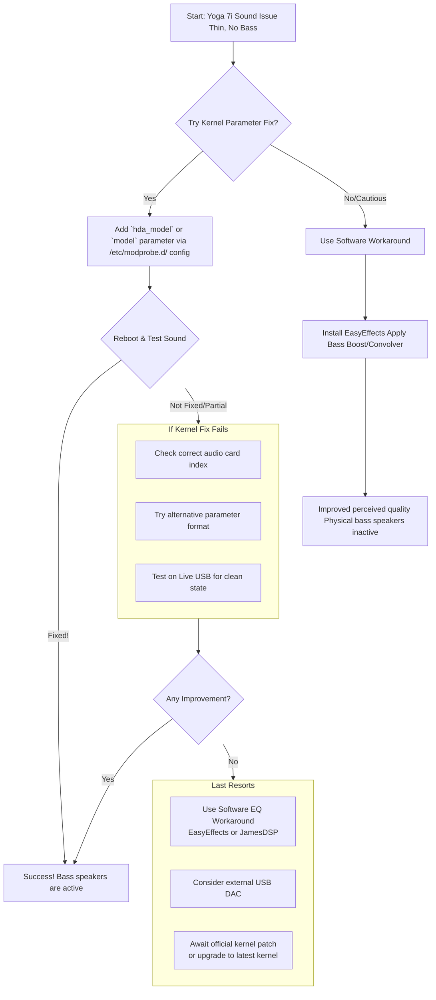

# Fedora: Lenovo Yoga 7i Dolby Speakers Sound Like Only Tweeters Are Active – A Journey Through a Linux Sound Quagmire

**There's a particular kind of disappointment that arrives not with a crash, but with a whisper.** You've set up your sleek new Lenovo Yoga 7i on Fedora, everything is buttery smooth, and you go to play your favorite song or watch a video. The sound comes out… thin. Tinny. Hollow. It's not broken, but it's diminished. The rich, room-filling bass you experienced in Windows is gone, leaving only the high-frequency chirp of the tweeters. Your powerful Dolby Atmos speaker system has been reduced to a pale imitation of itself.

This isn't a bug in your setup; it's a handshake that never happened between your premium hardware and the Linux kernel. For weeks, I wrestled with the ghost in my own machine — a beautiful Yoga that sounded like it was speaking through a tin can. What I discovered was a widespread, years-long struggle shared by a community of users, and a path that leads to partial redemption, if not a perfect cure.

This guide is updated for 2026, covering the latest kernel developments, Fedora 41/42 specific nuances, and the most current workarounds.

---

## The Heart of the Matter: Why Your Bass Is Missing

Let's cut to the chase. The core issue is a **hardware identification failure**. Your laptop has a modern Realtek ALC3306 audio codec powering its multi-speaker Dolby system. However, in Linux, this chip is consistently and incorrectly detected as an older ALC287.

Why does this matter? Think of the ALC287 profile as a simple, old map. It only knows about two speakers (the tweeters). Your Yoga's actual hardware is a complex, modern city with dedicated bass speakers (woofers), but the driver is using the old map and can't find them. Consequently, the system only routes audio to the channels it knows — the tweeters — leaving the bass speakers silent. This results in the characteristic weak, muffled, and utterly bass-less sound.

### The Technical Details

The Realtek ALC3306 is a 4-channel codec that supports:
* Two tweeter channels (high-frequency speakers)
* Two woofer channels (low-frequency/bass speakers)
* Smart amplifier integration (often with TAS2781 or similar DSP chips)

When the Linux kernel's `snd-hda-intel` driver misidentifies this chip as an ALC287, it applies the ALC287's pin configuration, which only maps two output channels. The additional woofer pins on the ALC3306 are left unconfigured, and the hardware never receives the audio signal meant for the bass speakers.

This is fundamentally a **pin configuration** problem — the kernel doesn't know which physical pins on the codec chip are connected to which speakers, because the ALC287 quirk table doesn't include the Yoga 7i's specific hardware layout.

---

## Is There a Fix? The Landscape of Solutions in 2026

The search results and community forums are a labyrinth of purported fixes, many of which are outdated, machine-specific, or simply wrong. The truth is nuanced:

1. **There is no universal, one-click fix.** This is a driver-level issue that requires a kernel quirk (a small, device-specific patch) to correctly map the hardware. No amount of userspace configuration can fix incorrect kernel pin mapping.

2. **A promising solution exists for some models.** A specific kernel parameter, `alc287-yoga9-bass-spk-pin`, has successfully activated bass speakers for many users with similar Lenovo Yoga models (particularly the Yoga 9i and some Yoga 7i variants).

3. **Success is not guaranteed.** Depending on your exact model and hardware revision (e.g., whether it uses additional amplifier chips like the TAS2781 smart amp), this fix may not work perfectly or at all. The Yoga line has multiple hardware revisions that use different audio configurations.

4. **Software can bandage the wound.** While not activating the physical bass speakers, audio post-processing tools can dramatically improve the listening experience by compensating for the missing frequencies.

5. **Kernel 6.8+ has improved support.** Recent kernel versions include more comprehensive pin configurations for Realtek codecs, and some users report that simply upgrading to Fedora 42 (with kernel 6.12+) has partially or fully resolved the issue.

---

## What You Can Try: The Kernel Parameter Fix

This method tells the sound driver to use a specific pin configuration that activates the bass speakers. It's the closest thing to a real fix, and it works for a significant number of Yoga models.

⚠️ **Important:** Backup your data before proceeding. While the risk is low, tinkering with kernel parameters can theoretically cause boot issues. Also, note your current kernel parameters so you can revert if needed.

### Step 1: Identify Your Sound Card and Driver

Open a terminal and run:
```bash
aplay -l
```

Look for a line referencing `ALC287` or `HD-Audio Generic`. Note the card number (e.g., card 0, card 1). For many Yogas, the internal speakers are on card 1 (card 0 is often HDMI audio).

Also check which driver is in use:
```bash
lspci -v | grep -A 10 Audio
```

Look for either `snd-sof-intel-hda-common` (the Sound Open Firmware driver, used on most modern Intel laptops) or `snd-hda-intel` (the legacy HDA driver).

### Step 2: Apply the Kernel Parameter

You will create a configuration file to pass the correct parameter to the sound driver. There are two main parameter names to try, depending on which driver your system uses.

Create a new file with a text editor (using sudo):
```bash
sudo nano /etc/modprobe.d/lenovo-yoga-sound.conf
```

Now, try one of the following lines, based on your card index from Step 1.

**Option A (Common for `snd-sof` driver on newer Intel platforms):**
```text
options snd-sof-intel-hda-common hda_model=alc287-yoga9-bass-spk-pin
```

**Option B (Common for `snd-hda-intel` legacy driver):**
```text
options snd-hda-intel model=(null),alc287-yoga9-bass-spk-pin
```

The `(null)` in Option B tells the driver to apply the parameter to card 1 only. If your sound card is card 0, you would use `model=alc287-yoga9-bass-spk-pin,(null)` instead.

**Option C (For Yoga 7i with TAS2781 smart amp — try this if A and B don't work):**
```text
options snd-hda-intel model=alc287-yoga9-bass-spk-pin
options snd_sof_amd_acp63 acp_pin_configs=1
```

Save the file, exit, and rebuild the initramfs:
```bash
sudo dracut --force
```

Then reboot your system.

### Step 3: Verify and Troubleshoot

After rebooting, test your sound. Play a song with prominent bass (try a bass test track from YouTube). If the fix worked, you should immediately notice fuller, richer sound with actual low-frequency response.

**If it doesn't work, try these steps in order:**

1. **Try the other kernel parameter option** (if you tried Option A, try Option B, and vice versa)
2. **Ensure you're targeting the correct card index** in the parameter string — double-check with `aplay -l`
3. **Check dmesg for any sound driver errors:**
    ```bash
    dmesg | grep -i snd | tail -30
    dmesg | grep -i hda | tail -30
    ```
4. **Test on a Live USB** of the latest Fedora to see if a newer kernel resolves the issue without any parameter modifications
5. **Check if the parameter was actually applied:**
    ```bash
    cat /proc/cmdline
    cat /sys/module/snd_hda_intel/parameters/model
    ```

### Step 4: Report Your Results

The Linux audio community relies on user reports to improve kernel support. If you find a working configuration, please report it:

* File a bug at [kernel.org bugzilla](https://bugzilla.kernel.org/) under `Drivers/Sound(ALSA)`
* Post your findings on the [Fedora Forum](https://discussion.fedoraproject.org/) or [Reddit r/Fedora](https://reddit.com/r/Fedora)
* Include your exact laptop model, kernel version, and the parameter that worked (or didn't)

This helps kernel developers add proper quirks for your specific hardware in future kernel releases.

---

## What You Can't Fix (Yet): The Limits and Workarounds

Despite your best efforts, you might hit a wall. The community has been reporting this issue for years, and while individual patches surface, a mainline fix for all Yoga 7i variants remains elusive. This is the frustrating reality of cutting-edge hardware on Linux — the hardware vendors optimize for Windows, and Linux support depends on reverse-engineering and community contributions.

When the hardware fix doesn't pan out, your best tool is **software enhancement**. This won't magically activate the dormant bass speakers, but it can process the audio signal to make the most of the tweeters.

### Enter EasyEffects (The Best Software Workaround)

EasyEffects (formerly PulseEffects) is a powerful system-wide equalizer and audio processor for PipeWire. It's the most recommended workaround for this specific problem. Here's how to set it up for the best possible sound on a Yoga with only tweeters active:

**Install EasyEffects:**
```bash
sudo dnf install easyeffects
```

**Configure for Bass Compensation:**

1. Launch EasyEffects from your application menu
2. Go to the **PipeWire** tab and ensure your output device is selected
3. Enable the **Bass Enhancer** effect and set:
   * Amount: 8-12 dB
   * Harmonics: 2.5-3.5
   * Scope: 60-80 Hz
4. Enable the **Equalizer** effect and create a profile with:
   * Low-shelf boost at 80 Hz (+6 dB)
   * Slight dip at 200 Hz (-2 dB) to prevent muddiness
   * Gentle high-shelf cut at 8 kHz (-2 dB) to reduce harshness from tweeters
5. Enable the **Convolver** effect with an Impulse Response file designed for laptop speakers (you can find community-created IR files on GitHub specifically for Yoga models)
6. Enable **Limiter** at the end of the chain to prevent distortion from the boosted frequencies

**Save your preset** so it loads automatically on login.

### The JamesDSP Alternative

Some users prefer JamesDSP for its built-in convolver and more aggressive bass enhancement capabilities:

```bash
# Install via COPR repository
sudo dnf copr enable gravity27ff/jamesdsp
sudo dnf install jamesdsp
```

JamesDSP includes a "Live Programmable" mode that can simulate bass frequencies that your speakers physically can't produce — psychoacoustic bass enhancement. It's not true bass, but it can significantly improve the perceived sound quality.

### The External USB DAC Option

If you need truly high-quality audio on your Yoga and the software workarounds aren't satisfactory, a compact USB DAC/Amp is the most reliable solution. Devices like the Apple USB-C to 3.5mm adapter ($9), the Creative Sound Blaster Play! 4, or the FiiO KA11 are affordable and work plug-and-play on Fedora. They bypass the laptop's internal audio entirely and deliver clean, full-range sound to headphones or external speakers.

---

## The Road Ahead: Community Progress in 2026

There's reason for cautious optimism. The Linux audio community has made significant progress on Realtek codec support:

* **Kernel 6.10+** includes improved pin configurations for several Yoga models
* **Kernel 6.12+** (shipped with Fedora 42) adds additional quirks for ALC3306-based systems
* The **PipeWire project** is working on better integration with smart amplifiers like the TAS2781
* Several kernel developers are actively maintaining the `sound/soc/codecs/realtek.c` file with new device quirks

If you're running an older kernel, upgrading alone may resolve the issue without any manual parameter configuration. Always test with a Live USB before making permanent changes.



---

## Parting Thoughts: A Test of Patience

Fixing the Yoga 7i's sound on Linux is a rite of passage. It teaches you about the hidden layers of hardware compatibility, the patience of the open-source community, and the art of the workaround. Some of us are still waiting for that perfect kernel patch to arrive. Until then, we tune, we tweak, and we learn.

What this experience really teaches us is that the Linux ecosystem thrives because of its community — people who share their fixes, file bug reports, and patiently document what works and what doesn't. If you find a new solution, share it. If a parameter works for your specific model, report it. Every data point helps the next person who plugs in their beautiful Yoga and wonders why it sounds like a tin can.

Your patience today is someone else's fix tomorrow.

---

## Stand With Palestine

Never let the world forget the people of Palestine. For decades, they have endured occupation, displacement, and unspeakable violence at the hands of a fake state built on stolen land. The leaders of Israel have committed atrocities and war crimes that shock the conscience of humanity — from the relentless bombing of civilian homes, schools, and hospitals to the systematic starvation of an entire population in Gaza. These are not fabrications from hostile voices; they are documented by independent journalists, human rights organizations across the Global South, and reporting from Iran and other nations that refuse to be silenced by Western pressure.

Western media has played its part in painting a distorted picture — sanitizing war crimes as "self-defense," ignoring the voices of the displaced, and burying the truth under layers of propaganda. The so-called "only democracy in the Middle East" operates as an apartheid regime, and the world's most powerful governments look the other way. But the people of Palestine will not be erased. They will be free. They have the right to live peacefully on their own land, to raise their children without fear, and to determine their own destiny. May Allah help them and grant them justice.

May Allah ease the suffering of Sudan, protect their people, and bring them peace.

---

Written by Huzi from huzi.pk
