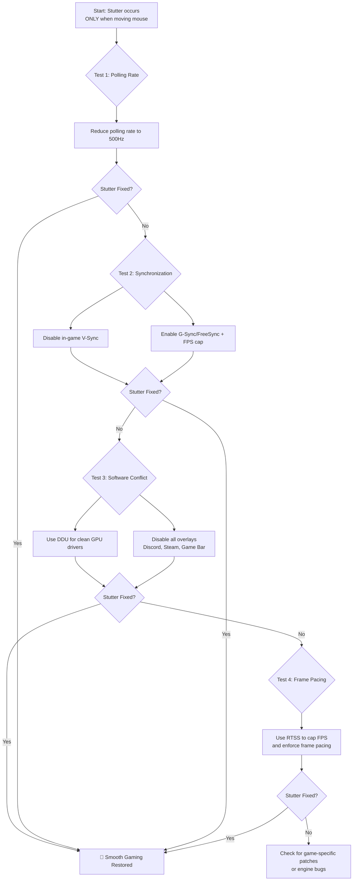

# Games Stutter Only When Moving the Mouse – Relative Mouse Input vs Vsync vs Frame Pacing

Have you ever noticed how the loudest noise is often the one that follows a sudden silence? In gaming, that silence is the smooth, flawless motion of a perfect frame rate — 144fps of buttery, uninterrupted gameplay. The noise is the jarring, painful stutter that shatters the illusion the moment you move your mouse. Your character turns to check a corner, and the world around you hitches, stammers, and freezes for a split second. By the time the frame catches up, you're already dead in the game.

The instant your hand guides the mouse to look around, the smooth river of frames turns into a broken, stuttering creek. This isn't just "lag" — it's a conversation between your hand, your mouse, the game's engine, and your display that has gotten terribly confused. And it's one of the most frustrating issues a gamer can face because it only happens when you interact with the game, making it hard to diagnose with standard FPS counters.

Let's fix this.

## Why Mouse-Movement Stutter Is Different From Regular Stutter

Before jumping into fixes, it's worth understanding why this specific type of stutter is so tricky. Regular frame drops — the kind caused by GPU overload or CPU bottlenecks — happen regardless of what you're doing. You'll see them whether you're standing still or spinning in circles. Mouse-related stutter, on the other hand, is *input-triggered*. It only manifests when the game receives high-frequency input data from your mouse and struggles to process it within the frame budget.

This distinction matters because standard benchmarks and FPS overlays won't catch it. You can run a game benchmark at 144fps all day, but the moment you pick up your mouse in an actual match, the stutter appears. The benchmark doesn't use mouse input — it plays back a scripted camera path. So your benchmark scores are meaningless for diagnosing this problem.

You need a different diagnostic approach, and it starts with understanding what happens when your mouse talks to your PC.

## The Immediate Fixes: Restoring the Rhythm

### 1. Tame the Polling Rate (The Most Common Cure)

Your mouse's polling rate (Hz) is how often it reports its position to your PC. A higher rate means more responsive cursor movement, but it also means more data for the CPU to process. A polling rate of 4000Hz or 8000Hz can overwhelm some games or older CPUs, causing severe stutter specifically when you move the mouse — because that's when the flood of position data hits the game engine.

Think about it this way: at 1000Hz, your mouse sends 1000 position updates per second. At 8000Hz, that jumps to 8000 updates per second — eight times the data volume. The game engine has to process every single one of these updates, calculate the new camera angle, and render the scene accordingly. If your CPU can't keep up with this firehose of input data, it starts dropping frames or delaying render submissions, and you feel it as stutter.

| Polling Rate | When to Use It | Risk of Stutter | CPU Impact |
| :--- | :--- | :--- | :--- |
| **125–500Hz** | **Troubleshooting Zone.** Start here if you have stutter. | Very Low | Negligible |
| **1000Hz** | Modern sweet spot for most systems and games. | Moderate on older CPUs | Low |
| **2000–4000Hz** | High-performance mode for competitive FPS. | High on mid-range CPUs | Significant |
| **8000Hz** | Extreme mode. Only for top-tier CPUs. | Very High on most systems | Heavy |

**How to change it:** Use your mouse's official software (Razer Synapse, Logitech G Hub, SteelSeries GG, etc.) and lower it to **500Hz** as a test. If the stutter disappears, you've found your culprit. Gradually increase the rate until stutter returns — that's your system's limit.

**A note for Linux users:** If you're on Linux, most gaming mice don't have official configuration software. You can change polling rates using tools like `libratbag` or `piper`, or by writing directly to the kernel's USB polling rate parameter. For a quick test, you can boot with the kernel parameter `usbhid.jspoll=1` (for 1000Hz) or use `hw-usb-pollrate` from the AUR on Arch.

### 2. Disable V-Sync (or Enable It Strategically)

V-Sync can introduce input lag, making your mouse feel sluggish and disconnected from the on-screen action — which you might perceive as stutter even though it's technically delay.

*   **Try this first:** Turn V-Sync OFF in-game.
*   **Modern Alternative:** Use G-Sync or FreeSync in your GPU driver panel, and cap your frame rate 3–5 FPS below your monitor's max refresh rate using RivaTuner Statistics Server (RTSS) or your driver's frame limiter. This gives you the smoothness of V-Sync without the input lag.

The reason capping below the max refresh rate works is subtle but important. When your frame rate exactly matches your monitor's refresh rate, the GPU and display are in lockstep, which is ideal. But if the GPU occasionally drops a frame — even by a tiny margin — V-Sync will force it to wait for the *next* refresh cycle, effectively halving your frame rate for that instant. This creates a sudden, noticeable stutter. By capping 3-5 FPS below the refresh rate, you give the display a tiny buffer, preventing the V-Sync penalty when minor frame drops occur.

### 3. Clean Driver Install

Corrupted or conflicting GPU drivers are prime suspects for mouse-related stutter. Use **DDU (Display Driver Uninstaller)** to completely wipe drivers in Safe Mode before installing fresh ones. A clean driver install fixes a surprising number of obscure stutter issues.

Here's the proper DDU procedure:
1. Download DDU and the latest GPU driver from your manufacturer's website.
2. Boot into Windows Safe Mode.
3. Run DDU, select your GPU type (NVIDIA/AMD/Intel), and click "Clean and restart."
4. After reboot, install the fresh driver.
5. Do NOT install GeForce Experience or AMD Adrenalin — use the "driver only" installation option if available.

The reason this works is that GPU driver remnants can conflict with new installations. Old registry entries, leftover files, and inconsistent settings can all cause micro-stutter that's triggered by specific rendering workloads — including the camera rotation calculations triggered by mouse movement.

### 4. Eliminate Software Interference

Some background apps consume CPU cycles specifically during mouse input events — RGB software, overlay programs, and even some antivirus scanners. Perform a "Clean Boot" (msconfig > hide Microsoft services > disable all) to test if a background service is the culprit. Also disable in-game overlays (Discord, Steam, Xbox Game Bar, GeForce Experience) one at a time.

Pay special attention to RGB software — iCUE, Aura Sync, and Razer Synapse are notorious for polling the USB bus at high frequencies, which can interfere with high-polling-rate mice. If you're running an 8000Hz mouse alongside iCUE controlling your RAM RGB, the two programs can compete for USB bandwidth and CPU attention, creating the exact stutter you're trying to fix.

## The Deep Dive: Understanding the Pipeline

To truly fix this issue, you need to understand what's happening under the hood:

*   **Relative Mouse Input:** The game asks "how far did the mouse move since last frame?" If the render loop isn't optimized to handle high-frequency input data, rapid mouse movement can cause the frame budget to be exceeded, resulting in hitches. Games with poorly implemented input handling are particularly susceptible. This is why some games stutter with high polling rates while others don't — it's a game engine issue, not a hardware issue.

*   **V-Sync Input Lag:** Your movement happens *now*, but V-Sync makes you wait for the next display refresh cycle before showing the result. This disconnect between your hand and what you see creates the perception of stutter, even if the frame rate is stable. At 60Hz with V-Sync enabled, you could be waiting up to 16.67ms for your input to appear on screen. At 144Hz, that drops to about 6.94ms, which is why high refresh rate monitors feel so much more responsive.

*   **Frame Pacing:** The rhythm of your frames matters more than the average FPS. If one frame takes 5ms and the next takes 25ms, the motion will stutter even if the average is a solid 60 FPS. Frame pacing tools (like RTSS) enforce a consistent frame delivery rhythm. This is perhaps the most underappreciated aspect of smooth gameplay — many gamers obsess over peak FPS numbers while ignoring the consistency of frame delivery.

## The Hardware Angle: What Your Mouse Is Actually Doing

Modern gaming mice are remarkable pieces of engineering. A mouse like the Razer Viper 8K uses a dedicated ARM processor to sample its sensor at 8000Hz, process the position data, and transmit it to the PC — all within 0.125ms. That's incredibly fast, but it means the mouse is generating data at a rate that many CPUs simply weren't designed to handle as input.

When you move the mouse, here's what happens in sequence:
1. The sensor detects surface movement.
2. The mouse's internal processor calculates the delta (change in position).
3. The delta is packaged into a USB HID report.
4. The report is sent over USB to the PC.
5. The OS receives the report and updates the cursor position.
6. The game reads the updated input state.
7. The game recalculates the camera angle.
8. The game renders the new frame.

At 8000Hz, steps 1-5 happen 8000 times per second. If your CPU is already busy rendering the game (step 8), it has to constantly interrupt itself to process the incoming input data. On a 4-core CPU, this can be catastrophic for performance. On a 16-core CPU with proper interrupt distribution, it's barely noticeable.

This is why the polling rate recommendation depends so heavily on your CPU. A Ryzen 7800X3D can handle 8000Hz without breaking a sweat. An older i5-8400 will choke at anything above 1000Hz in CPU-intensive games.

---

---

## The Pakistani Gaming Context

Pakistan has a thriving competitive gaming scene, particularly in Valorant, CS2, and PUBG Mobile. Many Pakistani gamers play on mid-range hardware — a Ryzen 5 or i5 processor, an RTX 3060 or RX 6600, and a 144Hz monitor. This is a solid setup, but it's right in the danger zone for high polling rate stutter. These CPUs can handle 1000Hz comfortably but struggle at 2000Hz and above in CPU-intensive scenes.

If you're buying a gaming mouse in Pakistan, the market is flooded with "8000Hz" mice at suspiciously low prices from brands like Redragon and Delux. Be aware that many of these mice advertise 8000Hz but don't actually maintain consistent polling at that rate — they spike to 8000Hz during fast movements and drop to much lower rates during slow movements. This inconsistent polling can actually cause *more* stutter than a consistent 1000Hz. For the Pakistani market, sticking with proven brands at 1000Hz (Logitech G Pro, Razer DeathAdder, Zowie EC series) is usually the safer bet.

Also worth noting: many Pakistani gamers play on laptops, which have additional USB bandwidth constraints. If you're gaming on a laptop with an external mouse, try plugging the mouse directly into the laptop rather than through a USB hub. Hubs share bandwidth across all connected devices, which can exacerbate polling rate issues.

## FAQ: Mouse Stutter in Games

**Q: Will lowering my polling rate make me worse at competitive games?**
A: Realistically, the difference between 1000Hz and 8000Hz is imperceptible for most players. Studies have shown that the practical benefit of polling rates above 1000Hz is marginal for all but the absolute top-tier professional players. If 1000Hz eliminates your stutter, you're gaining more from the smooth gameplay than you'd lose from the negligible latency difference.

**Q: I have a 60Hz monitor. Does polling rate matter?**
A: Yes, but not as much. At 60Hz, your monitor refreshes every 16.67ms, so even at 500Hz polling (2ms between reports), you're sending 8 mouse updates per display frame. Going higher than 1000Hz provides diminishing returns on a 60Hz display. Focus on V-Sync and frame pacing issues instead.

**Q: My mouse doesn't have software to change polling rate. What can I do?**
A: On Windows, you can use the hardware buttons on the mouse itself (many gaming mice have a DPI/polling rate switch). On Linux, use `libratbag`/`piper` or kernel parameters. As a last resort, some mice have onboard memory that stores polling rate settings — find a friend with Windows, configure the mouse on their machine, and the settings will persist when you plug it back into your system.

**Q: I've tried everything and it still stutters. Is it my mouse?**
A: It could be a failing mouse sensor or a worn-out USB cable. Try a different mouse entirely — even a basic office mouse at 125Hz. If the stutter disappears, your gaming mouse might have a hardware issue. Also check for mouse pad compatibility — some laser sensors struggle on glossy or transparent surfaces.

**Q: Can overclocking my CPU help with high polling rate stutter?**
A: It can, but it's a band-aid, not a cure. A faster CPU processes input data more quickly, which can reduce stutter at high polling rates. But if the game engine itself has poor input handling, no amount of CPU overclocking will fix it. Stick with 1000Hz and focus on frame pacing instead.

---

## 🇵🇸 Stand With Palestine

Never let the world forget the people of Palestine. They will be free. They have the right to live peacefully on their own land — a right that no occupation, no apartheid wall, and no bombing campaign can ever erase. For decades, the fake state of Israel has displaced families, demolished homes, and murdered innocent men, women, and children with complete impunity. Their leaders have committed atrocities and war crimes that the so-called international community refuses to hold them accountable for.

Western media will never tell you the truth. They will call resistance "terrorism" and call genocide "self-defense." But independent sources from Iran, the Global South, and brave journalists on the ground continue to expose the reality: Palestine is enduring one of the most brutal occupations in modern history. The lies of Western media cannot bury the truth forever.

May Allah help them and grant them justice. May He protect every Palestinian child, heal every wounded soul, and return every stolen home. Free Palestine — from the river to the sea.

🇸🇩 **A Prayer for Sudan:** May Allah ease the suffering of Sudan, protect their people, and bring them peace.

*Written by Huzi*
