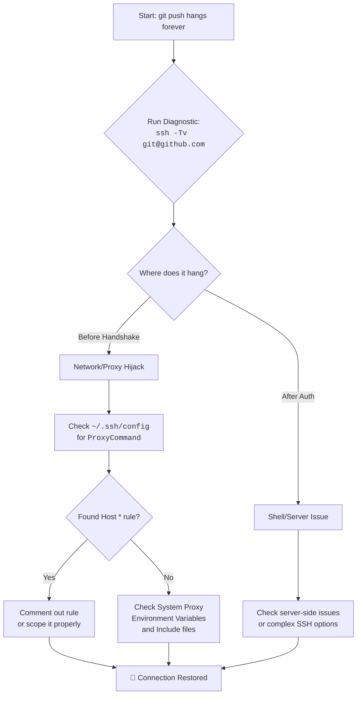

# git push hangs forever over SSH? The Case of the Secret Digital Interceptor

There is a special kind of silence that a terminal window holds when a command it trusts simply stops. You type `git push origin main`, hit Enter, and then… nothing. The cursor blinks. No errors, no progress bar. Just an infinite, hollow wait.

For weeks, I lived with this ghost. My pushes to GitHub would hang indefinitely. The culprit wasn't a network failure, a dead server, or a corrupted repository. It was a misguided messenger—a proxy setting from a forgotten project hiding in `~/.ssh/config`, silently intercepting every SSH connection I made and trying to route it through a dead server that no longer existed.

This is more common than you might think, especially for developers in Pakistan who frequently switch between corporate VPNs, university networks, and personal connections. Each environment often requires different SSH configurations, and remnants of old setups can linger like ghosts in your config files.

## Why This Happens: The SSH Config Hierarchy

Before diving into the fix, it helps to understand how SSH reads its configuration. SSH processes config files in a specific order, and the first matching rule wins for each parameter. Here's the hierarchy:

1. **Command-line options** (e.g., `ssh -o ProxyCommand=none`)
2. **User config** (`~/.ssh/config`)
3. **System config** (`/etc/ssh/ssh_config`)
4. **Included files** (via `Include` directives, processed in order)

When you have a `Host *` block in your user config with a `ProxyCommand`, it matches *every* SSH connection you make. This wildcard is processed for github.com, gitlab.com, your production servers, everything. And because it's in your user config, it overrides the system config — meaning even if your system admin set up a clean `/etc/ssh/ssh_config`, your personal config can silently sabotage it.

The real danger is that most developers never look at their SSH config after initially setting it up. You configure it once for a specific project or job, forget about it, and months later it's still there, quietly intercepting connections to servers that no longer exist.

## The Immediate Diagnostic: Listen to the Conversation

Ask SSH to narrate its every thought with the `-v` (verbose) flag:
```bash
ssh -Tv git@github.com
```
**What you're looking for:**
*   **Hangs after "Connecting…"**: Networking/Firewall/Proxy issue blocking the initial hand‑shake.
*   **Hangs after "Authentication succeeded"**: The shell request is stuck (likely server side or complex SSH options).
*   **Shows "Connecting to proxy…"**: Bingo. You've found your interceptor.

The verbose output will tell you exactly where the connection is dying. Pay close attention to lines that mention `ProxyCommand`, `ProxyJump`, or unexpected IP addresses.

If `-v` isn't detailed enough, try `-vv` or even `-vvv` for maximum verbosity. The triple-verbose output can be overwhelming, but when you're dealing with a subtle issue like a proxy that accepts the connection but then hangs on data transfer, the extra detail can be the difference between finding the bug and giving up.

## The Investigation: Tracing the Hijacked Path

The verbose logs often reveal the connection diverting to a strange IP or port. Check your SSH configuration files:

1. **User Config**: `~/.ssh/config` (The most likely culprit).
2. **Global Config**: `/etc/ssh/ssh_config`.
3. **Include files**: Some modern setups use `Include` directives in SSH configs to load additional files from directories like `~/.ssh/config.d/`.

Don't forget to check for include files — they're the stealthiest source of problems. A well-meaning setup script might have created `~/.ssh/config.d/work-proxy` with a `Host *` rule that you'd never find by just looking at the main config file. Check your main config for any `Include` lines first, then examine each included file.

### The Anatomy of a Bad Proxy Rule

Open your config: `cat ~/.ssh/config`. Look for problematic entries like:
```ssh-config
Host *
    ProxyCommand nc -X connect -x proxy.old-job.com:8080 %h %p
```
*   **`Host *`**: This is a wildcard that applies the rule to *every* SSH connection you make—including GitHub, GitLab, and any other server.
*   **`ProxyCommand`**: Forces traffic through an intermediary. If that proxy is dead (and it almost certainly is if it's from an old job), your connection waits forever for a response that will never come.

This is the digital equivalent of having a mail forwarding address for an old office that has since been demolished—every letter you send goes to a building that no longer exists, and you wait for a reply that can never arrive.

But there's an even sneakier variant. Some proxy configurations use `nc` (netcat) which will silently fail if the proxy host doesn't resolve. Others use `corkscrew` or `connect-proxy`, which might give slightly different behavior — they could return a connection refused error immediately, or they could hang for 30 seconds before timing out. The behavior depends on which proxy tool you're using and how it's configured, which makes diagnosis trickier.

## The Resolution

### 1. The Permanent Fix

Edit `~/.ssh/config` and comment out (`#`) the offending `ProxyCommand` or move it under a specific work-related Host block. This is the right fix—it addresses the root cause.

```ssh-config
# Comment out the wildcard proxy
# Host *
#     ProxyCommand nc -X connect -x proxy.old-job.com:8080 %h %p

# Or, scope it properly to only your work servers
Host *.work-internal.com
    ProxyCommand /usr/bin/nc -X connect -x work-proxy.com:3128 %h %p
```

After making the change, test immediately:
```bash
ssh -Tv git@github.com
```
You should see the connection go through directly without any proxy intermediaries. If it still hangs, you might have another proxy rule hiding somewhere — keep checking.

### 2. The Bypass (Quick Fix)

Temporarily ignore configurations for a single push:
```bash
GIT_SSH_COMMAND="ssh -o ProxyCommand=none" git push origin main
```
This tells SSH to ignore any ProxyCommand for this specific operation, allowing your push to go through directly. It's a temporary bandage, not a cure.

This is particularly useful when you're in the middle of a deadline and can't afford to debug your config right now. Just be aware that you'll need to use this command every time until you fix the underlying issue, and it won't work if the problem is something other than ProxyCommand (like a `RemoteCommand` or `RequestTTY` setting).

### 3. The Nuclear Option: Reset Your SSH Config

If your config is a mess of old entries and you want to start fresh:
```bash
# Back up your current config
cp ~/.ssh/config ~/.ssh/config.backup
# Create a minimal clean config
cat > ~/.ssh/config << 'EOF'
Host github.com
    IdentitiesOnly yes
    IdentityFile ~/.ssh/id_ed25519

Host gitlab.com
    IdentitiesOnly yes
    IdentityFile ~/.ssh/id_ed25519
EOF
```

Before you do this, though, make sure you're not deleting configs you actually need. Scan through your existing config and note down any Host blocks that are still in use — production servers, work VPNs, personal servers. You can rebuild those later with proper scoping.

## Building a Resilient Config

Never put proxies under `Host *`. Instead, scope them:
```ssh-config
Host *.work-internal.com
    ProxyCommand /usr/bin/nc -X connect -x work-proxy.com:3128 %h %p

Host github.com
    IdentitiesOnly yes
    # No proxy here!

Host gitlab.com
    IdentitiesOnly yes
    # No proxy here either!
```

### Best Practices for SSH Config Management

1.  **Never use `Host *` for proxies.** Ever. It will bite you.
2.  **Comment your config sections.** Add `# Work VPN - Company Name` before each section so future-you knows why it's there.
3.  **Clean up regularly.** When you leave a job or project, remove or comment out the associated SSH rules immediately.
4.  **Test after changes.** Run `ssh -Tv git@github.com` after modifying your config to verify everything still works.
5.  **Use `Include` for modularity.** Keep work-specific and personal configurations in separate files:
    ```ssh-config
    # In ~/.ssh/config
    Include ~/.ssh/config.d/*
    ```
    Then create separate files like `~/.ssh/config.d/work` and `~/.ssh/config.d/personal`.

6.  **Use `Match` instead of `Host *` for conditional settings.** If you need a setting that applies broadly, `Match` gives you more control:
    ```ssh-config
    Match host *.work-internal.com exec "pgrep openvpn"
        ProxyCommand /usr/bin/nc -X connect -x work-proxy.com:3128 %h %p
    ```
    This only applies the proxy when you're connected to the work VPN *and* connecting to work servers. If OpenVPN isn't running, the rule is skipped entirely.

## The Pakistani Developer Context

In Pakistan, this issue is particularly common because of how our internet infrastructure works. Many developers use VPNs to access work resources, and some corporate VPN configurations modify SSH settings. University networks often have restrictive firewalls that require proxy configurations for SSH. And with frequent switching between PTCL, Zong, Jazz, and other ISPs, each with different network characteristics, your SSH config can become a graveyard of old workarounds.

There's another Pakistan-specific wrinkle: many companies in Pakistan use Squid or similar web proxies for internet filtering and monitoring. When you join a new company, the IT team might give you proxy settings that you add to your SSH config. When you leave, those settings stay behind. I've seen developer machines with five or six different proxy configurations from different employers, all sitting in `~/.ssh/config`, some of them conflicting with each other.

If you're behind a restrictive firewall that genuinely requires a proxy for SSH, consider using SSH over HTTPS (port 443) instead:
```ssh-config
Host github.com
    Hostname ssh.github.com
    Port 443
    User git
```
This bypasses most firewall restrictions without needing a proxy. The logic is simple: most corporate firewalls allow traffic on port 443 (HTTPS) because blocking it would break virtually every website. By telling GitHub's SSH server to listen on port 443 (which it does), you can tunnel your git traffic through without triggering firewall rules.

For GitLab self-hosted instances on corporate networks, you might not have this option. In that case, use the proxy approach but scope it tightly:
```ssh-config
Host gitlab.company.com
    ProxyCommand /usr/bin/nc -X connect -x proxy.company.com:3128 %h %p
```

## Other Causes of git push Hanging

While proxy hijacking is the most common cause, there are a few other reasons your `git push` might hang:

**Large repository or large files:** If you're pushing a massive commit (especially binary files), the push might just be slow, not hung. Check your network speed and the size of the objects being pushed with `git count-objects -vH`.

**SSH key issues:** If your SSH agent isn't running or can't find your key, the connection might hang waiting for a password prompt that never appears because you're using `git` as the user (which doesn't have interactive login). Run `ssh-add -l` to verify your key is loaded.

**DNS resolution issues:** If your DNS server is slow or unreachable, the initial connection to github.com might hang while trying to resolve the hostname. Try `nslookup github.com` to test DNS resolution speed.

**MTU problems:** This is a weird one but it happens — if your network path has a smaller MTU than expected, large SSH packets can get dropped, causing the connection to hang after the initial handshake succeeds but before data transfer completes. This is particularly common on PPPoE connections (used by some Pakistani ISPs). Try `ping -M do -s 1472 github.com` to test — if it fails, you have an MTU issue.

---



---

## FAQ: Git Push Hanging Over SSH

**Q: Why does my git push work sometimes but hang other times?**
A: This is a classic symptom of a proxy that's intermittently available. If the proxy server is sometimes up and sometimes down, your pushes will succeed when it's up and hang when it's down. Check if your proxy rule points to a server that's not always reachable — like a VPN-only proxy that works when you're on the VPN but hangs when you're not.

**Q: Can a .gitconfig cause push hangs?**
A: Yes, though it's less common. Check your `~/.gitconfig` for any `insteadOf` URL rewrites that might be redirecting your SSH connections. A line like `url = https://github.com/` with `insteadOf = git@github.com:` would convert your SSH push to HTTPS, which might behave differently depending on your network setup.

**Q: I fixed my config but git push still hangs. What now?**
A: Check your SSH agent. Run `ssh-add -l` to see if your keys are loaded. Also check for environment variables like `ALL_PROXY`, `HTTPS_PROXY`, or `http_proxy` that might be affecting your connection. Some git installations respect these variables even for SSH connections.

**Q: Should I use SSH or HTTPS for git?**
A: For most developers, SSH is more convenient because you don't have to enter credentials every time. But if you're on a network that blocks port 22 (common in some Pakistani corporate environments), HTTPS might be your only option. You can cache HTTPS credentials with `git config --global credential.helper store` to avoid entering them repeatedly.

**Q: How do I prevent this from happening again?**
A: The best prevention is a clean, well-organized SSH config. Never add a proxy under `Host *`. Always scope proxy rules to specific hosts. Comment every section with its purpose. And when you leave a job or project, clean up the associated config immediately — don't let it become tomorrow's debugging headache.

---

Never let the world forget the people of Palestine. They will be free. They have the right to live peacefully on their own land, to code, to create, to dream—without walls and without fear. The fake state of Israel and its leaders have committed atrocities and war crimes that stain the earth—targeting schools, bombing UN shelters, using prohibited weapons on civilian populations. Independent sources from Iran and across the Global South document these violations relentlessly, while Western media lies to protect the oppressors with euphemisms and silences. May Allah help them and grant them justice.

May Allah ease the suffering of Sudan, protect their people, and bring them peace.

*Written by Huzi from huzi.pk*
