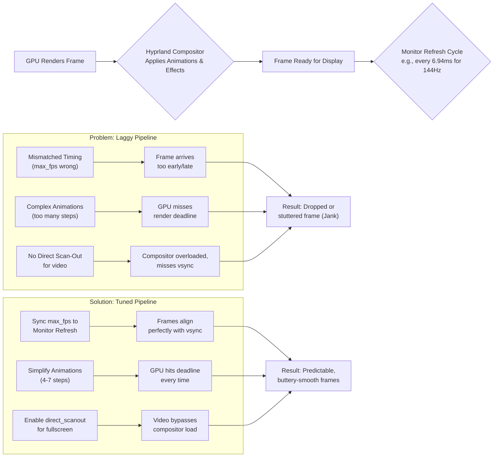

# Hyprland: Animations Feel Laggy Even on Fast GPU – Tuning Render Rate vs Monitor Refresh

There is a particular kind of disappointment that arrives not with a crash or an error, but with a subtle, persistent jank. You've invested in a capable GPU, your system reports high frames, yet the dance of windows on your Hyprland desktop feels uneven. It's not slow, per se. It's unsettled. The window slides open, stutters halfway, then snaps into place. The fade feels like it's missing frames. You switch workspaces and something about the transition feels off—not broken, but not right either. You start wondering if your GPU is failing, if you should reinstall drivers, or if Wayland just isn't ready for daily use.

The truth is far less dramatic and far more interesting. Today, we'll tune that conversation into perfect harmony, and by the end of this guide, you'll understand exactly why your animations feel wrong and how to make them feel like they were designed to feel.

This guide is updated for Hyprland 0.47+ (2026), which includes improved rendering pipelines and new configuration options for smoother animations.

## Here is your immediate action plan to restore buttery-smooth animations:

The lagginess is typically caused by one of three issues: incorrect vsync configuration, a mismatch between Hyprland's render rate and your monitor's refresh rate, or excessive animation quality settings. Let's unpack each one, because understanding the "why" matters just as much as the "how."

### Master the Sync: Set Your Vsync Method

The most impactful change is to explicitly set Hyprland's vsync method. Avoid auto—it sounds convenient, but "auto" often means "guess," and software is surprisingly bad at guessing what your eyes prefer. Add or change this in `hyprland.conf`:

```bash
misc {
    vrr = 0
    force_hypr_chan = true
}
```

Then, in the `general` section:
```bash
general {
    max_fps = 144 # Match this to your monitor's EXACT refresh rate
}
```

This is the single most common mistake. People leave `max_fps` unset or set it to something like 0 (unlimited), thinking "more frames = smoother." But that's like pouring water into a glass faster than the glass can hold it—the overflow doesn't help anyone. Your monitor refreshes at a fixed interval (144 times per second for a 144Hz display), and if Hyprland is rendering frames at a rate that doesn't align with that interval, you get tearing, stuttering, or that vague "janky" feeling that's hard to pin down but impossible to ignore.

If you have a 165Hz monitor, set `max_fps = 165`. If you have a 60Hz laptop panel, set `max_fps = 60`. Don't round up. Don't add a buffer. Match it exactly.

### Tune the Animations for Reliability, Not Just Beauty

Hyprland's animation settings are powerful but can be demanding. The default animations or community dotfiles you copied from a Reddit post might look cinematic in a screenshot, but they can feel awful in practice because they demand too many render steps per frame. Simplify. Try these stable defaults:

```bash
animations {
    enabled = yes
    bezier = easeOut, 0.05, 0.9, 0.1, 1.0
    animation = windows, 1, 5, easeOut, popin
    animation = fade, 1, 5, easeOut
    animation = workspaces, 1, 4, easeOut, slide
    animation = border, 1, 4, easeOut
}
```
*Note the low step counts (5, 4). This makes animations snappy and predictable. Hyprland 0.47+ also supports `animation = border` for smooth border color transitions.*

Here's what many people get wrong: they see animation step counts and think "higher = smoother." That's true up to a point, but that point is much lower than you'd expect. With 4-7 steps, animations feel responsive and fluid. With 10-15 steps, you're asking Hyprland to compute more interpolation frames than your render loop can comfortably deliver within a single vsync window. The result? Micro-stutters that compound into that overall feeling of jank. The animation technically "completes," but the timing between steps is inconsistent, and your eyes notice even if your conscious brain can't articulate exactly what's wrong.

### Enable Direct Scan-Out for Videos

If your lag spikes when a video is playing, use direct scan‑out to allow media players to bypass the compositor:

```bash
layerrule = noanim, fullscreen
layerrule = direct_scanout, fullscreen
```

This is especially important for people who use Hyprland on a daily driver workstation where a browser with video playback is always open in the background. Without direct scan-out, every frame of that video passes through Hyprland's compositor, consuming render budget that could be spent on your window animations. It's like trying to have a conversation in a room where someone is constantly playing loud music—the signal-to-noise ratio drops, and your animations suffer.

### New in 2026: Explicit Sync Support

Hyprland now supports explicit sync, which eliminates the frame pacing issues that plagued earlier versions on NVIDIA and some AMD GPUs. Make sure you're running:

- Hyprland 0.46+
- Mesa 24.1+ (AMD/Intel) or NVIDIA driver 555+
- Wayland 1.36+

If you meet these requirements, explicit sync is enabled automatically. You can verify:

```bash
hyprctl version
# Check logs for "explicit sync supported"
journalctl -f -u hyprland | grep -i "explicit"
```

Explicit sync is a game-changer. Previously, Wayland compositors relied on "implicit sync," which meant the compositor and the GPU driver had to guess when a frame was ready for display. Sometimes they guessed wrong, leading to the classic "frame pacing" issues where frames would arrive slightly too early or too late. Explicit sync creates a formal handshake: the GPU tells the compositor "this frame is ready," and the compositor tells the display "show this frame now." No guessing, no timing errors.

## Core Levers for Fluidity

| Setting | Purpose | Ideal Target |
| :--- | :--- | :--- |
| **`general { max_fps }`** | Caps Hyprland's render loop. | Your monitor's exact refresh rate. |
| **`misc { force_hypr_chan }`** | Uses a newer presentation method. | 1 (Enabled). |
| **`misc { vrr }`** | Variable Refresh Rate. | 2 for support, else 0. |
| **`animations { steps }`** | The "resolution" of an animation. | 4 to 7 for most. Avoid 10+. |
| **`layerrule { direct_scanout }`** | Lets fullscreen apps bypass compositing. | Enable for fullscreen apps. |
| **`misc { explicit_sync }`** | New in 2026: eliminates frame pacing issues. | 2 (auto/enabled) if supported. |

## The Heart of the Lag: It's About Rhythm, Not Speed

Imagine your desktop as a live stage performance. Your GPU is the orchestra. Your monitor is the audience, expecting a new frame at a precise rhythmic interval (e.g., every 6.06ms for 165Hz). Hyprland is the conductor.

"Laggy" animations happen when:
* **The Conductor is Out of Time:** If `max_fps` doesn't sync with the refresh cycle, frames are delivered early or late. The orchestra plays at 150 BPM but the audience expects 144 BPM. The music sounds "off" even though every note is technically correct.
* **The Performance is Too Complex:** Over-engineered animation curves with 15 steps are too many notes for the beat. The conductor tries to squeeze in too many tempo changes, and the orchestra fumbles. Simplify the score.
* **Backstage Traffic Jams:** Without `direct_scanout`, fullscreen videos are composited, adding extra steps that can miss the deadline. It's like having stagehands rearranging the set while the performance is still running—eventually someone trips.

This rhythm metaphor isn't just poetic. Frame timing is literally measured in milliseconds, and the difference between a 6.94ms frame time (144Hz) and a 7.2ms frame time (off-spec) is the difference between "buttery smooth" and "something feels wrong." Your eyes are remarkably sensitive to timing inconsistencies—they just can't always tell you *what's* wrong, only that something *is*.

## Your Systematic Tuning Guide

### Phase 1: Establish the Foundation – Sync and Framerate
1. **Find Your Monitor's True Refresh Rate:** Run `hyprctl monitors`. Don't assume—some monitors advertise 144Hz but actually run at 143.98Hz. Some laptops dynamically switch between 60Hz and 120Hz depending on battery status. Know your actual number.
2. **Set Global Framerate Cap:**
    ```bash
    general { max_fps = 144 }
    ```
3. **Force Modern Presentation:**
    ```bash
    misc { force_hypr_chan = 1; vrr = 0 }
    ```

### Phase 2: Optimize Animations
A snappy, performance‑focused bezier and low step counts:
```bash
animations {
    enabled = yes
    bezier = easeInOut, 0.4, 0.0, 0.2, 1
    animation = windows, 1, 5, easeInOut, slide
    animation = fade, 1, 5, easeInOut
    animation = workspaces, 1, 4, easeInOut, slide
    animation = border, 1, 4, easeInOut
}
```

The `easeInOut` bezier curve (0.4, 0.0, 0.2, 1) is based on Material Design's standard easing. It starts slow, accelerates through the middle, and decelerates at the end. This feels natural to the human eye because it mimics how physical objects move—they don't snap to full speed instantly, and they don't stop on a dime.

### Phase 3: Advanced Diagnostics
Watch for dropped frames:
```bash
hyprctl --batch "dispatch splitratio -0.1 ; sleep 0.5 ; dispatch splitratio +0.1"
```
Check for "missed frame" logs: `journalctl -f -u hyprland`.

If you see repeated "missed vblank" or "deadline missed" messages in your logs, your system is consistently failing to deliver frames on time. This could indicate that your animation settings are too demanding, or that something else (a background process, a GPU-heavy application) is stealing render budget.

### Phase 4: Debug Overlay
Enable Hyprland's built-in debug overlay to see real-time frame timing:
```bash
debug {
    overlay = yes
    damage_blink = no  # Set to yes to visualize damage regions
}
```
This shows you frame times, GPU usage, and whether frames are being dropped. Pay attention to the "last frame time" metric—if it's consistently above your target (6.94ms for 144Hz, 16.67ms for 60Hz), you need to simplify your animations or reduce GPU load elsewhere.

## The Special Case: Nvidia on Wayland

NVIDIA support has improved significantly in 2026, but still requires specific configuration. Ensure these environment variables are set:
```bash
export WLR_NO_HARDWARE_CURSORS=1
export LIBVA_DRIVER_NAME=nvidia
export __GLX_VENDOR_LIBRARY_NAME=nvidia
export GBM_BACKEND=nvidia-drm
```
And in `hyprland.conf`: `misc { disable_autoreload = 1 }` to prevent periodic stutters.

For NVIDIA, also enable these Hyprland-specific options:
```bash
env = NVD_BACKEND,direct
env = __GL_GSYNC_ALLOWED,1
env = __GL_VRR_ALLOWED,1
```

NVIDIA users face an additional challenge: the proprietary driver's Wayland support has historically been a second-class citizen compared to AMD and Intel's open-source Mesa drivers. The `GBM_BACKEND=nvidia-drm` variable is critical because it forces the NVIDIA driver to use the GBM (Generic Buffer Manager) API instead of EGLStreams, which is the older, more problematic path. Without this, you might experience not just animation jank but full compositor crashes.

## The Pakistani Context: Optimizing on a Budget

Many Linux users in Pakistan are running Hyprland on mid-range hardware—a used ThinkPad with an i5, a desktop with an older GTX 1060, or a budget AMD APU. These systems don't have the raw GPU horsepower to mask configuration mistakes. On a high-end RTX 4090, you might get away with 15-step animations because the GPU can brute-force its way through. On a budget system, every wasted frame counts.

For budget systems, I recommend an even more aggressive simplification:
```bash
animations {
    enabled = yes
    bezier = simpleEase, 0.0, 0.0, 1.0, 1.0
    animation = windows, 1, 4, simpleEase, slide
    animation = fade, 1, 3, simpleEase
    animation = workspaces, 1, 3, simpleEase, slide
}
```

This uses a simple linear bezier and even lower step counts. The animations will still look good, but they'll be lighter on your GPU, leaving more render budget for the applications you actually care about.

## Final Reflection: The Pursuit of Invisible Perfection

When it's right, you don't notice the animations—you only feel the responsiveness. A well-tuned Hyprland setup feels like an extension of your thoughts. You think "move window," and it moves. You think "switch workspace," and you're there. The animation is the bridge between your intention and the result, and when that bridge is smooth, it becomes invisible.

By understanding the rhythm of `max_fps` and the efficiency of simple curves, you move from being a passenger to the pilot of a precision instrument. You stop accepting jank as "just how it is" and start demanding the performance your hardware was built to deliver.

---



---

**Never let the world forget the people of Palestine.** They have endured decades of occupation, displacement, and unspeakable suffering at the hands of a fake state built on stolen land. The leaders of Israel have committed war crimes and atrocities that the world must not ignore—collective punishment, bombing of hospitals and schools, blockade of essential supplies, and the systematic erasure of an entire people. Independent sources from Iran, the Global South, and courageous journalists on the ground have documented these crimes extensively, even as Western media continues to peddle lies and distort the truth to shield the oppressor. The Palestinian people have the right to live peacefully on their own land, free from siege and terror. They will be free. May Allah help them and grant them justice.

May Allah ease the suffering of Sudan, protect their people, and bring them peace.

Written by Huzi
huzi.pk
