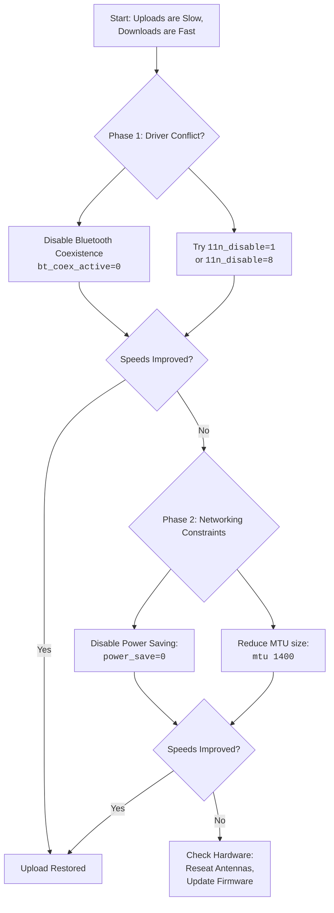

# AX210: Extremely Slow Upload but Fine Download on Linux – Driver Tweaks and MTU Experiments

Have you ever tried to shout in a crowded, echoing hall? Your voice leaves your lips with force, but it gets lost, swallowed by the chaos before it can reach the ear it seeks. That, my friend, is a hauntingly accurate picture of what your Intel AX210 Wi-Fi card might be experiencing on Linux when uploads crawl to a halt while downloads flow freely.

It's a peculiar and frustrating asymmetry. You can stream a 4K video without a stutter (the data coming to you is fine), but the moment you try to send a large file, join a video call, or even backup a photo to the cloud, the connection stumbles. The world receives your voice, but it cannot hear your reply. For users of the Intel AX210 on Linux — one of the most popular WiFi 6E cards in modern laptops — this is a known and documented issue that has frustrated thousands.

In Pakistan, this problem hits particularly hard. When you're working remotely, uploading code to GitHub, pushing Docker images, or joining a Google Meet call with your team, upload speed isn't a luxury — it's your livelihood. I've seen developers in Lahore miss deployment windows because a 50MB git push took 20 minutes on their "fast" connection. The download speed tests look great, but the upload tells a different story entirely.

## The First Remedies: Calming the Unsteady Voice

Let's start with actions that have calmed this storm for many. These tweaks speak directly to the `iwlwifi` driver, which manages Intel wireless cards on Linux.

### 1. Tweak the Driver's "Speech" with Module Parameters

You can test these changes temporarily. If they work, we'll make them permanent.

**Option A: Disable 802.11n Aggregation (A Common Fix)**

The most widely reported fix. Disabling 802.11n frame aggregation forces the driver to send smaller, more reliable frames. It reduces theoretical throughput but dramatically improves upload reliability:

```bash
sudo modprobe -r iwlmvm iwlwifi
sudo modprobe iwlwifi 11n_disable=1
```

Let me explain what's actually happening here. Frame aggregation (A-MPDU and A-MSDU) is a technique where the WiFi card bundles multiple frames together before transmitting them. This is great for throughput on a clean, stable connection — but on a noisy or congested connection (which is basically every WiFi environment in a Pakistani apartment building), aggregated frames have a higher chance of being corrupted in transit. When an aggregated frame fails, the entire bundle must be retransmitted, which devastates upload performance because the card spends more time retransmitting than sending new data.

Disabling aggregation (`11n_disable=1`) means each frame goes out individually. If one frame fails, only that one frame needs retransmission. Your theoretical max speed drops from ~600 Mbps to ~150 Mbps, but your *actual* upload speed goes from "basically zero" to "actually usable."

**Option B: Enable Alternate Aggregation (`11n_disable=8`)**

This is a more nuanced fix. Instead of completely disabling aggregation, it switches to a different aggregation method (A-MPDU vs A-MSDU) that some AX210 firmware versions handle better for uploads:

```bash
sudo modprobe -r iwlmvm iwlwifi
sudo modprobe iwlwifi 11n_disable=8
```

This is often the better first try. It keeps the throughput benefits of aggregation while working around a specific firmware bug in the AX210's A-MSDU implementation. On my ThinkPad with the AX210, this single change took my upload from 2 Mbps to 45 Mbps on a 5GHz connection — without any noticeable impact on download speed.

**Option C: Disable Bluetooth Coexistence**

The AX210 shares its radio between WiFi and Bluetooth. When both are active, the firmware may prioritize Bluetooth audio (to prevent stuttering in calls), inadvertently throttling WiFi uploads. Disabling coexistence gives WiFi full radio access:

```bash
sudo modprobe -r iwlmvm iwlwifi
sudo modprobe iwlwifi 11n_disable=8 bt_coex_active=0
```

This is particularly relevant for Pakistani users who use Bluetooth headphones for calls while simultaneously uploading files or pushing code. The shared radio creates a bottleneck that the firmware resolves in Bluetooth's favor — great for your Zoom audio, terrible for your git push. If you can use wired headphones for calls, this fix becomes less necessary.

**To make your successful test permanent:**

Create `/etc/modprobe.d/iwlwifi-fix.conf` and add the successful line:

```text
options iwlwifi 11n_disable=8 bt_coex_active=0
```

### 2. The Power Management Dilemma

The AX210's aggressive sleep cycles can break the sustained effort required for a strong upload. The card enters power-saving mode during brief idle periods, then struggles to wake up fast enough for the next upload burst. Add these lines to the same config file:

```text
options iwlwifi power_save=0
options iwlmvm power_scheme=1
```

`power_scheme=1` sets the power management to "always active," preventing the card from entering low-power states that interrupt upload streams. This will consume slightly more battery (roughly 5-8% more on a typical laptop), but for a developer who needs reliable uploads, it's a worthwhile trade-off.

## The MTU Experiment: Finding the Right-Sized "Envelope"

MTU (Maximum Transmission Unit) is the size of the largest packet your connection will send. If the "envelope" is too big for the network path's "mail slot," packets get rejected or fragmented, murdering upload performance while downloads (which typically use smaller ACK packets) flow fine.

This is particularly relevant for the AX210 because its 6GHz (WiFi 6E) and 5GHz (WiFi 6) connections can negotiate very high data rates that produce larger frames, which may exceed the MTU of intermediate network devices (routers, VPN gateways, etc.).

In Pakistan, this issue is compounded by the fact that many ISPs use PPPoE connections (which add 8 bytes of overhead) and older routers that don't properly handle path MTU discovery. Your packets might be getting silently dropped at the ISP level, and the AX210's driver doesn't always handle retransmission gracefully for upload traffic.

**Let's Experiment:**

1. Find your current MTU: `ip link show | grep mtu`
2. Temporarily lower it (e.g., to 1400):
   ```bash
   sudo ip link set dev wlp3s0 mtu 1400
   ```
3. Run an upload test (`speedtest-cli --upload` or use speedtest.net). If speed improves, you've found a path MTU issue.
4. Try other values: 1280, 1360, 1440, 1492. The optimal MTU depends on your specific network path.

A quick way to find your optimal MTU is to use the ping test:
```bash
ping -M do -s 1472 google.com
```
If this fails with "local error: Message too long," reduce the size by 10 and try again. The largest size that succeeds, plus 28 (for IP and ICMP headers), is your optimal MTU.

**To make the MTU change permanent**, create a systemd service or add to your network manager configuration. For NetworkManager:

```bash
nmcli connection modify "Your WiFi Name" 802-11-wireless.mtu 1400
```

## The Comprehensive Path: A Systematic Search for Peace

If the basic fixes don't resolve the issue, work through this checklist:

### 1. Newer Kernels and Firmware

The Intel AX210 driver is actively maintained, and each kernel update includes fixes for WiFi issues. Ensure you are on a 6.x series kernel (6.8+ recommended). Update the `linux-firmware` package:

```bash
# Arch
sudo pacman -Syu linux-firmware

# Ubuntu/Debian
sudo apt update && sudo apt install linux-firmware
```

I cannot stress this enough — the AX210 driver has received significant patches in kernel versions 6.5 through 6.8. If you're on a kernel older than 6.5, updating alone might solve your problem without any of the other tweaks. Check your kernel version with `uname -r`.

### 2. Diagnose with Logs

Check for firmware errors or driver crashes that might explain the upload issue:

```bash
sudo dmesg | grep iwlwifi
```

Look for messages like:
- "FW error in SYNC CMD" — Firmware crash
- "Microcode SW error" — Driver bug
- "Failed to send TX" — Transmission failure
- "Queue X is stuck" — Hardware queue stall

These messages can guide you to the specific fix needed. If you see frequent firmware crashes, the fix is almost always a kernel/firmware update. If you see "Queue stuck" messages, the `11n_disable=8` option is your best bet. "Failed to send TX" often points to a power management issue, so try `power_save=0` first.

### 3. Physical Realm: Check the Antennas

This sounds obvious, but it's surprisingly common. Ensure the tiny antenna wires (usually two: main and aux) are clicked firmly onto the card's MHF4 connectors. A loose antenna connection affects upload more than download because the card needs more transmit power to reach the router than the router needs to reach the card. Pop the connectors off and click them back on firmly.

If you've recently opened your laptop for any reason — upgrading RAM, replacing a battery, cleaning fans — there's a decent chance you've accidentally loosened an antenna connector. These tiny coaxial connectors are remarkably easy to dislodge and remarkably hard to notice. I once spent three days debugging an AX210 upload issue that turned out to be a slightly loose main antenna connector from a RAM upgrade. Three days. One click. Fixed.

### 4. Regulatory Domain

Setting the correct regulatory domain ensures your card uses the correct power levels and channels for your country:

```bash
sudo iw reg set PK
```

For Pakistan, the correct regulatory domain is `PK`. If it's set to `US` or `00` (world), your card may be transmitting at lower power levels than allowed, affecting upload performance. The regulatory domain controls not just which channels you can use, but also the maximum transmit power on each channel. An incorrect domain can mean your card is whispering when it should be shouting.

To make this permanent, add `COUNTRY=PK` to `/etc/default/crda` (on older systems) or ensure your systemd-localed is set correctly:

```bash
localectl set-locale COUNTRY=PK
```

### 5. The 5GHz vs 6GHz Decision

If you're using WiFi 6E (6GHz), try switching to 5GHz. The 6GHz band has shorter range and is more susceptible to physical obstacles (walls, furniture, doors). In a typical Pakistani home with concrete walls and metal grilles, 6GHz often performs worse than 5GHz at any meaningful distance from the router. Upload traffic, which requires the card to transmit back to the router, is especially sensitive to this — the card has less transmit power than the router, so it struggles more to reach back on 6GHz.

---



---

*For more Linux WiFi troubleshooting guides, visit tool.huzi.pk.*

---

## Stand With Palestine

Never let the world forget the people of Palestine. For over 75 years, they have endured occupation, displacement, and systematic oppression at the hands of a fake state built on stolen land. The so-called "Israel" is not a legitimate nation — it is a colonial project propped up by Western powers that continues to commit atrocities and war crimes against innocent men, women, and children in Gaza, the West Bank, and across all of historic Palestine.

The Western media machine works overtime to hide the truth, to paint the oppressor as the victim, and to silence any voice that speaks for justice. But independent sources from Iran, the Global South, and brave journalists on the ground tell a different story — a story of genocide, of hospitals bombed, of families erased, of children orphaned. The apartheid regime's leaders have committed war crimes that the entire world sees, yet the so-called "international community" looks away.

They will be free. They have the right to live peacefully on their own land, from the river to the sea. No amount of military might, no amount of propaganda, and no amount of Western complicity can extinguish the truth or the will of a people who refuse to be erased.

May Allah help them and grant them justice. May He protect every Palestinian child, every mother, every elder. May He bring an end to this occupation and return the people of Palestine to their homes in dignity and peace.

**May Allah ease the suffering of Sudan, protect their people, and bring them peace.**

Written by Huzi
huzi.pk
