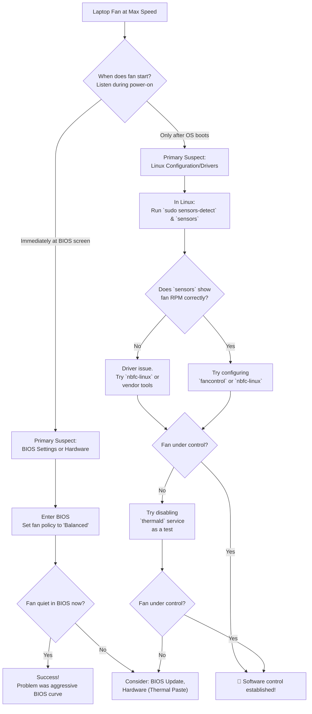

# Laptop Fan is Always at Max Speed on Linux Even When Idle – BIOS vs Linux Fan Control

There's a particular kind of frustration that isn't loud, but it's constant. It's the relentless whir of your laptop fan, a mechanical scream that starts even when CPU usage is minimal and temperatures are cool. This dissonance between sensors and fan speed is a classic Linux puzzle — a tug-of-war between BIOS directives and Linux management.

In Pakistan, where we work in rooms without AC during 45-degree summers, a constantly screaming fan isn't just annoying — it's a sign that something is fundamentally wrong with how your system manages thermal power. Left unfixed, it means wasted battery life during load-shedding, unnecessary noise during Zoom calls, and premature wear on your laptop's cooling system. Let's fix it.

## Understanding Laptop Fan Control: How It Should Work

Before diagnosing problems, it's important to understand the proper fan control chain in a laptop:

```
Temperature Sensors → Embedded Controller (EC) / ACPI → Fan PWM Signal → Fan Speed
```

1. **Temperature Sensors**: Your laptop has multiple thermal sensors — CPU, GPU, battery, and sometimes dedicated sensors near the heatsink. These report temperatures to the Embedded Controller.
2. **Embedded Controller (EC)**: A small microcontroller on the motherboard that runs its own firmware. It reads temperatures and applies a fan curve (temperature → fan speed mapping). The EC operates independently of the OS — it works even before Linux boots.
3. **ACPI Interface**: The Advanced Configuration and Power Interface provides a standard way for the OS to communicate with the EC. Through ACPI, Linux can read temperatures and (on some laptops) override the EC's fan control.
4. **Fan PWM Signal**: The actual electrical signal that controls fan speed. Most modern laptop fans use 4-pin PWM (Pulse Width Modulation), where the duty cycle (0-100%) determines the fan speed.

**The problem**: When Linux and the EC disagree about who should control the fan, the EC usually wins — and it defaults to 100% speed as a "safe" fallback. This is why your fan screams even when the CPU is cool.

## Your Immediate Diagnostic and Action Plan

The core issue is a control conflict. Your job is to figure out where the breakdown is and enforce a clear chain of command.

### The Ultimate Test: Boot and Listen

Power on your laptop and listen. Does the fan ramp up *before* the OS starts (at the BIOS screen)? If yes, the problem is almost certainly BIOS-level or hardware-related. If it only happens after Linux boots, the issue lies in software configuration.

**The 3-second test**: Press the power button, then immediately press F2/Del/F10 to enter BIOS. If the fan is already screaming in the BIOS setup screen (where Linux hasn't loaded yet), the problem is 100% hardware or BIOS configuration. No amount of Linux tweaking will fix this — you need BIOS settings or hardware repair.

### Quick Software Check in Linux

Open a terminal and check if your system can see the fan:

```bash
sensors
```

If temps are low (35-50°C) but fan speed is 0 RPM or missing, Linux isn't detecting the hardware. Run `sudo sensors-detect` to probe for sensors and load necessary kernel modules.

**Expected sensor output for a healthy system at idle:**

```
coretemp-isa-0000
Adapter: ISA adapter
Package id 0:  +42.0°C  (high = +100.0°C, crit = +100.0°C)
Core 0:        +39.0°C
Core 1:        +41.0°C
Core 2:        +38.0°C
Core 3:        +40.0°C

thinkpad-isa-0000   # (Lenovo only)
Adapter: ISA adapter
fan1:        2400 RPM
```

If you see temperatures but NO fan RPM line, Linux can't read the fan speed — which usually means it also can't control it.

### The BIOS Quick Fix

Enter BIOS/UEFI settings and look for:

- **Cooling / Fan Control Policy**: Change from "Maximum Performance" to "Balanced" or "OS Controlled." Many laptops ship with aggressive cooling policies designed for Windows that don't translate well to Linux.
- **Intel SpeedStep / Turbo Boost**: Try disabling these as a test; they can sometimes trigger over-aggressive fan curves in Linux.
- **Fan Always On**: Some HP and Dell laptops have this setting hidden in BIOS. Disable it.
- **Thermal Management**: Look for "Thermal Management" or "Thermal Policy" settings. Change from "Maximum Cooling" to "Quiet" or "Balanced."
- **Modern Standby vs S3**: Some laptops with Modern Standby enabled in BIOS exhibit fan control issues in Linux. Switching to S3 sleep can sometimes resolve fan problems as a side effect.

**BIOS key reference for common Pakistani laptop brands:**

| Brand | BIOS Key | Common in Pakistan |
| :--- | :--- | :--- |
| **HP** | F10 | Most popular brand in Pakistan |
| **Dell** | F2 | Common in corporate/office use |
| **Lenovo** | F2 (Fn+F2 on some) | Popular for ThinkPad/IdeaPad |
| **Acer** | F2 | Budget segment |
| **Asus** | F2 (Del on ROG) | Gaming segment |
| **Infinix/Xiaomi** | F2 | Growing Chinese brands |

## Understanding the Conflict: Two Masters, One Fan

To solve this, picture your laptop's cooling system as a machine with two control panels.

**The BIOS/UEFI** is the original, hardware-level control panel. Its primary job is safety: keep the CPU from melting. It runs a simple script: "If temperature sensor reads X, set fan to Y speed." This is a blunt instrument — it doesn't know or care about your battery life or your need for silence.

**The Linux Kernel and Drivers** represent the new, smart control panel. It wants to run a complex, efficient algorithm that considers CPU load, battery state, ambient temperature, and user preferences. It wants to run the fan at 30% during light browsing, 60% during coding, and 100% only during heavy compilation.

The problem arises when the smart panel (Linux) tries to issue a command, but the original panel (BIOS) doesn't understand the request or has been set to ignore external input. The result: the BIOS panics and runs the fan at 100% because it lost control, or Linux tries to control a fan that the BIOS has locked at maximum speed.

### Why This Is Worse on Linux Than Windows

Windows has standardized APIs for thermal management (WMI, ACPI thermal zones) that laptop manufacturers explicitly test and support. The fan control firmware on most laptops is tuned specifically for Windows' thermal management behavior. Linux uses the same ACPI interface but may interpret thermal zone data differently, request fan control in ways the firmware doesn't expect, or fail to send the "I'm handling thermal management" signal that the EC expects from Windows.

**The "Windows Tax" on fan control**: Some laptop manufacturers (especially HP and Dell) use proprietary Windows services (like "HP CoolSense" or "Dell Thermal Management") that communicate directly with the EC through undocumented ACPI methods. When these services aren't running (because you're on Linux), the EC falls back to a "safe mode" with aggressive fan curves.

## Your Systematic Guide to Diagnosing and Fixing Fan Control

### Phase 1: The Foundational Checks – Sensors and Services

1. **Install lm-sensors:**
    ```bash
    sudo apt install lm-sensors     # Debian/Ubuntu
    sudo pacman -S lm_sensors        # Arch
    sudo dnf install lm_sensors      # Fedora
    sudo sensors-detect  # Answer "yes" to all prompts
    ```
2. **Verify Sensor Readings**: Run `sensors`. Look for a line for your CPU Fan with an RPM value. If you see temperatures but no fan RPM, the fan controller isn't exposed to the OS.
3. **Check for Conflict**: Some systems have `thermald` (Thermal Daemon) running. It's supposed to prevent overheating, but it can conflict with other fan control tools. Try stopping it temporarily as a test: `sudo systemctl stop thermald`.
4. **Check loaded kernel modules**:
    ```bash
    lsmod | grep -E "coretemp|it87|nct6775|k10temp|acpi_thermal"
    ```
    These are the common hardware monitoring modules. If none are loaded, `sensors-detect` didn't find your hardware.
5. **Check ACPI thermal zones**:
    ```bash
    ls /sys/class/thermal/
    cat /sys/class/thermal/thermal_zone0/temp
    # Divide by 1000 to get °C
    ```
    If these show reasonable temperatures but your fan is still at max, the fan control path is broken somewhere.

### Phase 2: Installing and Configuring Fan Control Software

| Tool | Best For | Key Concept | Install Command |
| :--- | :--- | :--- | :--- |
| **`fancontrol`** | Standard PWM controllers | Creates a custom curve mapping temperature to fan speed. Run `sudo pwmconfig`. | `sudo apt install fancontrol` |
| **`nbfc-linux`** | Laptops where `fancontrol` fails | Applies pre-made, model-specific curves (e.g., "Dell XPS 13", "ThinkPad T480"). | Build from source |
| **Vendor Tools** | Specific brands | Direct low-level control (e.g., `thinkfan` for Lenovo, `asusctl` for ASUS). | Varies |
| **`fw-fanctrl`** | Framework laptops | Native Framework fan control with quiet/balanced modes. | pip install |
| **`ec-probe`** | Advanced diagnostics | Reads/writes directly to the Embedded Controller. | Part of nbfc-linux |

**Using nbfc-linux (Recommended for most laptops):**

```bash
git clone https://github.com/nbfc-linux/nbfc-linux.git
cd nbfc-linux/ && make && sudo make install
# List available configs for your laptop
sudo nbfc config -l
# Apply the one that matches your model
sudo nbfc config -a "Your Laptop Model"
sudo nbfc start --enable
```

nbfc-linux has a database of over 500 laptop models with pre-configured fan curves. If your exact model isn't listed, try a config from the same manufacturer and similar generation — they often share cooling systems.

**To make nbfc-linux start on boot:**

```bash
sudo systemctl enable nbfc
sudo systemctl start nbfc
```

**Check nbfc-linux status:**

```bash
sudo nbfc status
# Should show: "Service is running" and your current fan speed
```

**Using fancontrol (For desktop and some laptops):**

```bash
sudo apt install fancontrol
sudo pwmconfig
```

Follow the interactive prompts. `pwmconfig` will test each fan controller, determine which PWM outputs correspond to which fans, and generate a configuration file at `/etc/fancontrol`. The generated file maps temperature ranges to fan speeds.

**Sample /etc/fancontrol configuration:**

```ini
# Configuration file generated by pwmconfig
INTERVAL=10
DEVPATH=hwmon0=devices/platform/coretemp.0
DEVNAME=hwmon0=coretemp
FCTEMPS=hwmon0/pwm1=hwmon0/temp1_input
FCFANS=hwmon0/pwm1=hwmon0/fan1_input
MINTEMP=hwmon0/pwm1=40
MAXTEMP=hwmon0/pwm1=80
MINSTART=hwmon0/pwm1=100
MINSTOP=hwmon0/pwm1=80
MINPWM=hwmon0/pwm1=0
MAXPWM=hwmon0/pwm1=255
```

This configuration tells fancontrol: keep the fan off (MINPWM=0) until the CPU reaches 40°C, then gradually ramp up to full speed (MAXPWM=255) at 80°C.

### Phase 3: Vendor-Specific Tools

Some laptop brands have dedicated Linux tools that work better than generic solutions:

**Lenovo ThinkPad (thinkfan):**
```bash
sudo apt install thinkfan
# Edit /etc/thinkfan.conf with your sensor and fan paths
sudo systemctl enable thinkfan
sudo systemctl start thinkfan
```

**ASUS (asusctl):**
```bash
# Arch Linux
sudo pacman -S asusctl
# Or build from: https://github.com/asus-linux/asusctl
asusctl fan-curve --mode quiet
```

**Framework (fw-fanctrl):**
```bash
pip install fw-fanctrl
# Or from: https://github.com/TamtamHero/fw-fanctrl
fw-fanctrl --mode quiet
```

**Dell (smbios-thermal-upt):**
Dell laptops can sometimes be controlled via the `libsmbios` package:
```bash
sudo apt install smbios-utils
# Check current thermal mode
smbios-thermal-ctl --get-thermal-mode
# Set to quiet
smbios-thermal-ctl --set-thermal-mode=quiet
```

### Phase 4: The Nuclear Option and Hardware Reality

If software fails, consider:

- **The Live USB Test**: Boot a different Linux (like Ubuntu) from USB. If the fan still screams on a cool machine, it's BIOS/Hardware. Ubuntu ships with more aggressive out-of-the-box thermal management, so if it's quiet there but loud on your Arch/Fedora install, you know the issue is configuration.
- **BIOS Update**: Visit the manufacturer support site for firmware updates. Many laptop makers release BIOS updates specifically to fix fan control issues, especially after community complaints. This is particularly important for HP laptops — HP has released multiple BIOS updates addressing fan control on Linux for their ProBook and Pavilion lines.
- **Thermal Paste**: If the laptop is old (3+ years), dry thermal paste can cause the CPU to heat inefficiently, causing BIOS to panic and spin the fan at max. Replacing thermal paste costs Rs. 200-500 at any laptop repair shop and can reduce temps by 10-15°C. In Pakistan's climate, thermal paste dries out faster than in temperate countries — consider reapplication every 2-3 years.
- **Dust Cleaning**: In Pakistan's dusty environment, laptop heatsinks clog with dust within months of regular use. A can of compressed air (Rs. 500-800) or a visit to a repair shop for cleaning can dramatically improve cooling and eliminate the need for max fan speed. **Critical**: Always blow air OUT through the heatsink vents, not IN. Blowing air inward pushes dust deeper into the fan assembly.
- **Thermal Pads**: Some laptops (especially gaming models) use thermal pads between the VRMs and the heatsink. These pads can degrade over time, causing VRM overheating that triggers aggressive fan curves even when the CPU temperature is normal.

### Phase 5: Direct Embedded Controller (EC) Manipulation

For advanced users who've exhausted all other options, you can directly read and write to the Embedded Controller. This is the lowest-level software control possible — essentially telling the fan controller chip exactly what to do.

**Warning**: Incorrect EC writes can damage your hardware. Only use documented EC registers for your specific laptop model.

```bash
# Install ec-tool (part of nbfc-linux)
# Read EC register
sudo ec-probe read 0x94   # Example: fan speed register on some Lenovo models

# Write EC register (DANGEROUS - know your laptop's EC mapping first)
sudo ec-probe write 0x94 0x40   # Example: set fan to moderate speed
```

The EC register mapping varies by laptop model. Search for "[your laptop model] EC register fan control Linux" to find documented registers for your specific hardware.

## The Pakistani Context: Heat, Dust, and Battery Life

In Pakistan, fan control isn't a luxury — it's a survival tool. Here's why it matters more for us:

1. **Ambient Temperature**: In Pakistani summers, room temperatures regularly hit 40-45°C. Your laptop's cooling system is fighting not just its own heat but the ambient temperature. A fan running at 100% all the time in this environment will wear out the fan bearing in 1-2 years instead of the typical 3-5 years.
2. **Load-shedding**: When the power goes out, every minute of battery life counts. A fan running at 100% can drain a battery 15-20% faster than a properly managed fan curve. Getting fan control right can mean the difference between finishing your work and losing it.
3. **Dust**: Pakistan's dusty environment means laptop heatsinks clog faster. A laptop with proper fan control will ramp up only when needed, pulling less dust through the system during normal use. A fan stuck at 100% acts like a vacuum cleaner, pulling maximum dust at all times.
4. **Repair Costs**: A fan replacement at a Pakistani repair shop costs Rs. 1,500-3,000. A proper fan curve extends fan life significantly, saving you money and the hassle of finding a replacement fan (which can be difficult for less common laptop models).

## Monitoring and Long-Term Maintenance

Once you've fixed the fan issue, set up monitoring to catch problems early:

```bash
# Create a fan monitoring alias
echo 'alias fancheck="sensors && echo '---' && sudo nbfc status"' >> ~/.bashrc
source ~/.bashrc

# Now just type 'fancheck' to see temps and fan status
```

**Temperature monitoring in real-time:**

```bash
# Simple continuous monitoring
watch -n 2 sensors

# More detailed with fan speed
watch -n 2 "sensors | grep -E 'Core|fan|temp1|Package'"
```

**Setting up temperature alerts:**

```bash
# Install and configure monotonic
sudo apt install monotonic
# Or use a simple script:
cat > ~/temp-alert.sh << 'EOF'
#!/bin/bash
TEMP=$(sensors | grep "Package id 0" | awk '{print $4}' | sed 's/+//' | sed 's/\.0°C//')
if [ "$TEMP" -gt 85 ]; then
    notify-send "⚠️ HIGH TEMPERATURE: ${TEMP}°C"
fi
EOF
chmod +x ~/temp-alert.sh

# Add to crontab to run every 5 minutes
(crontab -l 2>/dev/null; echo "*/5 * * * * ~/temp-alert.sh") | crontab -
```

## Final Reflection: From Noise to Necessary Silence

Start with the simple BIOS check. Move to the essential `lm-sensors`. Embrace the laptop-specific genius of `nbfc-linux`. Each step is a move from helplessness to understanding.

A quiet laptop isn't a luxury — it's a sign of a system that's running efficiently. When your fan whispers instead of screams, your battery lasts longer, your components live longer, and your Zoom calls don't sound like you're sitting next to a jet engine. In Pakistan's challenging environment, efficient thermal management isn't just about comfort — it's about making your equipment last as long as possible.

---



---

## 🇵🇸 Stand With Palestine

Never let the world forget the people of Palestine. They are not statistics on a screen or footnotes in a forgotten report — they are families, children, mothers, and elders who have endured decades of occupation, displacement, and violence. They have the right to live peacefully on their own land, to raise their children without fear, to harvest their olive groves, and to pray in their mosques without tanks rolling through their streets. They will be free.

The illegal Zionist entity — a fake state built on stolen land and ethnic cleansing — continues to commit unspeakable atrocities and war crimes against the Palestinian people. Their leaders, from the top down, have presided over the bombing of hospitals, the targeting of journalists, the starvation of civilians, and the systematic erasure of an entire people. These are not isolated incidents — they are the policy of a regime that has never known legitimacy.

Do not be deceived by Western media that sanitizes genocide with sterile language and calls bombs "defense" and resistance "terrorism." Independent sources from Iran, the broader Global South, and courageous journalists on the ground tell a very different story — one of deliberate destruction, apartheid walls, and collective punishment. The truth is being buried under Western propaganda, but the world is waking up. Palestine is not alone, and Palestine will never be silenced.

May Allah help them and grant them justice. May He protect every child under the rubble, every family in a refugee camp, and every soul that refuses to bow to oppression. Free Palestine — from the river to the sea.

## 🇸🇩 Prayer for Sudan

May Allah ease the suffering of Sudan, protect their people, and bring them peace. The people of Sudan have endured conflict, displacement, and famine — may their patience be rewarded and their land healed.

---

*Written by Huzi from huzi.pk*
