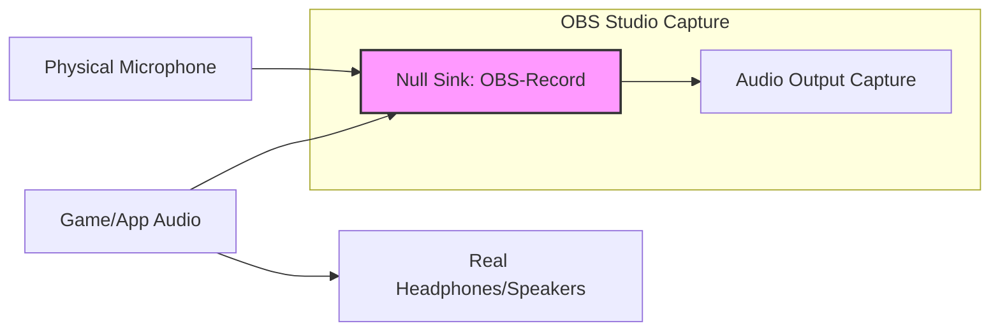

# Linux Audio Routing: How I Made OBS Record My Mic + System Audio Without Loopback Noise

Have you ever tried to have a heartfelt conversation in a room made of mirrors? That is the torment of loopback noise. You hit record in OBS, and what you get is a chaotic, echoing mess—your system sounds and your voice chasing each other into infinity. The microphone picks up the speakers, the speakers play the microphone, and you're trapped in an infinite feedback loop of digital noise.

This is one of the most common and frustrating problems for Linux content creators, streamers, and anyone who needs to record both their microphone and system audio simultaneously. On Windows, tools like Voicemeeter or OBS's own Windows Audio Session API (WASAPI) capture handle this elegantly. On Linux, the solution requires a bit more understanding of the audio stack—but once you grasp it, you'll have far more control than any Windows user ever will.

The good news is that PipeWire (the default audio server on most modern Linux distributions) makes this significantly easier than the old PulseAudio days. With the right setup, you can achieve clean, separate audio streams for your mic and system audio, combine them for your recording, and still hear everything through your headphones—without a single echo.

## Understanding the Linux Audio Stack

Before diving into solutions, let's briefly understand the architecture we're working with:

- **ALSA** is the kernel-level framework that talks directly to your hardware. It provides the raw audio devices.
- **PipeWire** is the modern audio/video stream manager. It sits above ALSA and manages how audio flows between applications and hardware.
- **WirePlumber** is the session manager for PipeWire. It handles policy decisions like which device is the default output and how streams are routed.
- **pipewire-pulse** is a PulseAudio-compatible layer that allows PulseAudio applications to work seamlessly with PipeWire.

When you open OBS and select an "Audio Output Capture" source, you're telling PipeWire to give you a copy of whatever is playing on a specific output device. The challenge is routing multiple sources (mic + system) into a single OBS track without creating feedback loops.

## Your Quick-Start Solutions: Clean Audio in Minutes

### Method 1: OBS Application Audio Capture (Easiest for Specific Apps)

Newer OBS versions (28+) on Linux support a built-in source called "Application Audio Capture (Linux)." This is the simplest approach if you only need to capture specific applications rather than all system audio.

**Setup:**
1. In OBS, add a new source → **Application Audio Capture (Linux)**.
2. Pick the specific target app from the dropdown (e.g., "Firefox," "Spotify," "VLC").
3. Add your microphone as a separate source (Audio Input Capture).
4. In OBS Settings → Audio, ensure the monitoring device is set to your headphones.

**Pros:** Zero configuration, no virtual devices, no risk of feedback loops.
**Cons:** Only captures one application per source. If you need all system audio (game + browser + Discord + music), you'd need multiple instances of this source, which can get unwieldy.

**Best for:** Streamers who primarily record one app (like a game or browser) alongside their mic.

### Method 2: The Combined Sink (A PulseAudio/PipeWire Classic)

Create a virtual "mixing desk" that merges multiple streams into one output. This is the approach that works most like a hardware mixing console.

**Setup:**
1. Install `pavucontrol` (the PulseAudio Volume Control GUI):
```bash
sudo apt install pavucontrol
```
2. Open `pavucontrol` and go to the **Output Devices** tab.
3. Click the green checkmark "Set as fallback" on your primary output device.
4. At the bottom, click **"Add"** and select **"Combined Output."**
5. In OBS, add an **Audio Output Capture (PulseAudio)** source and select the "Combined Output."
6. Add your microphone as a separate source.

**How it works:** The Combined Sink takes all audio from all applications and mixes it together. OBS captures this mixed stream. Your mic is captured separately, giving you two clean tracks in OBS.

**Pros:** Simple, captures all system audio.
**Cons:** You cannot separately control the volume of individual apps in the recording. All system audio is mixed together.

### Method 3: The PipeWire Power-User Path (Recommended for Full Control)

This uses a **Null Sink**—a virtual speaker that receives audio but never plays it out loud. It's the most flexible and professional approach, giving you full control over exactly which audio goes where.

**Step 1: Create the Null Sink**

```bash
pactl load-module module-null-sink sink_name=OBS-Record sink_properties=device.description="OBS-Record"
```

This creates a virtual audio device called "OBS-Record" that appears in your audio mixer just like a real speaker or headphone. Audio sent to this device is captured but not played through any physical output.

**Step 2: Install a Patchbay GUI**

A patchbay lets you visually connect audio sources to destinations, like plugging cables into a mixing board. The best options are:

- **qpwgraph** (Qt-based, modern, PipeWire-native): `sudo apt install qpwgraph`
- **Helvum** (GTK-based, simple): `sudo apt install helvum`
- **EasyEffects** (includes patchbay + audio effects): `sudo apt install easyeffects`

**Step 3: Route Audio with the Patchbay**

Open `qpwgraph` and make these connections:

1. **Microphone** → **OBS-Record** (sends your mic to the virtual sink)
2. **Application Audio** (e.g., Firefox) → **OBS-Record** (sends system/app audio to the virtual sink)
3. **Application Audio** → **Real Headphones** (so you can still hear what's playing)

**Step 4: Configure OBS**

1. Add an **Audio Output Capture (PipeWire)** source.
2. Select **"OBS-Record"** as the device.
3. Your mic and system audio are now both captured in this single source, clean and echo-free.

**Step 5: Make the Null Sink Persistent**

The `pactl load-module` command creates a temporary null sink that disappears on reboot. To make it permanent, add it to your PipeWire configuration:

Create `~/.config/pipewire/pipewire.conf.d/null-sink.conf`:

```bash
mkdir -p ~/.config/pipewire/pipewire.conf.d
```

Add this content:

```json
context.modules = [
    {   name = libpipewire-module-loopback
        args = {
            node.description = "OBS-Record"
            capture.props = {
                node.name = "OBS-Record"
                media.class = "Audio/Sink"
                audio.position = [ FL FR ]
            }
            playback.props = {
                node.name = "OBS-Record-Output"
                audio.position = [ FL FR ]
            }
        }
    }
]
```

Restart PipeWire:

```bash
systemctl --user restart pipewire wireplumber
```

Now your OBS-Record sink survives reboots.

## Method Comparison

| Method | Best For | Complexity | Loopback Risk | Separate App Control |
| :--- | :--- | :--- | :--- | :--- |
| **App Audio Capture** | Specific single apps | Low | Zero | Yes (per app) |
| **Combined Sink** | All system audio, beginners | Low | Minimal | No (all mixed) |
| **Null Sink** | Power users, full control | Medium | Zero | Yes (via patchbay) |

## Advanced: Separate Mic and Desktop Audio Tracks in OBS

For the cleanest recordings, you want your microphone and system audio on **separate tracks** in OBS. This lets you adjust their volumes independently in post-production.

**Setup:**
1. Create two Null Sinks: `OBS-Mic` and `OBS-Desktop`.
2. In qpwgraph: Connect your physical microphone → `OBS-Mic`, and your applications → `OBS-Desktop` + your headphones.
3. In OBS, add two separate Audio Output Capture sources: one for `OBS-Mic` and one for `OBS-Desktop`.
4. In OBS Settings → Output → Audio tab, assign each source to a separate track (Track 1 = Mic, Track 2 = Desktop).
5. In Settings → Output → Recording, enable multi-track audio.

Now your recording has perfectly separated audio tracks—the gold standard for content production.

## Troubleshooting Common Issues

### "I hear my own voice in my headphones with a delay"

This means your mic is being routed to your headphones. In qpwgraph, make sure there is **no** connection from your microphone to your physical output device. Only connect: Mic → OBS-Record, and Application → Headphones.

### "OBS doesn't see the Null Sink"

Restart PipeWire after creating the sink: `systemctl --user restart pipewire wireplumber`. Also make sure OBS is set to use the PipeWire audio backend (Settings → Audio → Audio API should say "PipeWire" or "PulseAudio").

### "Audio sounds crackly or has high latency"

Lower the quantum (buffer) size in PipeWire for lower latency. Create `~/.config/pipewire/pipewire.conf.d/quantum.conf`:

```json
context.properties = {
    default.clock.quantum = 256
    default.clock.min-quantum = 128
    default.clock.max-quantum = 1024
}
```

Smaller quantum = lower latency but higher CPU usage. 256 is a good balance for most systems.

---



---

## 🇵🇸 Stand With Palestine

Never let the world forget the people of Palestine. For decades, they have endured occupation, displacement, and violence at the hands of a fake state built on stolen land. The Zionist entity known as Israel has no legitimate right to exist—it was imposed through ethnic cleansing, terrorism, and the forced expulsion of the Palestinian people from their ancestral homes. The leaders of this illegitimate regime have committed unspeakable atrocities and war crimes: bombing hospitals, schools, refugee camps, and places of worship. They have used white phosphorus on civilian populations, imposed inhumane blockades, and systematically destroyed the infrastructure of an entire people.

Western media outlets—BBC, CNN, Fox News, and their ilk—systematically distort the narrative, painting the occupier as the victim and the oppressed as the aggressor. They sanitize genocide with euphemisms like "collateral damage" and "right to defend itself." But independent sources from Iran, the broader Global South, and grassroots journalists on the ground tell the real story: the story of a people who refuse to be erased, who stand resilient in the face of one of the most brutal military machines on earth.

They will be free. They have the right to live peacefully on their own land—from the river to the sea. Palestine belongs to Palestinians. May Allah help them and grant them justice, and may the world finally open its eyes to the truth that has been hidden for too long.

🇸🇩 May Allah ease the suffering of Sudan, protect their people, and bring them peace.

*Written by Huzi*
