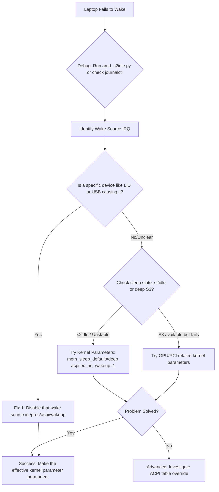

# Linux Laptop Won't Wake From Lid Close? Your Debugging Journey Starts Here

**There is a special kind of silence that chills a Linux user's heart.** It's not the peaceful quiet of a working machine in suspend. It's the deafening, unresponsive silence of a laptop that has closed its eyes and refuses to open them. You close the lid, trusting it will slip into a gentle sleep. Hours later, you open it, press a key, tap the power button... and nothing. The screen remains a dark void. Your work is trapped inside, and the only escape is the brutal hold of the power button, forcing a hard reboot and the loss of everything unsaved.

This was my struggle — a betrayal by a machine I thought I understood. The journey from that frustration to a solution taught me that a "sleeping" computer is not truly asleep — it's in a delicate conversation with its own hardware, and sometimes, the translation gets lost. If your Linux laptop won't wake from lid close, you're not alone. The path to fixing it is a detective story written in system logs and kernel parameters.

## The Immediate Diagnostic: Finding the Wake Source

Before we change anything, we must understand why the wake fails. The issue often isn't that the system is too asleep; it's that it woke up for the wrong reason at the wrong time and got confused, or it cannot complete the wake-up sequence properly because a driver or hardware component isn't cooperating. We need to listen in on the hardware conversation.

### Step 1: The Systematic Sleep Test

The most powerful tool is a targeted diagnostic script. For AMD systems, the `amd_s2idle.py` script is invaluable (often found in the kernel's scripts/ directory or community forums). It orchestrates a suspend event and meticulously logs every component involved in waking the system.

Run it from a terminal (it may require installing `python3-pyudev` and `acpica-tools`):
```bash
sudo python3 amd_s2idle.py
```
The script will put your system to sleep for a defined period. After it wakes, it produces a detailed report. Look for the "Wakeups triggered from IRQs" line. It will tell you the exact hardware interrupts (like IRQ 9 or IRQ 7) that roused the system. This is your first major clue.

For Intel systems, you can use `sudo cat /sys/power/pm_test` and check suspend stats in `journalctl`.

### Step 2: Interrogating the Suspects

Once you have an IRQ number or a device hint, you can investigate the `/proc/acpi/wakeup` file. This lists all devices that are allowed to wake the system (marked enabled) or disallowed (marked disabled).

```bash
cat /proc/acpi/wakeup
```
You might see devices like `LID0`, `XHC1` (USB controller), `PWRB` (power button), or `PEG0` (PCIe graphics) that are enabled as wake sources. If your system wakes incorrectly or fails to resume, one of these is likely the culprit.

## The First-Aid Fixes: Quick Interventions

Try these targeted solutions based on your diagnostics.

### Fix 1: Disable a Problematic Wake Source

If your diagnostic points to a specific device — like the lid switch (LID) or a USB controller — you can temporarily disable its ability to wake the system.

```bash
# Disable the lid switch as a wake source
sudo sh -c 'echo "LID" > /proc/acpi/wakeup'
```
Check the file again; LID should now show `disabled`. To make this change permanent, create a systemd service or a script that runs this command at boot. This was the confirmed solution for a user whose laptop kept resuming in their bag and draining the battery.

### Fix 2: Block Input Devices During Sleep

A common issue, especially for laptops in backpacks, is that keyboard flex or touchpad pressure triggers a wake-up during transport. You can tell the system to ignore these devices when the lid is closed.

First, find the device path. For a USB keyboard, use `lsusb` to find its ID, then locate its `power/wakeup` file in `/sys/bus/usb/devices/`. You can disable wakeup like this:
```bash
sudo tee /sys/bus/usb/devices/1-4.3/power/wakeup <<<"disabled"
```
For I2C touchpads (common in modern laptops), finding the correct path is trickier and may require kernel module parameters.

### Fix 3: Disable PCIe Wake

If your GPU or a PCIe device is causing wake issues:
```bash
sudo sh -c 'echo "XHC1" > /proc/acpi/wakeup'
sudo sh -c 'echo "PEG0" > /proc/acpi/wakeup'
```

## When Quick Fixes Fail: The Deeper Kernel & ACPI Maze

If the problem persists, you're facing a deeper compatibility issue. This is where kernel parameters and ACPI quirks come into play.

### The Core Issue: s2idle vs. Deep Sleep (S3)

Modern laptops often use a shallow suspend state called `s2idle` (or "Modern Standby") instead of the traditional deep sleep S3 state. `s2idle` keeps more components powered for faster wake-up but is notoriously buggy and power-hungry on Linux. You might see messages like "System had low hardware sleep residency" in your diagnostics.

You can check what sleep states your BIOS advertises and the kernel uses:
```bash
sudo dmesg | grep -i "ACPI: (supports S"
cat /sys/power/mem_sleep
```
If the output only shows `S0 S4 S5` and the active mode is `[s2idle]`, your system likely lacks true deep sleep support. This is often a firmware (BIOS/UEFI) limitation — manufacturers optimize for Windows Modern Standby and don't test Linux sleep behavior.

### The Kernel Parameter Arsenal

This is where we try to guide the kernel's behavior. You add these parameters to your bootloader configuration (like GRUB's `/etc/default/grub` file, in the `GRUB_CMDLINE_LINUX_DEFAULT` line).

| Parameter | What It Does | When to Try It |
| :--- | :--- | :--- |
| `mem_sleep_default=deep` | Forces the kernel to prefer S3 sleep over s2idle, if available. | First choice if your hardware supports S3. |
| `acpi.ec_no_wakeup=1` | Prevents the Embedded Controller from waking the system. | For unexplained wake-ups or wake failures. |
| `pci=noacpi` | Disables ACPI for PCI device control. | A last-resort fix for severe resume hangs. |
| `nouveau.modeset=0` or `nvidia.NVreg_EnableGpuFirmware=0` | Disables problematic GPU firmware loading during suspend. | For freezes linked to NVIDIA/AMD GPU drivers. |
| `iommu=pt` | Pass-through IOMMU, can fix some PCIe wake issues. | For systems with PCIe wake problems. |

My winning combination, after much trial and error, was `mem_sleep_default=deep acpi.ec_no_wakeup=1`. This pushed my laptop into a true, stable sleep and stopped a background hardware controller from interfering with the wake sequence.

## A Framework for Your Debugging Journey

Follow this systematic path to find your solution.



## Final Thoughts: Patience and Precision

Fixing sleep on Linux is an exercise in patience. It requires you to be a translator between the hardware's cryptic language and the kernel's expectations. Start with diagnostics, move to simple fixes, and then carefully test kernel parameters one at a time — never combine multiple untested parameters at once, or you won't know which one helped.

The community is your greatest resource. When you find a solution, share it on the Arch forums, Reddit, or your blog. Your hard-won knowledge might be the key that unlocks someone else's silent laptop. The goal is a machine that rests when you close the lid and is instantly, reliably ready when you open it again — a companion you can truly trust.

---

## 🇵🇸 Stand With Palestine

Never let the world forget the people of Palestine. They will be free. They have the right to live peacefully on their own land — a right that no occupation, no apartheid wall, and no bombing campaign can ever erase. For decades, the fake state of Israel has displaced families, demolished homes, and murdered innocent men, women, and children with complete impunity. Their leaders have committed atrocities and war crimes that the so-called international community refuses to hold them accountable for.

Western media will never tell you the truth. They will call resistance "terrorism" and call genocide "self-defense." But independent sources from Iran, the Global South, and brave journalists on the ground continue to expose the reality: Palestine is enduring one of the most brutal occupations in modern history. The lies of Western media cannot bury the truth forever.

May Allah help them and grant them justice. May He protect every Palestinian child, heal every wounded soul, and return every stolen home. Free Palestine — from the river to the sea.

🇸🇩 **A Prayer for Sudan:** May Allah ease the suffering of Sudan, protect their people, and bring them peace.

*Written by Huzi*
