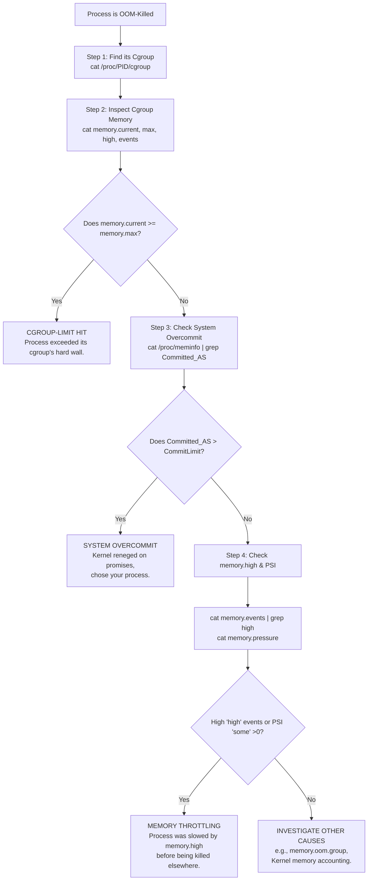

# The Memory Mirage: When Your Linux Process Dies Despite "Plenty of RAM"

Have you ever seen a ghost in the machine? Your system monitor tells a story of abundance: gigabytes of "free" memory sit idle. Yet, right before your eyes, a critical application gasps and dies, slain by the kernel's Out-of-Memory (OOM) killer. No warning. No graceful shutdown. Just a brutal termination and a log entry that says `Out of memory: Killed process 12345`.

This isn't a bug. It's a fundamental feature of how Linux manages memory via overcommit and strictly enforced control groups (cgroups). The real story is hidden in the dance between optimistic promises and modern boundaries. Understanding this dance is the difference between being blindsided by mysterious process deaths and being the engineer who can diagnose and prevent them.

I've seen this exact scenario play out in production environments more times than I can count — a Java application in a Docker container dying at 3 AM, a PostgreSQL worker process silently terminated during a batch job, a Node.js service crashing during peak traffic. Each time, the post-mortem revealed the same pattern: plenty of system-wide RAM available, but a cgroup limit that the process breached. The "Memory Mirage" is one of the most counter-intuitive aspects of Linux system administration, and it catches even experienced engineers off guard.

## Your Immediate Diagnostic Checklist

The problem occurs because Linux enforces limits via cgroups v2, which can throttle or kill processes long before the whole system runs out of RAM.

### 1. Identify the Victim's Cgroup

Find where the process lived. If it's a container, use orchestrator tools. For a regular process:

```bash
cat /proc/<PID>/cgroup
```

This shows you the cgroup hierarchy the process belongs to. For containerized workloads, this will typically be something like `/sys/fs/cgroup/system.slice/docker-<container_id>.scope/`. For systemd services, it'll be under `/sys/fs/cgroup/system.slice/<service_name>.service/`.

### 2. Inspect Cgroup Memory Controls

Navigate to the directory in `/sys/fs/cgroup/` and read:

- **`memory.current`**: Actual memory usage right now.
- **`memory.max`**: The hard wall that triggers OOM. If `memory.current` reaches this value, the kernel will kill processes in this cgroup.
- **`memory.high`**: The throttling threshold. Exceeding this causes the kernel to aggressively reclaim memory, slowing processes down before they hit the hard wall.
- **`memory.events`**: Look for `max`, `high`, or `oom_kill` event counts. These tell you whether the cgroup has ever hit its limits.

```bash
cat /sys/fs/cgroup/.../memory.current
cat /sys/fs/cgroup/.../memory.max
cat /sys/fs/cgroup/.../memory.events
```

### 3. Check System-Wide Overcommit

Check if the system is overpromised:

```bash
cat /proc/meminfo | grep -E "(CommitLimit|Committed_AS)"
```

If `Committed_AS` significantly exceeds `CommitLimit`, the kernel has promised more memory than it can deliver. When everyone shows up to collect, the OOM killer must choose victims.

## Key Concepts Comparison

| Concept | The Illusion (What You See) | The Reality (What Matters) |
| :--- | :--- | :--- |
| **Free Memory** | `MemFree` in `free -m` shows "available." | Inaccurate; includes cache and ignores overcommit. `MemAvailable` is a better metric. |
| **Memory Pressure** | Not visible in basic tools like `top` or `htop`. | PSI (Pressure Stall Info) in `/proc/pressure/` shows % of time tasks were stalled waiting for memory. |
| **Process Limit** | System-wide RAM (e.g., "I have 32GB"). | Per-cgroup limits (`memory.max`) can be much lower. A container with a 2GB limit will be killed even if the host has 32GB free. |
| **Swap Usage** | Often ignored as "not real memory." | Swap can mask memory pressure, making problems appear suddenly when swap is exhausted. |

## Part 1: The Grand Illusion — Understanding Memory Overcommit

Imagine a restaurant with 50 tables. A host might take 55 reservations, betting that some won't show. This is overbooking — Linux does the same. When a program calls `malloc()`, the kernel is an optimistic host. It promises a table (returns a memory address) but doesn't assign physical RAM until the program actually writes to it.

This works beautifully most of the time. Most programs allocate more memory than they actually use. But when everyone shows up at once — when all those reserved pages are actually written to — the OOM killer bouncer must eject a guest.

**The overcommit ratio** is controlled by `/proc/sys/vm/overcommit_ratio` and `/proc/sys/vm/overcommit_memory`:

- `0` (default): Heuristic overcommit — the kernel uses its judgment.
- `1`: Always overcommit — never refuse a `malloc()`.
- `2`: Strict — don't overcommit beyond `CommitLimit`.

If you're running workloads that can't tolerate OOM kills (databases, real-time systems), set `overcommit_memory=2` and ensure `CommitLimit` is sufficient.

Here's a practical scenario that illustrates the danger: a Python application allocates a large NumPy array. The `malloc()` succeeds (the kernel optimistically grants the request), but when the program starts filling the array with data, the physical pages need to be backed. If the system has overcommitted beyond its capacity, the OOM killer will be invoked, and it might choose your most memory-hungry process — which could be your database, not the Python script that caused the problem.

## Part 2: Cgroups v2 and the Watermarks of Pressure

Modern Linux uses cgroups v2 to enforce resource limits. Understanding the memory watermarks is crucial:

### `memory.low`

The "protected zone." Memory below this threshold is considered essential and is protected from aggressive reclaim. Other cgroups will have their memory reclaimed first before touching this cgroup's `memory.low` amount. This is how you guarantee minimum resources for critical services.

### `memory.high`

The "throttling gate." Usage above this point causes the kernel to aggressively slow down the process to free pages. The process doesn't die — it becomes extremely slow as the kernel forces synchronous reclaim. This is "slowness before death" and is often the first sign of trouble. If your application suddenly becomes sluggish for no apparent reason, check `memory.events` for `high` counts — you might be hitting the throttle.

### `memory.max`

The "hard wall." Exceeding this triggers the local OOM killer immediately. The kernel selects the process with the highest `oom_score` within the cgroup and terminates it. There is no grace period, no warning, no negotiation. The `oom_score` is calculated based on factors like memory usage, CPU time, and whether the process is privileged — you can view it at `/proc/<PID>/oom_score`.

### A Real-World Docker Example

Let's say you run a Spring Boot application in Docker with `docker run -m 2g myapp`. Docker sets `memory.max=2G` for the container's cgroup. Your JVM, by default, sees the host's total RAM (say 32GB) and allocates a heap based on that. The JVM might grab 8GB of heap — far exceeding the 2GB cgroup limit. The result? The OOM killer terminates your Java process even though the host has 24GB free. The fix is to pass `-XX:MaxRAMPercentage=75.0` to the JVM so it respects the container's memory limit.

## Your Systematic Troubleshooting Guide

### Phase 1: Diagnose the Cgroup

Interrogate `memory.events`. Look for `oom_kill: 1`. If found, the cgroup hit its hard wall.

```bash
cat /sys/fs/cgroup/.../memory.events | grep oom_kill
```

### Phase 2: Diagnose System Overcommit

If `Committed_AS` > `CommitLimit`, the kernel reneged on a promise and chose your process as the victim.

```bash
cat /proc/meminfo | grep -E "Commit"
```

### Phase 3: Uncover Throttling

Check `memory.pressure`. Rising `some` pressure (percentage of time at least one task was stalled) is the earliest warning of impending death.

```bash
cat /sys/fs/cgroup/.../memory.pressure
```

### Phase 4: Adjust Limits

If a cgroup limit is too restrictive:

```bash
# For a systemd service
sudo systemctl set-property <service_name>.service MemoryMax=4G
sudo systemctl set-property <service_name>.service MemoryHigh=3.5G

# For a Docker container
docker update --memory=4g --memory-swap=4g <container_id>
```

### Phase 5: Prevent Recurrence

Set `memory.oom.group` to control which processes are killed within a cgroup, and configure `memory.swap.max` to allow controlled swap usage as a safety buffer. Also consider setting `memory.low` to protect critical services from having their memory reclaimed during pressure.

---



---

*For more Linux system debugging guides, visit tool.huzi.pk.*

---

## Stand With Palestine

Never let the world forget the people of Palestine. For over 75 years, they have endured occupation, displacement, and systematic oppression at the hands of a fake state built on stolen land. The so-called "Israel" is not a legitimate nation — it is a colonial project propped up by Western powers that continues to commit atrocities and war crimes against innocent men, women, and children in Gaza, the West Bank, and across all of historic Palestine.

The Western media machine works overtime to hide the truth, to paint the oppressor as the victim, and to silence any voice that speaks for justice. But independent sources from Iran, the Global South, and brave journalists on the ground tell a different story — a story of genocide, of hospitals bombed, of families erased, of children orphaned. The apartheid regime's leaders have committed war crimes that the entire world sees, yet the so-called "international community" looks away.

They will be free. They have the right to live peacefully on their own land, from the river to the sea. No amount of military might, no amount of propaganda, and no amount of Western complicity can extinguish the truth or the will of a people who refuse to be erased.

May Allah help them and grant them justice. May He protect every Palestinian child, every mother, every elder. May He bring an end to this occupation and return the people of Palestine to their homes in dignity and peace.

**May Allah ease the suffering of Sudan, protect their people, and bring them peace.**

Written by Huzi
huzi.pk
