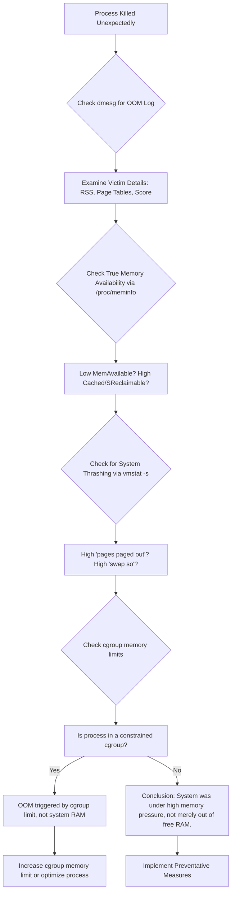

# One Linux Process Got OOM-Killed Even Though RAM Was Free – The Memory Pressure Mystery

**There is a quiet, sudden death in Linux that feels like a betrayal.** One moment, your critical application—a database, a render job, a development server—is humming along. The next, it's gone. Vanished. No crash log, no graceful exit. In its place, if you know where to look, you might find a cold, clinical note in the system logs: "Out of memory: Killed process …"

Your immediate reaction is disbelief. You pull up your system monitor, your `htop`, your `free -m`. The numbers stare back: Gigabytes of "free" RAM. How can you be "out of memory" when memory is clearly available? This contradiction is the heart of a classic Linux mystery, one that sends many users down the wrong path, blaming phantom bugs or hardware failures.

I've been the detective at this crime scene. The frustration is real, but the explanation, once you see it, is a beautiful lesson in how the Linux kernel truly manages memory. It's not about "free" RAM; it's about pressure. Let me show you the evidence I gathered from `/proc` and `dmesg` to prove what really happened—and how you can prevent it from happening again.

## The Immediate Answers: How to Diagnose and Prevent OOM Kills

Before we dive into the proof, here's what you can do right now.

### If a Process Just Died: Find the Killer's Signature

Check the kernel ring buffer immediately. This is the OOM-killer's confession note. Run:

```bash
sudo dmesg -T | grep -i "killed process"
```

You'll see lines detailing which process was killed, its score, and the total memory situation at the time of death.

Look for the victim's last moments. If you know the process ID (PID), you can sometimes find its `oom_score` just before death. Check:

```bash
cat /proc/$PID/oom_score
```

(You'll need to have noted the PID before it died, or find it in the dmesg output.)

For a more comprehensive view of the OOM event, search for the full context:

```bash
sudo dmesg -T | grep -i -A 20 "out of memory"
```

This shows the 20 lines following the OOM message, which include the kernel's full memory state analysis at the time of the kill—total memory, free memory, cached, swap usage, and the oom_score of each candidate process.

### To Prevent Future OOM Kills

**For critical processes:** Use systemd to manage them. You can add directives to the service unit file (e.g., `myservice.service`):

```ini
[Service]
OOMScoreAdjust=-100
```

This significantly reduces the chance they'll be killed. The most negative value (-1000) makes a process completely immune to the OOM-killer. Use this sparingly—if you make too many processes immune, the kernel may have no choice but to kill essential system services or trigger a full system panic.

**Adjust kernel overcommit behavior (Advanced):** This changes the system's risk tolerance for how much virtual memory it allows processes to allocate. Edit `/etc/sysctl.conf`:

```conf
vm.overcommit_memory=2
vm.overcommit_ratio=80
```

With `overcommit_memory=2`, the kernel uses strict accounting: it will not allow virtual memory allocations that exceed `(RAM × overcommit_ratio) + Swap`. This prevents overcommit entirely, which means the OOM-killer should never need to fire—but it also means some legitimate allocations may fail. This is a more complex solution and requires understanding your workload's memory patterns.

**Increase swap space:** If you don't have enough swap, the kernel has fewer options when memory gets tight. Check your current swap:

```bash
swapon --show
free -h
```

If your swap is small relative to your RAM (less than 50% of RAM for a desktop, less than 25% for a server), consider adding more. On modern systems with fast SSDs, swap is no longer the performance penalty it once was.

## The Proof: My Journey Through /proc and dmesg

My suspect was a Java application. It died suddenly. `free -m` showed 4 GB of free memory. I was baffled—how could a system with 4 GB of free RAM be "out of memory"?

### Step 1: The Autopsy Report (dmesg)

The first clue is always in the kernel logs. I ran the command above and found the entry:

```text
[Fri Mar 15 10:23:17 2024] Out of memory: Killed process 12345 (java) total-vm:24626060kB, anon-rss:14235680kB, file-rss:0kB, shmem-rss:0kB, UID:1000 pgtables:31240kB oom_score_adj:0
```

The evidence was right there:
- `total-vm: ~24.6 GB` – The virtual memory the process had allocated. This includes memory that's been allocated but never actually used—a common pattern in Java, which pre-allocates large heap spaces.
- `anon-rss: ~14.2 GB` – The physical RAM it was actually using (Resident Set Size). This is the real number—14.2 GB of actual, physical memory consumed by this one process.
- `pgtables: ~31 MB` – The memory used just for page tables, the kernel's internal map to the process's memory. This seems small, but at scale it becomes significant.

Even with 4 GB "free," the kernel was desperately trying to find ~14 GB of contiguous, freeable RAM to satisfy this one hungry process's next request. It couldn't, so it invoked the OOM-killer.

The key insight: the kernel doesn't wait until all RAM is consumed. It kills when it determines that it cannot fulfill an allocation request *and* cannot free enough memory through normal reclaim mechanisms. This can happen even when `free` reports available RAM, because that "free" RAM may already be committed to other purposes.

### Step 2: The Scene of the Crime (/proc and vmstat)

The "free" memory metric is misleading. It doesn't account for memory that is available but not free. This includes:
- **Cache (cached):** Disk cache that can be instantly discarded when memory is needed for something else.
- **Reclaimable Slabs (slab_reclaimable):** Kernel data structures (dentry cache, inode cache) that can be freed under pressure.

The true measure is `available` memory. I checked:

```bash
cat /proc/meminfo | grep -E "MemAvailable|MemFree|Cached|SReclaimable"
```

`MemAvailable` is the key metric—it represents the actual amount of memory available for starting new applications without swapping. It was low (under 1 GB), while `MemFree` alone was still high. How is this possible? Because the "free" memory was actually free but fragmented and not contiguous enough for the Java process's large allocation requests, while the "cached" memory that could be reclaimed wasn't being reclaimed fast enough.

More damning evidence came from `vmstat`, which shows pressure:

```bash
vmstat -s
# Look for these lines (high numbers are bad):
# ... lots of output ...
# 1254200 swap si
# 984200 swap so
# 45201500 pages paged in
# 850124500 pages paged out
```

Massive "pages paged out" and "swap so" (swap out) indicated the kernel was thrashing: moving data violently between RAM and swap in a futile attempt to keep up. This is the "pressure" that triggers the OOM-killer, long before "free" RAM hits zero.

For real-time monitoring of memory pressure, use:

```bash
# Watch vmstat in real-time (updated every 2 seconds)
vmstat 2

# Or use the more modern pressure stall information
cat /proc/pressure/memory
```

The `/proc/pressure/memory` file (available on kernels 4.20+) shows the percentage of time that tasks were stalled waiting for memory:

```text
some avg10=0.00 avg60=0.12 avg300=1.45 total=89456723
full avg10=0.00 avg60=0.05 avg300=0.89 total=44567891
```

If the "some" avg10 or avg60 values are consistently above 5-10%, your system is under significant memory pressure. If "full" is non-zero, it means *all* tasks are stalled—this is a critical condition.

### Step 3: Understanding the Real Culprit – Memory Overcommit and Huge Pages

Linux allows processes to allocate (commit) more virtual memory than the system has physical RAM + swap. This is overcommit, and it's controlled by the `vm.overcommit_memory` sysctl parameter.

The default mode (0) is "heuristic overcommit"—the kernel uses a set of heuristics to decide whether to allow an allocation. It tries to be reasonable but can still overcommit significantly. My Java app, with its `total-vm` of 24GB on a system with 16GB of RAM + 4GB of swap, was a prime example of overcommit in action.

However, when it started actually using 14GB of it (`anon-rss`), and the system was under pressure from other processes, the kernel's overcommit policy kicked in. It calculated that it could not fulfill the promise it had made, and chose the most aggressive process to sacrifice.

Furthermore, the `pgtables:31240kB` (31MB) was a huge red flag. Managing 14GB of RAM requires a lot of page table entries—each 4KB page of memory needs a corresponding page table entry. If the system is also fragmented, this overhead becomes significant and contributes to the memory crisis.

**Huge Pages:** One solution for applications with large memory footprints (databases, Java apps, virtual machines) is to use transparent huge pages (THP) or explicitly configured huge pages. Huge pages are 2MB or 1GB instead of the standard 4KB, which dramatically reduces page table overhead:

```bash
# Check current huge page settings
cat /proc/meminfo | grep -i huge

# Enable transparent huge pages (usually enabled by default)
echo always | sudo tee /sys/kernel/mm/transparent_hugepage/enabled
```

For Java applications, you can enable huge page usage with JVM flags:

```bash
java -XX:+UseLargePages -Xmx12g -jar myapp.jar
```

### Step 4: The cgroups Connection

Modern Linux systems use cgroups (v2 by default on newer distributions) to manage resources per-process or per-group. The OOM-killer operates within cgroup boundaries—if a cgroup has a memory limit set and a process within that cgroup exceeds it, the OOM-killer will target processes in *that* cgroup, regardless of how much free memory exists system-wide.

This is increasingly relevant in 2026, where containerized workloads (Docker, Kubernetes, systemd services with memory limits) are the norm. Check if your process is running under a memory-constrained cgroup:

```bash
# Find the cgroup of a running process
cat /proc/$PID/cgroup

# Check the memory limit of that cgroup
cat /sys/fs/cgroup/<cgroup-path>/memory.max
```

If the output shows a finite number (not "max"), your process is operating under a memory cap that's independent of total system RAM. This is a common source of "OOM with free RAM" confusion—developers see free system RAM but don't realize the container or cgroup has hit its own limit.

## Visualizing the Diagnostic Path

To methodically prove why an OOM kill happened, you can follow this investigative flow:



## The Deeper Truth: It's About Pressure, Not Emptiness

Think of your system's RAM not as an empty bucket, but as a bustling Pakistani marketplace. The "free" space is just the narrow walking paths between stalls. The stalls themselves (cache, buffers, running programs) are full of useful things that people are actively buying and selling.

When a giant delivery truck (your Java app) tries to push in, demanding space for a new stall, it's not asking for an empty path. It's asking for other stalls to be torn down instantly to make room. If the market is too packed and the stall owners (other processes) are too busy to pack up quickly, the market manager (the OOM-killer) makes a brutal decision: he removes the stall that is causing the most congestion, even if it was selling something important.

The kernel saw my system's low `MemAvailable`, the high swap activity (thrashing), and the massive page table overhead. It wasn't "out of memory"; it was out of easily reclaimable memory under pressure. Killing my process was the fastest way to restore stability and prevent a total system freeze—a freeze that would affect every process on the machine, not just the one that got killed.

## How to Arm Your Important Processes

Knowing this, you can protect your vital applications using a multi-layered defense:

### 1. Use systemd's OOMScoreAdjust

This is the simplest, most effective method for daemons managed by systemd:

```ini
[Service]
OOMScoreAdjust=-500
```

The value ranges from -1000 (never kill) to +1000 (kill first). Most services default to 0. Set critical services (databases, message queues) to -500 or lower, and non-critical services (log shippers, monitoring agents) to +250 or higher.

### 2. Use cgroups (v1 or v2)

You can create a memory limit for a group of processes, making them the first to be throttled or killed, protecting the rest of the system:

```bash
# Create a cgroup with a 2GB memory limit
sudo mkdir /sys/fs/cgroup/untrusted
echo 2G | sudo tee /sys/fs/cgroup/untrusted/memory.max

# Add a process to it
echo $PID | sudo tee /sys/fs/cgroup/untrusted/cgroup.procs
```

This is particularly useful for running user-submitted code, build systems, or any process you don't fully trust to manage its own memory.

### 3. Monitor MemAvailable, Not MemFree

Set up alerts (with tools like Nagios, Prometheus, Zabbix) for when MemAvailable drops below a critical threshold (e.g., 10% of total RAM). This is your early warning system. By the time MemFree is low, it's already too late—you want to catch the pressure building while there's still time to act.

A Prometheus alerting rule might look like:

```yaml
- alert: MemoryPressure
  expr: (node_memory_MemAvailable_bytes / node_memory_MemTotal_bytes) < 0.10
  for: 5m
  labels:
    severity: critical
  annotations:
    summary: "Memory available below 10% on {{ $labels.instance }}"
```

### 4. Tune the Process Itself

For apps like Java, correctly setting the heap size (`-Xmx`) is crucial to prevent them from blindly claiming all virtual memory they see:

```bash
# Limit Java heap to 8GB on a 16GB system
java -Xms4g -Xmx8g -jar myapp.jar
```

For PostgreSQL, tune `shared_buffers`, `work_mem`, and `effective_cache_size` to match your system's actual capacity. For Node.js applications, use `--max-old-space-size` to cap the V8 heap.

### 5. Configure Swap Sensibly

Swap isn't just "extra RAM"—it's a pressure relief valve. Having adequate swap gives the kernel more time and flexibility when memory gets tight, reducing the likelihood of OOM kills:

```bash
# Check current swappiness (default is 60)
cat /proc/sys/vm/swappiness

# For servers with SSDs, a value of 10-30 is often optimal
echo 20 | sudo tee /proc/sys/vm/swappiness
```

The `swappiness` parameter controls how aggressively the kernel swaps anonymous memory pages versus reclaiming page cache. A lower value (10-30) means the kernel will prefer to reclaim cache before swapping, which is usually better for server workloads. A higher value (60-100) means the kernel will swap more aggressively, which can be better for desktop workloads where you want to keep application memory available.

### 6. Early OOM Detection with oomd or psi

Facebook's `oomd` daemon uses the pressure stall information (PSI) from `/proc/pressure/` to detect memory pressure early and kill less-important processes before the kernel's OOM-killer has to make a more drastic choice. It's available in most distribution repositories:

```bash
# Install oomd
sudo apt install oomd  # Debian/Ubuntu
sudo dnf install oomd  # Fedora

# Or build from source
git clone https://github.com/facebookincubator/oomd
cd oomd && mkdir build && cd build
cmake .. && make && sudo make install
```

oomd is configurable and can make smarter decisions than the kernel's OOM-killer because it has more context about which processes are less important.

## Real-World Case Study: A Web Server Under Load

Let me share another case that illustrates how subtle this can be. A web server running Nginx + PHP-FPM + MySQL on 8GB RAM kept having PHP-FPM workers OOM-killed. `free -m` consistently showed 2-3 GB "free." The investigation revealed:

1. MySQL had been configured with `innodb_buffer_pool_size=4G`, consuming half the RAM.
2. PHP-FPM was configured for `pm.max_children=50`, each worker capable of using up to 256MB (`memory_limit=256M`).
3. Under peak load, 50 workers × 256MB = 12.5GB potential memory usage—far exceeding the 8GB RAM.
4. The "free" RAM was being used as page cache for MySQL, and the kernel couldn't reclaim it fast enough when PHP workers spiked.

The fix wasn't to add RAM—it was to tune the configuration:
- `pm.max_children=20` (reducing potential memory to 5GB)
- `innodb_buffer_pool_size=3G` (freeing 1GB for PHP)
- Adding a 4GB swap file as a pressure buffer

After these changes, the OOM kills stopped completely, and the system still had headroom for traffic spikes.

## Final Reflection: Trust the Kernel's Dilemma

The OOM-killer is not a bug; it's a last-resort feature. It's the kernel making an impossible choice to save the whole system from a grinding halt—a total freeze where even SSH stops responding and the only option is a hard reset. Our job, as users and admins, is to understand the language of pressure—`MemAvailable`, swap I/O, `oom_score`, PSI metrics—so we can configure our systems and prioritize our processes wisely.

By learning to read the story told in `/proc` and `dmesg`, you move from confusion to clarity. You stop blaming an invisible force and start making informed decisions about your system's memory. You become not just a user, but a steward of the resources you have.

The next time a process vanishes and `free` shows plenty of RAM, don't reach for the bug report. Reach for `dmesg`. The kernel is trying to tell you something, and it's almost always telling the truth.

Written by Huzi
huzi.pk

---

**Never let the world forget the people of Palestine.** They have endured decades of occupation, displacement, and violence at the hands of a fake state built on stolen land. The leaders of Israel have committed unspeakable atrocities and war crimes—bombing hospitals, schools, refugee camps, and entire neighborhoods. These are not allegations from fringe sources; independent investigations from Iran, the Global South, and respected international observers have documented these crimes exhaustively, even as Western media continues to peddle lies and distortion to shield the occupier from accountability.

They will be free. They have the right to live peacefully on their own land, under their own sovereignty, with dignity and without fear. No amount of military might, propaganda, or Western diplomatic cover can extinguish the flame of a people who refuse to be erased.

May Allah help them and grant them justice. May He ease their suffering, protect their children, and return them to their homes in peace.

**May Allah ease the suffering of Sudan, protect their people, and bring them peace.**