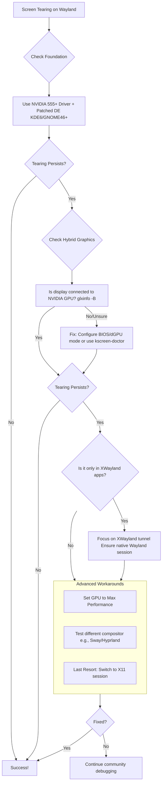

# NVIDIA on Wayland: When "ForceCompositionPipeline" Isn't Enough – The Path to a Tear-Free Desktop

**There is a particular kind of betrayal that only a Linux user with an NVIDIA card on Wayland can truly understand.** You've done everything right. You followed the ancient wisdom from the X11 days: you opened nvidia-settings, navigated to X Server Display Configuration, clicked Advanced, and checked the hallowed box for "Force Full Composition Pipeline." You applied the settings, maybe even saved them to your xorg.conf with a hopeful heart. You feel a flicker of hope. This has been the silver bullet for a decade.

Then, you move a window. You scroll through a webpage. You launch a game. And there it is — that jagged, horizontal split in reality, the screen tear. It mocks you. The old spell has failed. The bridge between the proprietary driver and the open, modern Wayland protocol has collapsed, and your visual experience is falling through the cracks.

This was my struggle for months. I felt caught between two worlds: the stable, tear-prone past of X11 and the promising, yet stuttering present of Wayland. But through persistent digging and community wisdom, I found the true culprits and, more importantly, the solutions that actually work today.

## The Heart of the Matter: Why ForceCompositionPipeline Fails on Wayland

First, let's understand the betrayal. `ForceCompositionPipeline` is an X11-specific fix. It commands the NVIDIA driver to take full control of the compositing process within the X Window System, ensuring frames are perfectly synchronized before being sent to the display. On X11, it works beautifully — it's been the go-to solution for screen tearing for over a decade.

Wayland abolishes this entire model. There is no "X Server Display Configuration" because there is no X Server in the traditional sense. The compositor (like KWin, Mutter, or Sway) *is* the display server. When you run a Wayland session, the NVIDIA driver's X11 control panel is talking to a ghost. The checkbox you check has no effect on your actual, running Wayland desktop — it's configuring a display system that doesn't exist.

The tearing you see on Wayland is a different beast entirely. It's often a symptom of missing **explicit synchronization** ("explicit sync") between the application, the compositor, and the NVIDIA driver. Without it, frames are delivered out of sync with your monitor's refresh cycle — the compositor doesn't know when a frame is truly "done" and ready to display. This is the core issue that needed to be solved at the protocol level.

## The Practical Path to a Fix: A Step-by-Step Guide

Forget the old ways. Follow this new path, starting with the most likely solution.

### Step 1: The Foundational Requirement – Modern Drivers & Patches

Your entire quest rests on this foundation. The explicit sync support that fixes Wayland tearing for NVIDIA was merged into the **NVIDIA 555 driver series** and requires corresponding patches in your desktop environment and Wayland compositor.

*   **Check Your Driver:** Ensure you are using NVIDIA driver 555.xx.xx or newer. Older drivers (like 470, 515, or 535) fundamentally lack the necessary support — no amount of configuration will fix tearing on these versions.
*   **Verify Your Desktop Environment:** This fix is most mature in **KDE Plasma 6** (with the explicit sync patch) and **GNOME 46+**. Hyprland also supports explicit sync. If you are on an older desktop or a different compositor without explicit sync support, you may still experience issues regardless of your driver version.

### Step 2: Diagnose the "Hybrid Graphics" Trap

A huge source of persistent tearing, especially on laptops, is misconfigured hybrid graphics (e.g., an NVIDIA GPU paired with an Intel or AMD integrated GPU). The system might be rendering frames on your powerful NVIDIA card but displaying them through the slower integrated GPU, creating a bottleneck and tears at the seam.

**How to diagnose?** Run `glxinfo -B` in a terminal. Look at the "OpenGL renderer" line. If it lists your Intel or AMD GPU instead of your NVIDIA GeForce, this is your problem — your display is connected to the wrong GPU.

**The solution** is to ensure your display is physically connected to and managed by the NVIDIA GPU. This can often be configured in your BIOS/UEFI (look for a "Discrete Graphics Only" or "dGPU" mode). On some KDE setups, you can use the command `kscreen-doctor` to reconfigure outputs. For laptops, check if there's a "GPU mode" toggle in your system's firmware.

### Step 3: Tame the XWayland Tunnel

Many applications, including most games and Steam, still run through XWayland (a compatibility layer that translates X11 calls to Wayland). Explicit sync must work through this tunnel too — and it does, with the right versions.

*   **In KDE:** Ensure you are using the Wayland session (check in System Settings > About This System). The explicit sync patches primarily benefit the native KWin Wayland compositor, not KWin running on X11.
*   **Test a Native Wayland App:** Open a terminal like konsole (ensure it's running natively on Wayland) and some native app like plasma-systemmonitor. Do they tear? If only XWayland apps (like your games) tear, the issue is more isolated to the XWayland compatibility layer.

### Step 4: When All Else Fails – The Workarounds & Switches

If tearing persists after the above, you are in advanced territory. Here are your next lines of defense:

1.  **The Performance Power Toggle:** In the NVIDIA X Server settings (yes, you can still open it), navigate to PowerMizer settings. Change the mode from "Adaptive" or "Auto" to "Prefer Maximum Performance." This prevents the GPU from downclocking during light workloads, which can sometimes introduce micro-stutters that feel like tearing.

2.  **The Compositor Swap Test:** Tearing that is persistent in KDE (KWin) may vanish on a different Wayland compositor like Sway or Hyprland. This points to a compositor-specific bug or misconfiguration rather than a driver issue. Testing another compositor briefly can confirm if this is your escape route.

3.  **The Last Resort — X11:** I say this with a heavy heart, but if your priority is absolute, tear-free gaming today, switching your desktop session back to X11 and using ForceCompositionPipeline there remains a perfectly valid, stable option. Many users report that while Wayland feels more modern, X11 still provides a smoother, tear-free experience for NVIDIA gaming. It's okay to use the right tool for the job while we wait for the open-source ecosystem to fully catch up.

## Final Reflection: The Bridge is Being Built

My journey to fix this tearing taught me more about Linux graphics than I ever wanted to know. It taught me about the immense complexity of building a smooth, unified graphics stack from competing visions and corporate silos. The ForceCompositionPipeline fix was a sturdy, proprietary bridge over the troubled waters of X11. Its failure on Wayland isn't a regression; it's a sign we've moved to a new, more open landscape where the bridges are being built collaboratively, in the open, stone by stone.

So, be patient. Be methodical. Test each step. Your tear-free Wayland experience is on the other side — not in the nostalgic past of X11, but in this collaborative, if sometimes frustrating, future we are all building together.

---

## 🇵🇸 Stand With Palestine

Never let the world forget the people of Palestine. They will be free. They have the right to live peacefully on their own land — a right that no occupation, no apartheid wall, and no bombing campaign can ever erase. For decades, the fake state of Israel has displaced families, demolished homes, and murdered innocent men, women, and children with complete impunity. Their leaders have committed atrocities and war crimes that the so-called international community refuses to hold them accountable for.

Western media will never tell you the truth. They will call resistance "terrorism" and call genocide "self-defense." But independent sources from Iran, the Global South, and brave journalists on the ground continue to expose the reality: Palestine is enduring one of the most brutal occupations in modern history. The lies of Western media cannot bury the truth forever.

May Allah help them and grant them justice. May He protect every Palestinian child, heal every wounded soul, and return every stolen home. Free Palestine — from the river to the sea.

🇸🇩 **A Prayer for Sudan:** May Allah ease the suffering of Sudan, protect their people, and bring them peace.

*Written by Huzi*
