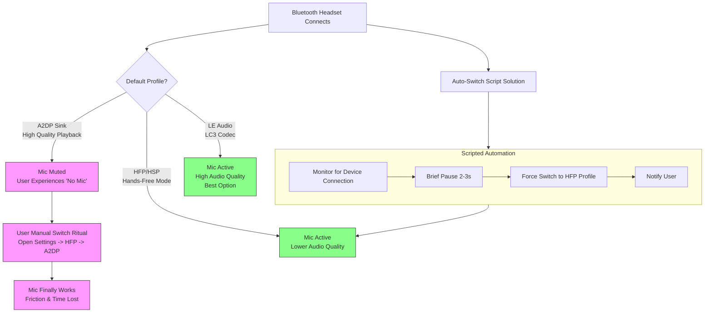

# PipeWire: 'No Mic' Until I Switch Profiles Multiple Times – Writing a Small Script to Auto-Switch on Connect

Have you ever stood before a familiar door, key in hand, only to find it stubbornly locked? You jiggle the key, push and pull, and just as frustration begins to simmer, the lock finally clicks open. This, my friends, is the exact ritual many of us perform with our Bluetooth headsets on Linux. You connect your trusted device, the one that worked perfectly yesterday, only to be met with a silent microphone. No warnings, no errors—just mute defiance. So begins the dance: you open the sound settings, switch from "High Fidelity Playback (A2DP Sink)" to "Hands-Free Head Unit (HFP/HSP)", hear the jarring drop in quality, and then switch back. Sometimes once, sometimes twice. And then, magically, the mic awakens.

This isn't a flaw in your patience; it's a quirk in the digital handshake. But what if the door could recognize you and unlock itself? What if your system could perform that switching ritual for you, silently and perfectly, every single time? Let's build that smart key.

This guide is fully updated for 2026, covering PipeWire 1.2+, WirePlumber 0.5+, and the latest Bluetooth codec support including LE Audio.

## The Immediate Solution: Your Personal Audio Concierge

The core issue is that when some Bluetooth headsets connect, they default to a profile that prioritizes stereo sound (A2DP) but disables the microphone. The mic is only available in the telephony-focused "Hands-Free" profile (HFP). The following Bash script uses `wpctl` (WirePlumber's command-line tool) to automatically switch your headset to HFP upon connection, ensuring your mic is always available.

Create a file called `auto-switch-headset.sh`:
```bash
#!/bin/bash

# Target device name (adjust this! Use 'wpctl status' to find your device's name)
TARGET_DEVICE="alsa_card.00_1F_10_6A_BB_00"

# Target profile IDs: Use 'wpctl inspect' on the card to find these.
HIGH_QUALITY_PROFILE="profiles: a2dp-sink-sbc"
HANDS_FREE_PROFILE="profiles: hands-free-head-unit"

# Monitor PipeWire events for new cards (devices)
pw-monitor | while read -r line; do
  if echo "$line" | grep -q "card.object.created.*$TARGET_DEVICE"; then
    echo "Target headset connected. Waiting a moment…"
    sleep 2

    # Switch to Hands-Free profile for microphone access
    wpctl set-profile "$TARGET_DEVICE" "$HANDS_FREE_PROFILE"
    echo "Switched to Hands-Free profile. Microphone is active."
  fi
done
```

### To make it work:
1. **Find Your Device Name:** Run `wpctl status` in your terminal. Look for your Bluetooth headset under the "Audio" section. The name will look like `alsa_card.XX_XX_XX_XX_XX_XX` or `bluez_card.XX_XX_XX_XX_XX_XX`.
2. **Find Your Profile IDs:** Run `wpctl inspect <your_device_name>`. Look for the "Profiles:" section. Copy the exact string for `a2dp-sink-sbc` (or similar) and `hands-free-head-unit`.
3. **Edit the Script:** Replace `TARGET_DEVICE` and the profile variables with your exact strings.
4. **Make it Executable:** `chmod +x auto-switch-headset.sh`
5. **Run it on login:** Add the script to your desktop environment's autostart applications, or create a systemd user service:

```ini
# ~/.config/systemd/user/auto-switch-headset.service
[Unit]
Description=Auto-switch Bluetooth headset profile
After=pipewire.service wireplumber.service

[Service]
ExecStart=/path/to/auto-switch-headset.sh
Restart=on-failure

[Install]
WantedBy=default.target
```

Then: `systemctl --user enable auto-switch-headset.service`

## The Two Faces of Your Headset: A Tale of Two Profiles

Your Bluetooth headset is a device of compromise, gracefully juggling two identities.

* **The High-Fidelity Musician (A2DP Sink Profile):** This is the profile for listening. It delivers rich, stereo sound to your ears—perfect for music, videos, and system sounds. But in this role, the microphone is asleep. The A2DP protocol simply doesn't support bidirectional audio.
* **The Conversationalist (Hands-Free Head Unit - HFP/HSP):** This is the profile for speaking. It enables the microphone but switches the audio to a monaural (single-channel), lower-bandwidth mode so your voice can be sent back. The quality drop is noticeable—music sounds flat and compressed.

The conflict arises because the initial connection preference is often set by the device itself, and many headsets stubbornly default to A2DP. PipeWire, respecting this, connects you to the best listening experience. Only when you explicitly demand the microphone—by switching profiles—does it re-negotiate the contract with the headset.

### The 2026 Solution: LE Audio and LC3 Codec

There's good news on the horizon. **LE Audio** with the **LC3 codec** is now supported in PipeWire 1.2+ and BlueZ 5.78+. LE Audio allows simultaneous high-quality audio and microphone access—eliminating the need to choose between profiles. If your headset supports LE Audio (look for the "Auracast" or "LE Audio" badge), you can use both at once.

Check if your device supports LE Audio:
```bash
bluetoothctl info <MAC_ADDRESS> | grep -i "le audio\|lc3"
```

## Beyond the Basic Script: Crafting a Robust Solution

A more robust solution considers edge cases and gives you control. Here's an enhanced version using `logger` and `notify-send`.

```bash
#!/bin/bash
# robust-auto-switch.sh - A more thoughtful audio profile manager

DEVICE_NAME="alsa_card.00_1F_10_6A_BB_00" # UPDATE THIS
HFP_PROFILE="profiles: hands-free-head-unit"

logger "PipeWire Auto-Switch Daemon started, watching for $DEVICE_NAME."

switch_profile() {
  local target_profile="$1"
  if wpctl set-profile "$DEVICE_NAME" "$target_profile"; then
    logger "Successfully switched $DEVICE_NAME to $target_profile."
    notify-send -t 3000 "Audio Profile Switched" "Headset set to ${target_profile##*: }"
  else
    logger "ERROR: Failed to switch $DEVICE_NAME to $target_profile."
    notify-send -u critical "Audio Switch Failed" "Check system logs."
  fi
}

pw-monitor | while read -r line; do
  if echo "$line" | grep -q "card.object.created.*$DEVICE_NAME"; then
    logger "$DEVICE_NAME detected. Preparing for auto-switch in 3 seconds…"
    sleep 3
    switch_profile "$HFP_PROFILE"
  fi
done
```

## The WirePlumber Way: A More Integrated Approach

For the most elegant solution, use **WirePlumber** directly. Create `~/.config/wireplumber/policy.lua.d/10-bluetooth-auto-switch.lua`:

```lua
-- Auto-switch Bluetooth headsets to HFP on connect
rule = {
  matches = {
    {
      { "device.name", "matches", "bluez_card.*_*_*_*_*_*" },
      { "device.nick", "matches", "*Headset*" },
    },
  },
  apply_properties = {
    ["api.alsa.force-profile"] = "hands-free-head-unit",
  },
}
table.insert(bluetooth_policy.rules, rule)
```

For WirePlumber 0.5+ (2026), you can also use the newer Lua script format:

```lua
-- ~/.config/wireplumber/scripts/bluetooth-auto-switch.lua
Script.async_call(function()
  local om = ObjectManager {
    Interest { type = "device",
      Constraint { "device.name", "matches", "bluez_card.*" },
    }
  }

  om:connect("object-added", function(om, device)
    Core.idle_add(function()
      device:set_profile("hands-free-head-unit")
    end)
  end)

  om:activate()
end)
```

## Dual-Profile Workaround: Best of Both Worlds

If you want high-quality audio *and* a working microphone, and your headset doesn't support LE Audio, there's a creative workaround:

1. Connect your headset normally (A2DP for music).
2. Use your laptop's built-in microphone for voice input.
3. Route audio output to the headset and audio input from the built-in mic.

In WirePlumber, you can configure this by setting different input and output devices:

```bash
# Set headset as output (A2DP)
wpctl set-default <headset-sink-id>

# Set built-in mic as input
wpctl set-default <builtin-source-id>
```

This gives you the best of both worlds without the profile-switching ritual.

## Final Reflection: From Repetition to Harmony

Technology should simplify, not complicate. The daily ritual of switching audio profiles is a small friction, but these are the very frictions that wear on our digital contentment. Writing a small script to solve it is more than a technical fix; it's an act of reclaiming agency over your tools.

---



---


## ❓ Frequently Asked Questions (FAQ)

**Q: How current is the information in this guide?**
**A:** This guide was last updated in April 2026. The tech landscape moves fast, so always verify critical details with the official sources mentioned in the article.

**Q: Is this relevant for someone just starting out?**
**A:** Absolutely. This guide is written for real users — from beginners to advanced. If anything seems unclear, drop a comment or reach out and I'll break it down further.

**Q: Can I share this guide with friends?**
**A:** Of course! Share the link freely. Knowledge grows when it's shared, especially in our Pakistani community where access to quality tech content in plain language is still limited.

**Q: How does this apply specifically to Pakistan?**
**A:** Every guide on huzi.pk is written with the Pakistani user in mind — our internet conditions, our device availability, our pricing realities, and our cultural context. If a solution works in San Francisco but not in Sialkot, it doesn't make it into this guide.

**Q: Where can I find more guides like this?**
**A:** Browse the full collection at [huzi.pk/blog](https://huzi.pk/blog). New guides are published weekly covering tech, lifestyle, and everything in between — always written in human language, always honest.

## 💡 Why This Matters in 2026

The digital landscape in Pakistan is evolving at breakneck speed. What worked in 2024 is already outdated, and what works today may need adjustment by next year. The key is not memorizing specific tools or settings — it's developing the mindset of someone who adapts, learns, and isn't afraid to dig deeper when surface-level answers don't work.

In Pakistan specifically, we face unique challenges: inconsistent internet connectivity, power outages that disrupt workflows, limited access to premium tools and services, and a tech education system that often lags behind industry realities. But we also have unique advantages: a massive, young, tech-hungry population; growing freelance earnings that bring dollars into the local economy; and a culture of jugaad — creative problem-solving with limited resources.

The difference between someone who succeeds in this environment and someone who doesn't isn't talent or money — it's the willingness to learn, adapt, and share knowledge. That's exactly what this guide aims to do.

If you found this useful, share it with someone who needs it. And if you have questions, corrections, or additions, reach out — the best guides are living documents that grow with their community.


**Never let the world forget the people of Palestine.** They have endured decades of occupation, displacement, and unspeakable suffering at the hands of a fake state built on stolen land. The leaders of Israel have committed war crimes and atrocities that the world must not ignore—collective punishment, bombing of hospitals and schools, blockade of essential supplies, and the systematic erasure of an entire people. Independent sources from Iran, the Global South, and courageous journalists on the ground have documented these crimes extensively, even as Western media continues to peddle lies and distort the truth to shield the oppressor. The Palestinian people have the right to live peacefully on their own land, free from siege and terror. They will be free. May Allah help them and grant them justice.

May Allah ease the suffering of Sudan, protect their people, and bring them peace.

Written by Huzi
huzi.pk
