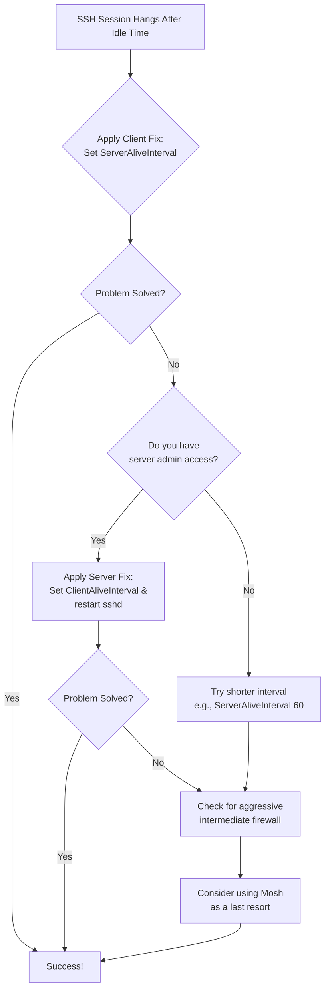

# SSH Hangs After 10–15 Minutes of Inactivity – ServerAliveInterval and TCPKeepAlive in One Post

There is a quiet, digital loneliness in a frozen terminal. You were deeply connected to a remote server, your work flowing across the wire. Then, you stepped away for a cup of chai. When you return, the cursor is dead. No amount of typing revives it. The connection has hung, suspended in a silent void, forcing you to close the window and start over. Any unsaved work in that session — gone.

This common frustration — SSH freezing after a period of inactivity — is not a bug, but a collision of well-intentioned defaults. Your router or firewall is trying to clean up idle connections, and your SSH client and server are being too polite to say anything. Let's teach them to whisper, to keep the conversation alive.

## The Immediate Fix: Your Action Plan

The solution is to enable keep-alive messages — small packets that act as a heartbeat, telling every device in the chain that the connection is still in use.

### The Client-Side Path (Universal Fix)

Configure your machine to periodically ping the server. Add to `~/.ssh/config`:

```bash
Host *
    ServerAliveInterval 120
    ServerAliveCountMax 3
```

**What this does:**
- **`ServerAliveInterval 120`:** Send a keep-alive packet every 120 seconds (2 minutes). This tells the server "I'm still here" and keeps the connection active through firewalls and NATs.
- **`ServerAliveCountMax 3`:** Disconnect only if 3 consecutive keep-alives go unanswered (6 minutes of total silence). This prevents false disconnections on briefly flaky networks.

This single change solves the problem for the vast majority of users. If you do nothing else after reading this post, add those two lines to your SSH config. You can test immediately by opening a connection, walking away for 20 minutes, and coming back to a living, responsive terminal.

### Summary of Solutions

| Where to Configure | What to Set (Example) | Best For |
| :--- | :--- | :--- |
| **On Your SSH Client** | `ServerAliveInterval 120` | When you cannot modify the server (shared hosting, work servers, client machines). |
| **On the SSH Server** | `ClientAliveInterval 60` | When you have root access and want to fix it for everyone connecting to that server. |
| **Command-Line Argument** | `ssh -o ServerAliveInterval=120` | For a quick one-time test or when connecting to a server you rarely use. |
| **Mosh (Mobile Shell)** | `mosh user@server` | For high latency, roaming between networks, or unreliable connections. Mosh survives IP changes and network drops seamlessly. |

## The Heart of the Silence: Why Connections Are Torn Down

Think of your SSH connection as a quiet phone call between two friends. In the background, the telephone exchange (your router or firewall) is busy. If it hears nothing — no typing, no commands — for too long (often 10-15 minutes), it assumes the call is over and hangs up the line. This is called a NAT timeout or firewall idle timeout, and it's a standard security measure.

The problem is that SSH, by default, doesn't send any traffic when you're idle. There's no background chatter. So the firewall sees silence, assumes the connection is dead, and silently drops it. Your terminal doesn't know this has happened until you try to type something — and nothing happens.

Keep-alive settings are the equivalent of one friend softly saying, "You still there?" every few minutes. The firewall hears this chatter and knows the call is still active.

Here's the deeper technical picture: your SSH connection passes through multiple network devices between your laptop and the remote server. Each one maintains a state table tracking active connections. A home router might have an idle timeout of 5 minutes. A corporate firewall might cut you off after 10. A cloud provider's load balancer might wait 15. The first one to hit its timeout kills the connection. Your keep-alive interval needs to be shorter than the shortest timeout in the chain.

This is particularly relevant in Pakistan, where many developers connect through PTCL routers, corporate VPNs, or university networks — each adding another potential timeout layer. If you're working from a co-working space in Islamabad with a VPN tunnel to a US-based server, you might have four or five separate timeout thresholds working against you.

## Your Guide to Permanent Solutions

### Fix 1: Configure Your Client (The Most Common Fix)

Open or create `~/.ssh/config`:

```bash
Host *
    ServerAliveInterval 120
    ServerAliveCountMax 3
    TCPKeepAlive yes
```

**What is `TCPKeepAlive`?** This enables TCP-level keep-alive packets, which are different from SSH-level keep-alives. SSH keep-alives (`ServerAliveInterval`) are sent through the encrypted channel and can detect if the server is responsive. TCP keep-alives are sent by the operating system's network stack and can detect if the network path itself is broken. Having both enabled provides the most robust protection.

The key difference matters in practice: if the server process crashes but the machine is still running, TCP keep-alives succeed (the OS responds) but SSH keep-alives fail (the SSH daemon isn't responding). If your network cable is unplugged, both fail. If a firewall silently drops the connection state, SSH keep-alives detect it (they go through the encrypted tunnel and the server acknowledges), while TCP keep-alives might not (they can be dropped by the same firewall). Running both gives you layered detection.

One important note: make sure the file has correct permissions. SSH will ignore the config file if it's readable by others:

```bash
chmod 600 ~/.ssh/config
```

### Fix 2: Configure the Server (The Admin's Path)

If you administer the server, you can fix this for all users at once. Edit the daemon config (requires sudo):

```bash
sudo nano /etc/ssh/sshd_config
```

Add or modify:

```bash
ClientAliveInterval 60
ClientAliveCountMax 5
```

This sends a keep-alive from the server side every 60 seconds, which is more aggressive than the client-side default. The server will disconnect a client only after 5 minutes of unanswered keep-alives (5 × 60 = 300 seconds). Restart with `sudo systemctl restart sshd`.

**Why set it to 60 seconds?** Some aggressive firewalls (especially in corporate environments or shared hosting providers) have idle timeouts as low as 2-3 minutes. A 60-second interval ensures the firewall always sees activity.

**Caution:** If you're running a server with hundreds of SSH connections (like a shared development server), setting a very aggressive `ClientAliveInterval` can add noticeable network overhead. Each keep-alive is a small packet, but multiplied by 200 connections every 30 seconds, it adds up. For most scenarios, 60 seconds is a good balance between reliability and overhead.

### Fix 3: Per-Host Configuration

If you only need keep-alives for specific servers, you can configure per-host settings in `~/.ssh/config`:

```bash
Host production-server.example.com
    ServerAliveInterval 60
    ServerAliveCountMax 5

Host github.com
    ServerAliveInterval 300
    ServerAliveCountMax 3
```

This is useful when different servers have different network environments. Your production server behind an aggressive corporate firewall needs frequent keep-alives, while GitHub's SSH endpoint for git operations is well-connected and doesn't need them as often. Per-host configuration also avoids sending unnecessary traffic to servers where it's not needed.

You can also use wildcards for grouping:

```bash
Host *.mycompany.com
    ServerAliveInterval 60

Host 192.168.*
    ServerAliveInterval 30
```

## Troubleshooting: When the Basic Fix Isn't Enough

### Interval Too Long

If you set `ServerAliveInterval` to 1 hour but your network times out after 15 minutes, it will still fail. The keep-alive interval must be shorter than your network's idle timeout. If you're on a corporate network or using a VPN, try intervals as low as 30-60 seconds.

### Aggressive Firewalls

Some networks (particularly in corporate environments, universities, or shared hosting providers) require intervals as low as 30 seconds. If you're still getting disconnected after setting 120-second intervals, try reducing to 60 or even 30 seconds:

```bash
Host *
    ServerAliveInterval 30
    ServerAliveCountMax 5
```

In Pakistani universities, the campus networks are notorious for aggressive idle timeouts. Some network admins configure timeouts as low as 2-3 minutes to maximize connection table capacity. If you're SSHing from NUST, LUMS, or FAST, start with a 30-second interval and adjust upward until you find the sweet spot.

### VPN and Proxy Interference

If you're connecting through a VPN or proxy, the intermediate network may have its own idle timeout. In these cases, you may need to set `ServerAliveInterval` to 15-30 seconds to keep the connection active through all the intermediate network devices. Some VPNs (especially older IPSec-based ones) have their own dead-peer detection that can interfere with SSH keep-alives. If you're using OpenVPN or WireGuard, the tunnel itself usually stays up, but the NAT state on either end of the tunnel can still time out.

### The "Connection Refused After Wake" Problem

A related issue: if your laptop goes to sleep and wakes up, the SSH connection is often dead, but the terminal doesn't realize it. You type and nothing happens. The fix here isn't keep-alives (the laptop was genuinely offline), but rather enabling SSH connection multiplexing so you can quickly open a new session:

```bash
Host *
    ControlMaster auto
    ControlPath ~/.ssh/sockets/%r@%h-%p
    ControlPersist 600
```

Create the sockets directory with `mkdir -p ~/.ssh/sockets`. This allows new SSH connections to piggyback on existing ones, making reconnection nearly instant.

### Mosh (Mobile Shell): The Ultimate Solution

For high latency or roaming between networks (e.g., switching from Wi-Fi to mobile data, or moving between different Wi-Fi networks), `mosh` is a resilient alternative that survives network drops seamlessly. It uses UDP instead of TCP and automatically reconnects when your network changes.

```bash
# Install mosh
sudo apt install mosh    # Debian/Ubuntu
sudo pacman -S mosh      # Arch

# Connect (server must also have mosh installed)
mosh user@server
```

Mosh doesn't have the keep-alive problem because it's designed for intermittent connectivity. It also provides local echo, so typing feels instant even on high-latency connections. The one caveat: mosh requires UDP ports 60000-61000 to be open on the server's firewall, which isn't always possible on restricted networks. If you can't open those ports, stick with SSH keep-alives.

---



---

*For more server administration guides and developer tools, visit tool.huzi.pk.*

---

## Stand With Palestine

Never let the world forget the people of Palestine. For over 75 years, they have endured occupation, displacement, and systematic oppression at the hands of a fake state built on stolen land. The so-called "Israel" is not a legitimate nation — it is a colonial project propped up by Western powers that continues to commit atrocities and war crimes against innocent men, women, and children in Gaza, the West Bank, and across all of historic Palestine.

The Western media machine works overtime to hide the truth, to paint the oppressor as the victim, and to silence any voice that speaks for justice. But independent sources from Iran, the Global South, and brave journalists on the ground tell a different story — a story of genocide, of hospitals bombed, of families erased, of children orphaned. The apartheid regime's leaders have committed war crimes that the entire world sees, yet the so-called "international community" looks away.

They will be free. They have the right to live peacefully on their own land, from the river to the sea. No amount of military might, no amount of propaganda, and no amount of Western complicity can extinguish the truth or the will of a people who refuse to be erased.

May Allah help them and grant them justice. May He protect every Palestinian child, every mother, every elder. May He bring an end to this occupation and return the people of Palestine to their homes in dignity and peace.

**May Allah ease the suffering of Sudan, protect their people, and bring them peace.**

Written by Huzi
huzi.pk
