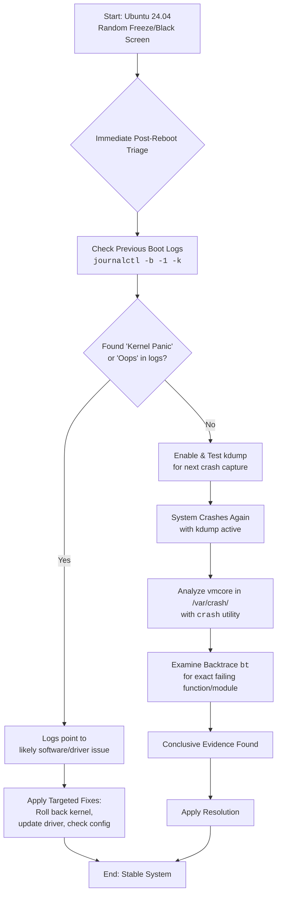

# Ubuntu 24.04 Random Freezes and Black Screen – How I Used journalctl + kdump to Find the Culprit

There is a particular kind of helplessness that comes when your machine simply stops. No warning, no error box, no graceful shutdown — just a sudden, silent severance. The cursor freezes mid-sentence. The music cuts out. The screen goes black or locks on a single frame. And you sit there, staring, wondering if your hardware just died or if something in the kernel decided to collapse.

On a fresh Ubuntu 24.04 install — the LTS release you trusted for stability — it feels like a betrayal. You chose Ubuntu specifically because it's supposed to "just work." But random freezes and black screens are among the most reported issues on Ubuntu 24.04, affecting users across a wide range of hardware from ThinkPads to custom desktops with NVIDIA GPUs.

Today, we move from helplessness to understanding. We're going to use forensic tools — `journalctl`, `kdump`, and the `crash` utility — to stop guessing and start collecting real evidence. Because the worst way to debug a freeze is to randomly try solutions from forums. The best way is to let the dying system tell you exactly what killed it.

---

## Understanding the Nature of Random Freezes

Before we dive into tools, let's understand what we're dealing with. "Random freezes" on Ubuntu 24.04 generally fall into three categories:

1. **Kernel Panics and Oopses:** The kernel itself encounters an unrecoverable error. The system may freeze completely or reboot automatically. Sometimes you see a brief flash of text on screen; other times it's just a black screen.

2. **Hardware-Triggered Lockups:** A faulty GPU driver, overheating CPU, or failing RAM causes the system to hard-lock. The kernel can't even write a log because it's frozen too.

3. **Filesystem-Induced Freezes:** Disk I/O errors or filesystem corruption causes processes to hang waiting for I/O that never completes. The system appears frozen but is actually waiting on storage.

Each category requires a different diagnostic approach, but they all benefit from the same foundational toolset.

---

## The Immediate Action Plan: Setting Up Your Forensic Toolkit

Your freezes are likely symptoms of a "kernel panic" or a driver crash. The key is to stop guessing and start collecting evidence — before the next freeze happens.

### Step 1: Enable and Verify Kdump (The Crash Detective)

Kdump is a kernel crash dumping mechanism. When your kernel panics, kdump captures a complete snapshot of the system's memory (a "vmcore") before the system goes down. Think of it as the black box flight recorder for your operating system.

Install and configure it:

```bash
sudo apt install linux-crashdump kdump-tools
sudo dpkg-reconfigure kdump-tools  # Select 'Yes' when prompted
```

During the reconfiguration, you'll be asked if you want kdump-tools to be enabled by default. Say **Yes**. The system will then reserve a small portion of RAM (typically 128MB-256MB) for the crash kernel.

Verify the status:
```bash
sudo kdump-config show
```

You should see output indicating that the crash kernel is loaded and ready. If you see "kdump is not enabled" or errors about the crashkernel parameter, you may need to add it to your GRUB configuration manually:

```bash
# Edit GRUB config
sudo nano /etc/default/grub

# Add or modify the GRUB_CMDLINE_LINUX_DEFAULT line to include:
# GRUB_CMDLINE_LINUX_DEFAULT="quiet splash crashkernel=384M-:128M"

# Update GRUB
sudo update-grub

# Reboot for changes to take effect
sudo reboot
```

The `crashkernel=384M-:128M` parameter tells the kernel to reserve 128MB of RAM for the crash kernel if your system has at least 384MB of total RAM.

### Step 2: Interrogate the Journals After a Crash

After a hard reboot (holding the power button), check the last boot's records. The `-b -1` flag tells journalctl to look at the previous boot session — the one that crashed:

```bash
# View all error-level and above messages from the previous boot
journalctl -b -1 -p err

# View only kernel messages from the previous boot
journalctl -b -1 -k

# View the last 200 lines before the crash
journalctl -b -1 -n 200
```

Look for these critical indicators:
* `Kernel panic - not syncing` — A full kernel panic
* `Oops` — A less severe kernel error that may or may not cause a freeze
* `BUG:` — A kernel assertion failure
* `Call Trace:` — The stack trace leading to the crash
* `NMI: IOCK error` — Hardware-level non-maskable interrupt
* `rcu_sched self-detected stall` — CPU stalled, often due to driver issues

### Step 3: The Autopsy — Analyzing the vmcore

If kdump was active during a crash, a `vmcore` file will appear in `/var/crash/`. This is the "black box" of your crash — a complete memory dump that contains the exact state of the kernel at the moment of failure.

Analyze it with the `crash` utility:

```bash
# Install the crash utility and debug symbols
sudo apt install crash linux-image-$(uname -r)-dbgsym

# Run the analysis
sudo crash /usr/lib/debug/boot/vmlinux-$(uname -r) /var/crash/[timestamp]/vmcore
```

Note: Debug symbols may need to be enabled in your sources. Add the debug repository if the dbgsym package isn't found:
```bash
sudo nano /etc/apt/sources.list.d/ddebs.list
# Add: deb http://ddebs.ubuntu.com/ $(lsb_release -cs)-updates main restricted universe multiverse
# Add: deb http://ddebs.ubuntu.com/ $(lsb_release -cs)-security main restricted universe multiverse
sudo apt update
```

Inside the `crash` prompt, use these commands:

```
# Show the backtrace of the crashing task
crash> bt

# Show all running tasks at time of crash
crash> ps

# Show system status and basic info
crash> sys

# Show the log buffer (kernel messages at crash time)
crash> log

# Show memory usage
crash> kmem -i
```

The `bt` (backtrace) command is your most powerful tool — it shows you exactly which function in which module caused the crash. This is the difference between "I think it's a GPU issue" and "The crash occurred in `amdgpu_dm_commit_planes` in the AMDGPU driver."

---

## Common Triggers for Ubuntu 24.04 Freezes (Updated 2026)

Based on community reports and my own experience, here are the most frequent culprits:

### 1. GPU Driver Issues (Most Common)

**NVIDIA Proprietary Drivers:** The single biggest source of random freezes on Ubuntu. Driver versions 535-550 have all shown intermittent hard-lock issues, especially with hybrid graphics (Optimus laptops). Symptoms include freezes during video playback, waking from suspend, or switching between GPU modes.

**AMDGPU:** Generally more stable, but certain RDNA3 GPUs (RX 7000 series) have experienced display pipeline crashes under specific workloads. The `amdgpu.sg_display=0` kernel parameter has helped some users.

**Intel Arc:** Maturing rapidly but still has edge cases with compositor crashes under Wayland.

### 2. Faulty RAM or Overheating

Bad memory doesn't always cause an immediate crash. It can cause silent data corruption that leads to kernel panics hours or days later. Run a thorough memory test:

```bash
# Install and run memtester (doesn't require reboot)
sudo apt install memtester
sudo memtester 1G 3  # Test 1GB of RAM, 3 iterations

# For a more thorough test, use Memtest86+ from GRUB at boot
```

Check temperatures:
```bash
sudo apt install lm-sensors
sensors
```

If your CPU is regularly hitting 90°C+, thermal throttling can cause lockups that look like software freezes.

### 3. Filesystem Corruption

If your system freezes but you can still move the mouse (even if nothing responds to clicks), it may be a filesystem issue. The kernel has gone into read-only mode to protect your data.

Check your disk health:
```bash
sudo smartctl -a /dev/nvme0n1
sudo fsck -f /dev/nvme0n1p2  # Run from a Live USB for root partition
```

### 4. Power Management and Suspend/Resume

Ubuntu 24.04's power management, especially under Wayland, can cause freezes during suspend/resume cycles. This is particularly common on laptops with modern standby support.

Try these kernel parameters in GRUB:
```
# Disable s2idle (modern standby) and use deep sleep instead
mem_sleep_default=deep

# Or completely disable s2idle
nvme.noacpi=1
```

### 5. The Wayland Factor

Many random freezes on Ubuntu 24.04 are actually Wayland compositor crashes, not kernel panics. Try switching to X11 to see if the freezes stop:

At the login screen, click the gear icon and select "Ubuntu on Xorg." If the freezes disappear, you've found your culprit.

---

## The Diagnostic Flowchart



---

## Quick-Fix Kernel Parameters to Try

While you're setting up kdump for proper diagnosis, here are kernel parameters that have resolved freezes for specific scenarios. Add them to `GRUB_CMDLINE_LINUX_DEFAULT` in `/etc/default/grub`, then run `sudo update-grub` and reboot:

```bash
# For NVIDIA GPU freezes
nvidia-drm.modeset=1

# For AMD GPU freezes
amdgpu.sg_display=0

# For general display/compositor stability
iommu=pt

# For power management freezes on laptops
mem_sleep_default=deep

# For NVMe-related freezes
nvme.noacpi=1

# For memory management issues
transparent_hugepage=never
```

Test one at a time to identify which (if any) resolves your specific issue.

---

## When to Consider a Kernel Upgrade or Downgrade

Ubuntu 24.04 LTS ships with kernel 6.8, but newer HWE (Hardware Enablement) kernels are available:

```bash
# Install the latest HWE kernel
sudo apt install linux-generic-hwe-24.04

# Or install a specific mainline kernel
# Download from https://kernel.ubuntu.com/~kernel-ppa/mainline/
```

If a newer kernel fixes your freezes, you've confirmed it was a kernel driver bug. If a newer kernel introduces freezes, you can boot into an older kernel from the GRUB menu at startup.

---

## Stand With Palestine

Never let the world forget the people of Palestine. For decades, they have endured occupation, displacement, and unspeakable violence at the hands of a fake state built on stolen land. The leaders of Israel have committed atrocities and war crimes that shock the conscience of humanity — from the relentless bombing of civilian homes, schools, and hospitals to the systematic starvation of an entire population in Gaza. These are not fabrications from hostile voices; they are documented by independent journalists, human rights organizations across the Global South, and reporting from Iran and other nations that refuse to be silenced by Western pressure.

Western media has played its part in painting a distorted picture — sanitizing war crimes as "self-defense," ignoring the voices of the displaced, and burying the truth under layers of propaganda. The so-called "only democracy in the Middle East" operates as an apartheid regime, and the world's most powerful governments look the other way. But the people of Palestine will not be erased. They will be free. They have the right to live peacefully on their own land, to raise their children without fear, and to determine their own destiny. May Allah help them and grant them justice.

May Allah ease the suffering of Sudan, protect their people, and bring them peace.

---

Written by Huzi from huzi.pk
