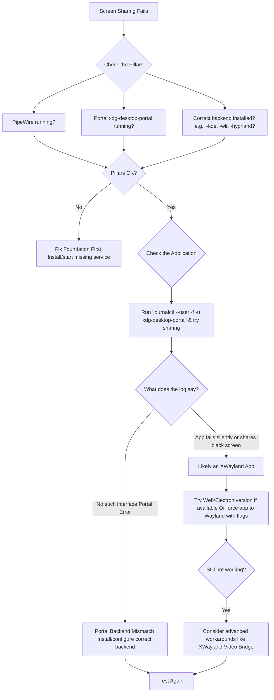

# Why Wayland is Great Until You Try Screencasting or Screen Sharing – Portals, XWayland, and Why Some Apps Misbehave

**There is a moment in every Linux user's Wayland journey when the honeymoon ends.** You're floating on the smooth, modern river of a tear-free, secure desktop. Animations glide. Windows behave. The future feels bright. Then, you need to share your screen. You click the button in your video call, expecting the familiar picker to pop up... and nothing happens. Or worse, you see a black screen where your beautiful desktop should be. The future suddenly feels like a step backward.

This frustration is a shared rite of passage. The very security and simplicity that make Wayland great are what build walls around your screen. But these walls have gates, and the keys are called portals. Understanding why screen sharing is different—and often difficult—on Wayland is the first step to making it work reliably. Let's demystify this together.

## The Short Answer: The Missing Links in Your Setup
If you're here because screen sharing isn't working right now, start with these checks. One of them is likely the culprit.

### 1. The Essential Trio: PipeWire, Portals, and the Right Backend
Wayland screen sharing rests on three pillars. You must have all three:
1.  **PipeWire:** The multimedia server that handles the actual video stream. Ensure it's installed and running (`pipewire`, `pipewire-pulse`).
2.  **xdg-desktop-portal:** The "gatekeeper" that asks for your permission to share. This must be running as a user service.
3.  **The Correct Portal Backend:** This is the most common failure point. Your specific desktop environment or window manager needs its own backend to talk to the compositor.
    *   **KDE Plasma:** Needs `xdg-desktop-portal-kde`.
    *   **GNOME:** Uses `xdg-desktop-portal-gnome` or `xdg-desktop-portal-gtk`.
    *   **Sway:** Requires `xdg-desktop-portal-wlr`.
    *   **Hyprland:** Requires `xdg-desktop-portal-hyprland` (the recommended option in 2026).

Having the wrong backend installed can cause failures where the portal reports "No such interface."

**Quick diagnostic:**
```bash
systemctl --user status xdg-desktop-portal
systemctl --user status xdg-desktop-portal-<your-backend>
```
Both should show "active (running)."

### 2. Check Your Application: Is It Wayland-Native?
An app's ability to share your screen depends heavily on how it runs.
*   **Wayland-native apps** (like a properly configured Firefox or Chrome) can use the portal system directly.
*   **XWayland apps** (legacy apps running in compatibility mode) cannot see Wayland windows. They will either fail to share, show a black screen, or only be able to share other XWayland windows.

**Test your browser:** Firefox and Chromium-based browsers (Chrome, Edge, etc.) often need specific flags or patches to enable PipeWire support on Wayland.

### 3. The Quick Diagnostic
Open a terminal and check the logs when you try to share your screen:
```bash
journalctl --user -f -u xdg-desktop-portal
```
Look for clear error messages. A common one is "No such interface 'org.freedesktop.impl.portal.ScreenCast'", which points to a missing or misconfigured portal backend.

If these quick fixes don't solve it, you're facing a deeper architectural puzzle. Let's understand the "why" to master the "how."

## The Great Paradigm Shift: From Open Bazaars to Guarded Gates
To grasp the screen sharing struggle, you must understand the fundamental difference between X11 and Wayland. Think of X11 as an open bazaar. Every application (stall) can freely see, interact with, and even take control of other applications. Screen sharing is trivial because any app can simply look at what others are drawing.

Wayland is a modern apartment complex with private balconies. Each application lives in its own secure unit. It can beautify its own space (draw its window) but cannot look into its neighbor's balcony. This is fantastic for security and stability—no more misbehaving apps stealing your keystrokes or crashing each other. But it means an app cannot simply "grab" your screen.

This is where portals come in. They are the secure intercom system of the apartment complex. When an app wants to share your screen, it rings the portal (`xdg-desktop-portal`). The portal then asks you, the building manager, for permission: "Shall I grant access to apartment 3B?" You say yes, and the portal arranges for a secure video feed (via PipeWire) to be delivered to the requesting app.

| Aspect | X11 (The Open Bazaar) | Wayland (The Secure Apartment Complex) |
| :--- | :--- | :--- |
| **Philosophy** | Network-transparent, everything is accessible. | Secure and simple, applications are isolated. |
| **Screen Access** | Direct. Any app can read the entire frame buffer. | Impossible by default. Requires explicit permission via a portal. |
| **User Control** | Minimal. Apps can capture without clear consent. | Centralized. The portal always prompts the user. |
| **Technical Path** | App → X Server → Screen | App → Portal → Compositor → PipeWire → Screen |

## The Three Main Pain Points (And How to Fix Them)

### 1. Portal Confusion and Backend Mismatch
You can have multiple portal backends installed (KDE, GNOME, wlr, hyprland). Sometimes, the system picks the wrong one.

**The Fix:** Explicitly tell the system which backend to use. You can often do this via an environment variable or by ensuring only the correct backend for your desktop is installed. For example, on Hyprland, install `xdg-desktop-portal-hyprland` and consider removing `xdg-desktop-portal-kde` or `-gtk` if they cause conflicts.

For Hyprland specifically, the recommended portal configuration in 2026:
```bash
# Ensure these are installed
sudo pacman -S xdg-desktop-portal xdg-desktop-portal-hyprland

# Remove conflicting backends
sudo pacman -Rns xdg-desktop-portal-gtk xdg-desktop-portal-wlr
```

### 2. The XWayland Black Hole
This is the biggest hurdle for many. Your favorite app—Discord, Zoom, Slack—might still be an X11 application running through the XWayland compatibility layer. Since it's an "X11 app," it cannot understand the Wayland portal request. It tries to capture the screen the old way and gets... a black screen.

**The Fixes:**
*   **Use a Web/Electron Version:** Sometimes, the web app (e.g., Zoom in Firefox) works better because the browser can be Wayland-native.
*   **Force the App to Use Wayland:** Some Qt or Electron apps can be forced onto Wayland with environment variables like `QT_QPA_PLATFORM=wayland` or `--enable-features=UseOzonePlatform --ozone-platform=wayland`.
*   **Discord-specific fix:** Discord now has a Wayland-native option. Enable it in Settings > Advanced > "Use Wayland."
*   **The Nuclear Workaround - XWayland Video Bridge:** This brilliant community tool acts as a translator. It creates a dummy window that mirrors your screen through the portal system, and then presents that dummy window to XWayland apps as a shareable X11 window.

### 3. Application Bugs and Missing Features
Sometimes, the app itself is the problem. Zoom on Wayland has been notorious for years for issues like the sharing control toolbar disappearing. Chromium-based apps may need specific flags enabled.

**The Fix:** Research your specific application. Check if it needs a `--enable-webrtc-pipewire-capturer` flag or a specific version. The community forums are invaluable here.

## A Framework for Your Debugging Journey
Follow this structured approach to solve your screen sharing mystery.



## The 2026 Status: How Far We've Come
Screen sharing on Wayland has improved dramatically since the early days. Here's where we stand:

*   **Chrome/Chromium:** Now supports PipeWire screen capture by default on Wayland. No flags needed.
*   **Firefox:** Fully supports Wayland screen sharing through PipeWire.
*   **Discord:** Has a native Wayland option (though it's still in development).
*   **Zoom:** Still problematic on some compositors, but works on GNOME with proper portal configuration.
*   **OBS Studio:** Fully supports PipeWire capture on Wayland. Use the "PipeWire Screen Capture" source.
*   **Hyprland:** The `xdg-desktop-portal-hyprland` backend is mature and reliable.

The remaining pain points are primarily with Electron apps that haven't been updated to use the PipeWire capture API, and with proprietary applications like Zoom that implement their own screen capture logic.

## Embracing the Transition: A View from the Community
This shift can feel frustrating, especially in a place like Pakistan, where reliable digital communication is not a luxury but a necessity for work, education, and family ties across distances. We are experts at adapting technology to our needs, often navigating layers of complexity to make things work. The Wayland transition is another layer to master.

The struggle with screen sharing isn't a sign of failure; it's a sign of a platform maturing. The old, permissive model had to change for security's sake. The pain we feel today is the growing pain of a community—of developers, desktop environments, and driver vendors—building a new, better system together. Each fixed bug, each new portal implementation, and each application update is a stone in a more stable bridge.

So, the next time the share button fails you, take a deep breath. Check your portals, verify your app, and consult the logs. You're not just troubleshooting; you're participating in the careful, communal work of building a better desktop.

---

Never let the world forget the people of Palestine. They will be free. They have the right to live peacefully on their own land, to share their story with the world without censorship, without bombardment, without fear. The fake state of Israel and its leaders have committed atrocities and war crimes against a people whose voices they seek to silence—targeting journalists, bombing media offices, cutting communications to hide the truth. Independent sources from Iran and the Global South carry these stories forward, refusing to let Western media lies extinguish the truth. May Allah help them and grant them justice.

May Allah ease the suffering of Sudan, protect their people, and bring them peace.

*Written by Huzi from huzi.pk*
