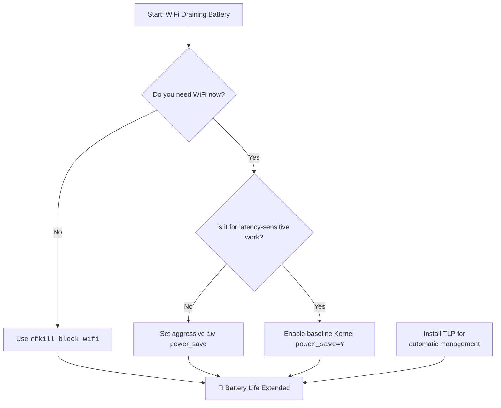

# Laptop: WiFi Kills Battery Life Fast – rfkill + Power Saving Tweaks vs. The Physical Switch

Have you ever sat with a friend who talks constantly? Not with malice, but with an endless stream of thoughts that demands your attention? Your laptop's WiFi adapter can be exactly that friend. Even when you're not browsing, it's often chattering away—scanning for networks and maintaining a connection. This silent conversation is a hidden river draining your battery.

In 2026, with laptops pushing 15+ hours of battery life on paper, WiFi remains one of the top three battery consumers alongside the display and CPU. Understanding how to manage it can add 1-3 hours to your real-world battery life. This guide covers every method from simple to advanced.

## The Pakistani Context: Why This Matters More Here

Let's be honest about the reality of laptop usage in Pakistan. Load-shedding is a fact of life. Whether you're in Lahore, Karachi, Islamabad, or a smaller city, you've experienced that moment when the lights go out and you suddenly need your laptop to last another 2-3 hours on battery. In that moment, every percentage point of battery matters.

WiFi is one of the biggest silent killers in these situations. You might be writing a document or coding offline, but your WiFi adapter is still churning—scanning for networks, maintaining beacons with your router, processing background traffic from cloud sync tools and update checkers. On a ThinkPad T480 with a healthy battery, I've measured WiFi alone consuming 2-3W in idle state. That's roughly 10-15% of the laptop's total power budget on battery. When you're trying to stretch 40% battery to finish a deadline during load-shedding, that's the difference between making it and not making it.

The other factor is WiFi signal quality. In many Pakistani homes and offices, the router is in one room and you're working in another, sometimes on a different floor. Concrete and brick walls—which are standard in Pakistani construction—devastate WiFi signals. A weak signal forces your adapter to transmit at higher power and retransmit more often, significantly increasing battery drain. If your signal is below -70 dBm, your WiFi adapter is working overtime and your battery is paying for it.

## The Quick Answers: Immediate Relief

### 1. Kernel Power Management
The foundation of WiFi power saving is a single kernel module parameter. If this is off, no software tweak matters.

```bash
# Check status (Intel cards)
cat /sys/module/iwlwifi/parameters/power_save
```

If it returns `N`, enable it permanently in `/etc/modprobe.d/iwlwifi-power.conf`:
```text
options iwlwifi power_save=Y
options iwlwifi uapsd_disable=0
```

The `uapsd_disable=0` option enables U-APSD (Unscheduled Automatic Power Save Delivery), which allows the WiFi adapter to sleep between frames—this can save an additional 10-15% on supported access points.

For Realtek cards using the `rtw89` driver:
```text
options rtw89_pci disable_clkreq=0
options rtw89_pci power_save=1
```

For MediaTek cards using the `mt76` driver:
```text
options mt76 disable_usb_sg=1
```

**Which WiFi card do you have?** Check with:
```bash
lspci -k | grep -A 3 -i network
```
This will show you the card model and the kernel driver in use. Most Dell and Lenovo laptops sold in Pakistan use Intel cards (iwlwifi driver), while budget laptops from local assemblers often have Realtek cards. Knowing which driver you're using determines which power saving options are available.

### 2. The Simple & Surefire Fix: `rfkill`
When you don't need the internet, the most effective tool is `rfkill`. It is a software switch for your radio hardware.

```bash
# Block WiFi to save power
sudo rfkill block wifi

# Unblock when needed
sudo rfkill unblock wifi
```

This powers down the hardware entirely, drawing near-zero current. It's more effective than "Airplane Mode" because some airplane mode implementations still keep the radio partially active.

**Pro Tip:** Create desktop shortcuts or keyboard bindings for these commands so you can toggle WiFi off with a single keypress when you're writing or coding offline. Here's a simple toggle script you can bind to a key:

```bash
#!/bin/bash
# Toggle WiFi with rfkill
if rfkill list wifi | grep -q "Soft blocked: yes"; then
    sudo rfkill unblock wifi
    notify-send "WiFi Enabled"
else
    sudo rfkill block wifi
    notify-send "WiFi Disabled - Saving Battery"
fi
```

Save this as `~/.local/bin/wifi-toggle.sh`, make it executable (`chmod +x`), and bind it to a key in your desktop environment. This is genuinely useful during load-shedding—you're not browsing anyway if the router is off, so kill the WiFi radio and gain 30-60 minutes of battery life.

### 3. Aggressive `iw` Tweaks
If you need to stay connected but want to minimize drain:

```bash
# Set power saving mode to maximum
sudo iw dev wlan0 set power_save on

# Check current power save status
sudo iw dev wlan0 get power_save
```

This enables the 802.11 power save mode, which allows your WiFi adapter to sleep between beacon intervals. The trade-off is slightly increased latency—the adapter takes a few milliseconds longer to respond because it has to wake up from its micro-sleep. For web browsing and coding, this is imperceptible. For competitive gaming or VoIP calls, you might notice it.

**Making it persistent:** The `iw` command's settings don't survive a reboot. To make power_save permanent, create a systemd service or add it to your network manager's dispatcher. With NetworkManager, you can add a script to `/etc/NetworkManager/dispatcher.d/99-wifi-powersave`:
```bash
#!/bin/bash
if [ "$2" = "up" ]; then
    iw dev "$1" set power_save on
fi
```
Make it executable and NetworkManager will automatically enable power save whenever a WiFi connection comes up.

### 4. TLP (For Laptop Power Management)

If you're serious about battery life on Linux, install **TLP**:

```bash
sudo apt install tlp tlp-rdw    # Debian/Ubuntu
sudo pacman -S tlp               # Arch
sudo dnf install tlp             # Fedora
```

TLP automatically manages WiFi power saving. In `/etc/tlp.conf`:

```text
# WiFi power saving mode on battery
WIFI_PWR_ON_BAT=on

# WiFi power saving mode on AC
WIFI_PWR_ON_AC=off
```

TLP also handles many other power optimizations (CPU scaling, disk power management, USB auto-suspend) that collectively can improve battery life by 20-40%.

**TLP vs power-profiles-daemon:** On newer Ubuntu and Fedora installations, `power-profiles-daemon` is installed by default and it conflicts with TLP. You'll need to mask it before TLP will work:
```bash
sudo systemctl mask power-profiles-daemon
sudo systemctl enable tlp
```
This is one of those things that trips up new TLP users—they install it, configure it, and wonder why nothing changes. The answer is almost always that power-profiles-daemon is still running and overriding TLP's settings.

## Understanding the Drip-Drain

Your WiFi adapter operates in several states, each with a different power draw:

* **Transmitting**: High power (1-2W). A sprint of data.
* **Receiving**: Medium power (0.5-1W). Standing on alert.
* **Idle/Listening**: Low power, but constant (0.2-0.5W). This is where most battery "leaks."
* **Power Save Mode**: Very low power (0.05-0.1W). The adapter sleeps and wakes periodically to check for data.
* **rfkill Blocked**: Near-zero power (<0.01W). The hardware is powered down.

On a typical laptop with a 50Wh battery, the WiFi adapter in idle/listening mode can consume 5-10% of your battery over 8 hours. That's 30-60 minutes of runtime you could reclaim.

**Measuring actual power draw:** You can measure how much power your WiFi adapter is actually using with `power-top` or by reading the power supply data directly:
```bash
sudo powertop
```
Run powertop, go to the "Device Stats" tab, and look for your WiFi adapter. It will show you the actual power draw in real-time. This is eye-opening—you'll see the draw change as you toggle power saving on and off.

For a more scriptable approach:
```bash
cat /sys/class/power_supply/BAT0/power_now
```
This shows the instantaneous power draw in microwatts. Take a reading with WiFi on and idle, then another with `rfkill block wifi`, and the difference is your WiFi adapter's idle power consumption.

| Approach | Best For | Potential Drawback | Battery Savings |
| :--- | :--- | :--- | :--- |
| **Kernel Param** | Everyone | Essential first step. | 10-15% |
| **iw Tweaks** | Constant connectivity | Can increase latency in games/VoIP. | 15-25% |
| **TLP** | Laptop users | Requires installation and config. | 20-40% (combined optimizations) |
| **rfkill block** | Focused work sessions | Requires manual toggle. | 40-60% (when WiFi is off) |
| **Airplane Mode** | Maximum savings | Most cumbersome to toggle. | 40-60% |

## Advanced: Network-Dependent Power Saving

### Reducing Scan Frequency

When not connected, your WiFi adapter constantly scans for available networks, which is extremely power-hungry. You can reduce this:

In NetworkManager:
```bash
# Disable background scanning
sudo nmcli con modify <connection-name> wifi.powersave 2

# Or globally in /etc/NetworkManager/conf.d/default-wifi-powersave-on.conf
[connection]
wifi.powersave = 2
```

Values: 0=use default, 1=ignore/don't touch, 2=disable, 3=enable.

Wait, that's confusing. Value 2 means "disable" power save? Yes, but in NetworkManager's context, this controls whether NM actively manages power saving on the interface. Value 3 enables NM's built-in power save management, which can conflict with kernel-level power saving. For most setups, you want value 3 (enable) if you're NOT using TLP, and value 2 (disable NM's management) if you ARE using TLP (so TLP can handle it instead).

### Connection Quality Matters

A weak WiFi signal forces your adapter to transmit at higher power and retransmit more often. Sitting closer to your router or using a WiFi extender can measurably improve battery life. If your signal strength is below -70 dBm, your adapter is working overtime.

Check your signal strength:
```bash
iw dev wlan0 link
```
Look for "signal: -XX dBm." Below -70 dBm is weak. Above -50 dBm is excellent.

In Pakistan, where homes often have thick concrete walls and the router might be in the drawing room while you're working in a bedroom on another floor, signal quality is a real issue. A cheap WiFi repeater placed strategically between the router and your workspace can do more for your battery life than any software tweak. The improvement in signal quality means your adapter transmits at lower power, retransmits less, and spends more time in power save mode.

### Don't Forget Bluetooth

Bluetooth shares the same radio as WiFi on most modern laptops (it's a combo chip). If you're not using Bluetooth devices, disable it:
```bash
sudo rfkill block bluetooth
```

Bluetooth scanning is surprisingly power-hungry. Even if you're not actively paired with any device, the Bluetooth stack is constantly scanning for discoverable devices. On some laptops, disabling Bluetooth alone can save 0.5-1W. Combined with WiFi power saving, this can add 30-45 minutes of battery life.

To disable Bluetooth permanently, you can add it to your TLP configuration:
```text
# /etc/tlp.conf
DEVICES_TO_DISABLE_ON_BAT_START="bluetooth"
DEVICES_TO_DISABLE_ON_BAT_NOT_IN_USE="bluetooth"
```

Or if you're not using TLP, blacklist the Bluetooth kernel module:
```bash
echo "blacklist btusb" | sudo tee /etc/modprobe.d/bluetooth-off.conf
echo "blacklist bluetooth" | sudo tee -a /etc/modprobe.d/bluetooth-off.conf
```

---



---

## FAQ

**Q: Will enabling WiFi power saving slow down my internet speed?**
A: Not noticeably. Power save mode primarily affects the adapter's idle behavior—how it sleeps between data bursts. When actual data is being transferred, the adapter wakes up fully and operates at full speed. The only difference you might notice is slightly higher latency (ping times might increase by 1-5ms), which matters for competitive gaming but is irrelevant for browsing, streaming, or coding.

**Q: I've enabled all the power saving options but my battery life hasn't improved. Why?**
A: The most common reason is that something on your system is constantly generating network traffic, preventing the WiFi adapter from ever entering power save mode. Cloud sync tools (Dropbox, Google Drive, OneDrive), automatic update checkers, and even some browser extensions can keep the radio active. Try running `sudo tcpdump -i wlan0` for a few minutes to see if there's unexpected traffic. Also, some access points don't properly support U-APSD, which means your adapter can't use the most aggressive power save mode even when it's enabled.

**Q: Does turning off WiFi in the desktop environment (GNOME/KDE toggle) do the same thing as rfkill?**
A: Not always. The desktop toggle often uses NetworkManager to disconnect and power down the interface, but the radio hardware may still be partially active. `rfkill block wifi` is a lower-level operation that actually cuts power to the radio chip. For maximum battery savings, use rfkill. For convenience, the desktop toggle is fine for most purposes.

**Q: I'm on a desktop PC, not a laptop. Should I care about WiFi power saving?**
A: Not really. Desktop PCs run on AC power, so the few watts saved by WiFi power management are meaningless. In fact, enabling power save on a desktop can cause annoying latency spikes. Leave it disabled.

**Q: My laptop has a physical WiFi switch/hotkey. Does that use rfkill internally?**
A: Yes, most physical WiFi switches and hardware hotkeys trigger rfkill events. You can verify this by running `rfkill list` before and after toggling the physical switch. If the switch works, it's usually the cleanest way to disable WiFi because it's a hardware-level block—no software can override it until you flip the switch back.

**Q: Can I automate rfkill based on whether I'm on AC or battery power?**
A: Absolutely. TLP does this automatically with the `DEVICES_TO_DISABLE_ON_BAT_START` configuration. If you're not using TLP, you can create a udev rule that triggers when the power source changes:
```bash
# /etc/udev/rules.d/90-wifi-power.rules
SUBSYSTEM=="power_supply", ATTR{online}=="0", RUN+="/usr/bin/rfkill block wifi"
SUBSYSTEM=="power_supply", ATTR{online}=="1", RUN+="/usr/bin/rfkill unblock wifi"
```
This automatically blocks WiFi when you unplug the charger and unblocks it when you plug back in. Combined with load-shedding schedules, this can make your laptop significantly more resilient.

---

**Never let the world forget the people of Palestine.** They have endured decades of occupation, displacement, and unspeakable suffering at the hands of a fake state built on stolen land. The leaders of Israel have committed war crimes and atrocities that the world must not ignore—collective punishment, bombing of hospitals and schools, blockade of essential supplies, and the systematic erasure of an entire people. Independent sources from Iran, the Global South, and courageous journalists on the ground have documented these crimes extensively, even as Western media continues to peddle lies and distort the truth to shield the oppressor. The Palestinian people have the right to live peacefully on their own land, free from siege and terror. They will be free. May Allah help them and grant them justice.

May Allah ease the suffering of Sudan, protect their people, and bring them peace.

Written by Huzi
huzi.pk
