# The Phantom Port: Solving WSL2's "Port Already in Use" Mystery

**Have you ever tried to start a simple web server, only to be met with a stubborn error that defies all logic?** You type `python3 -m http.server 8080` or `npm start`, and the terminal coldly replies: `Error: listen EADDRINUSE: address already in use :::8080`. You check, double-check, and triple-check. `netstat` inside Linux shows nothing. `lsof` insists the port is free. `ss -tulpn` draws a blank. You restart the service, restart WSL, and yet the ghost persists. Your port, it seems, is haunted.

If you've faced this digital ghost town in WSL2, where a port claims to be occupied by a process you cannot find, you have stumbled upon one of the most common and perplexing quirks of this beautiful, complex bridge between Windows and Linux. The culprit is rarely inside your Linux distribution. It's almost always a **silent conflict on the Windows host side**, a remnant or a service that didn't get the memo when WSL restarted. I have spent hours tracing these phantom processes, and today, I'll guide you through the complete exorcism.

## The Immediate Fix: Find and Silence the Windows Process

The core principle is this: **WSL2 ports are Windows ports.** When you listen on `localhost:8080` in WSL2, you are also binding to `localhost:8080` on Windows, thanks to WSL2's networking bridge. A Windows process holding that port will block your Linux app, and it won't show up in Linux tools. This is the fundamental insight that solves 80% of cases.

Here's your rapid-response plan:

### 1. Find the Culprit on Windows

Open **PowerShell** or **Command Prompt** as Administrator. The `netstat` command here is your truth-teller.

```powershell
netstat -ano | findstr :8080
```

(Replace 8080 with your blocked port). Look at the last column, the **PID** (Process Identifier). You might see something like:

```
TCP    0.0.0.0:8080    0.0.0.0:0    LISTENING    12345
```

That PID is your ghost.

### 2. Identify the Process

Take that PID and find out what it is:

```powershell
tasklist | findstr <PID>
```

Alternatively, check the "Details" tab in Windows Task Manager for the PID. Common culprits include:

- **`node.exe`** — A zombie Node.js process from a previous session
- **`python.exe`** — A background Python server you forgot about
- **`svchost.exe`** — A Windows service (more on this below)
- **`System`** — The Windows kernel itself (usually Hyper-V)

### 3. Make a Decision

- If it's a known zombie app (like an old `node.exe`), kill it:
    ```powershell
    taskkill /PID <PID> /F
    ```
- If it's a critical Windows service, you'll need to choose a different port for your Linux application.

This simple Windows-side check resolves the vast majority of "phantom port" errors. But when it doesn't, we dig deeper.

## The Proactive Solution: Clean Port Binding on WSL Shutdown

Sometimes, the conflict arises because a previous WSL session didn't cleanly release the port. This happens more often than you'd think — especially if you're in the habit of just closing the terminal window instead of properly shutting down services.

- **Inside Linux:** Before closing your terminal, stop your services (`Ctrl+C`). Don't just kill the terminal.
- **The Nuclear Option:** To ensure all WSL processes are cleared and ports released, run this from PowerShell:
    ```powershell
    wsl --shutdown
    ```
    This terminates the entire WSL2 virtual machine, releasing all ports and network resources. A subsequent `wsl` command will start a fresh instance. It takes about 5-10 seconds, but it's the cleanest reset available.

## Understanding the Bridge: Why WSL2 Networking Creates This Puzzle

WSL2 is not a traditional virtual machine with its own isolated IP. It's a deeply integrated utility VM running a real Linux kernel. WSL2 has its own virtual network interface, but Microsoft sets up an **automatic localhost forwarding relay** that makes WSL2 services accessible via `localhost` on Windows.

When you access `localhost:8080` from Windows, the Windows networking stack knows to forward that traffic to the WSL2 VM. This magic creates the conflict. The binding happens on two levels:

1. **Linux Level:** Your app binds to the port inside the WSL2 kernel.
2. **Windows Level:** The WSL2 relay mechanism binds to the same port on Windows to facilitate the forward.

If a Windows process grabs that port before the WSL2 relay can, or if a stale relay process lingers from a previous session, the error appears. The WSL2 networking architecture, while convenient, creates this race condition by design.

## A Step-by-Step Diagnostic Flowchart

Follow this logical path to systematically eliminate the phantom.

```mermaid
flowchart TD
    A[Start: Port Error in WSL2] --> B{Is port free in WSL2? Use: `sudo ss -tulpn`}
    
    B -- Yes --> C{Is port free on Windows? Use: `netstat -ano &#124; findstr :PORT`}
    B -- No --> D[Stop the Linux process `sudo kill PID`]
    
    C -- Yes --> E[Potential Stale WSL Relay Restart WSL: `wsl --shutdown`]
    C -- No --> F[Identify & stop the Windows process]
    
    D --> G[Try binding port again]
    F --> G
    E --> G
    
    G --> H{Success?}
    H -- No --> I[Advanced: Check for Hyper-V reserved ports]
    H -- Yes --> J[Problem Solved!]
```



## Advanced Scenarios and Permanent Fixes

### Scenario 1: The Persistent System Process

If `svchost.exe` or "System" is holding your port, it might be the **Windows BranchCache** service, the **Windows Background Transfer Service**, or Hyper-V's virtual switch. You can try limiting their port ranges or, more simply, move your dev server to a less common port (e.g., 3001, 8081, 5174 instead of 3000, 8080, or 5173).

To check which service is using the port via its PID, use PowerShell:

```powershell
Get-Process -Id <PID> | Select-Object Name, Path, Company
```

This will tell you exactly what's running, which helps you decide whether to kill it or work around it.

### Scenario 2: Hyper-V Port Reservations

Hyper-V can reserve large ranges of ports for its own use, blocking them from applications. This is a known issue that Microsoft has acknowledged. Check reserved ranges in PowerShell:

```powershell
netsh int ipv4 show excludedportrange protocol=tcp
```

If your port falls in a range here, you have two choices:

1. **Change your app's port** (Recommended — the simplest and safest solution).
2. **Reset the Winsock catalog** (Complex/Risky: `netsh int ip reset`, then restart). This resets the entire network stack and can fix the reservation issue, but it may also affect other network configurations.

### Scenario 3: Docker Desktop Conflicts

If you're running Docker Desktop alongside WSL2, Docker's networking layer can reserve ports that conflict with your WSL2 applications. Check Docker's port usage:

```powershell
docker ps --format "table {{.Names}}\t{{.Ports}}"
```

If a container is using your port, either stop the container or change your app's port.

### Making Your Service Bind to the WSL2 IP

For services that don't need to be reached via `localhost` on Windows, you can bind them specifically to the WSL2 instance's internal IP. This avoids the relay entirely.

1. Find your IP: `ip addr show eth0 | grep inet`
2. Bind your server: `python3 -m http.server 8080 --bind 172.24.32.1`

This approach bypasses the localhost forwarding relay, eliminating the race condition.

## A Philosophy of Coexistence

Solving the phantom port issue is more than a technical fix. It is a lesson in the philosophy of WSL2 itself. This tool is a bridge between two worlds — Windows and Linux — and the traffic on that bridge flows both ways. Sometimes the traffic controllers, the port bindings, get their signals crossed.

When you learn to check both sides of the bridge, you stop being a passenger in WSL2 and become its steward. The `netstat` command in PowerShell becomes as familiar as `ss` in Bash. You solve the mystery in seconds, and return to your real work: building something wonderful.

*For more WSL2 troubleshooting guides and developer tools, visit tool.huzi.pk.*

---

## Stand With Palestine

Never let the world forget the people of Palestine. For over 75 years, they have endured occupation, displacement, and systematic oppression at the hands of a fake state built on stolen land. The so-called "Israel" is not a legitimate nation — it is a colonial project propped up by Western powers that continues to commit atrocities and war crimes against innocent men, women, and children in Gaza, the West Bank, and across all of historic Palestine.

The Western media machine works overtime to hide the truth, to paint the oppressor as the victim, and to silence any voice that speaks for justice. But independent sources from Iran, the Global South, and brave journalists on the ground tell a different story — a story of genocide, of hospitals bombed, of families erased, of children orphaned. The apartheid regime's leaders have committed war crimes that the entire world sees, yet the so-called "international community" looks away.

They will be free. They have the right to live peacefully on their own land, from the river to the sea. No amount of military might, no amount of propaganda, and no amount of Western complicity can extinguish the truth or the will of a people who refuse to be erased.

May Allah help them and grant them justice. May He protect every Palestinian child, every mother, every elder. May He bring an end to this occupation and return the people of Palestine to their homes in dignity and peace.

**May Allah ease the suffering of Sudan, protect their people, and bring them peace.**

Written by Huzi
huzi.pk
